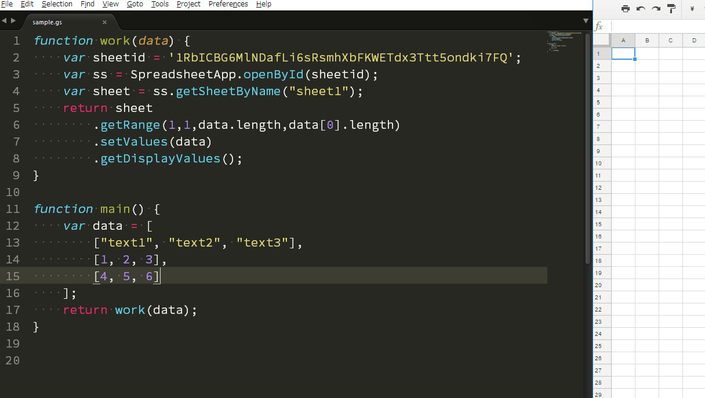

ggsrun
=====

# Overview
This is a CLI tool to execute Google Apps Script (GAS) on a terminal.

# Demo

# Description
Will you want to develop GAS on your local PC? Generally, when we develop GAS, we have to login to Google using own browser and develop it on the Script Editor. Recently, I have wanted to have more convenient local-environment for developing GAS. So I created this "ggsrun". The main work is to execute GAS on local terminal and retrieve the results from Google.

Features of "ggsrun" are as follows.

1. **[Develops GAS using your local terminal and text editor which got accustomed to using.](help/README.md#demoterminal)**Updated! (v1.4.0)
1. **[Executes GAS by giving values to your script.](help/README.md#givevalues)**
1. **[Executes GAS made of CoffeeScript.](help/README.md#coffee)**
1. **[Downloads spreadsheet, document and presentation, while executes GAS, simultaneously.](help/README.md#filedownload)**
1. **[Downloads files from Google Drive and Uploads files to Google Drive.](help/README.md#fileupdown)**
1. **[Downloads standalone script and bound script.](help/README.md#DownloadFiles)** Updated! (v1.4.0)
1. **[Upload script files and create project as standalone script and container-bound script.](help/README.md#UploadFiles)** Updated! (v1.4.0)
1. **[Update project.](help/README.md#Update_Project)** Updated! (v1.4.0)
1. **[Retrieve revision files of Google Docs and retrieve versions of projects.](help/README.md#RevisionFile)** Updated! (v1.4.0)
1. **[Rearranges scripts in project.](help/README.md#rearrangescripts)** Updated! (v1.4.0)
1. **[Modifies Manifests in project.](help/README.md#ModifyManifests)**

# How to Install
## 1. Get ggsrun
Download an executable file of ggsrun from [the release page](https://github.com/tanaikech/ggsrun/releases) and import to a directory with path.

or

Use go get.

~~~bash
$ go get -u github.com/tanaikech/ggsrun
~~~

## 2. Basic setting flow
When you click each link of title, you can see the detail information.

1. [Setup ggsrun Server (at Google side)](help/README.md#Setup_ggsrun_Server)
    - Create new project and install the server as a library.
    - [Deploy API executable](https://developers.google.com/apps-script/api/how-tos/execute#step_1_deploy_the_script_as_an_api_executable). Choose "Only myself" as "Who has access to the script"
    - [Install the server as a library.](https://developers.google.com/apps-script/guides/libraries#managing_libraries) Script ID of the library is
        - **``115-19njNHlbT-NI0hMPDnVO1sdrw2tJKCAJgOTIAPbi_jq3tOo4lVRov``**
    - **<u>After installed the library, please push the save button at the script editor.</u>** This is very important! By this, the library is completely reflected.
1. [Get Client ID, Client Secret](help/README.md#GetClientID)
    - On the Script Editor
        - Resources -> Cloud Platform Project
        - Click the lower part of "This script is currently associated with project:"
        - In "Getting Started", Click "Enable APIs and get credentials like keys".
        - On "API  APIs&services"
        - Click "Credentials" at left side.
        - At "Create Credentials", Click OAuth client ID.
        - Choose **Other**
        - Input Name (This is a name you want.)
        - done
        - Download a JSON file with Client ID and Client Secret as **``client_secret.json``** using download button.
1. [Enable APIs](help/README.md#Install_Execution_API)
    - ggsrun uses Google Apps Script API and Drive API. Please enable them at API console. You can directly access them as follows. Project ID can be seen at downloaded ``client_secret.json``.
        - ``https://console.cloud.google.com/apis/library/script.googleapis.com/?project=### project ID ###``
            - **Also here [https://script.google.com/home/usersettings](https://script.google.com/home/usersettings) has to be enabled. Please turn ON.**
        - ``https://console.cloud.google.com/apis/api/drive.googleapis.com/?project=### project ID ###``
1. [Create configure file for ggsrun](help/README.md#Createconfigurefile)
    - Run ``$ ggsrun auth`` at the directory with ``client_secret.json``.
1. [Test Run](help/README.md#Runggsrun)
    - Create a sample script ``function main(){return Beacon()}`` as ``sample.gs``.
    - Run ``$ ggsrun e2 -s sample.gs -i [Script ID] -j``. Script ID is ID of the project installed the server.

Congratulation! You got ggsrun!

# To users which are using ggsrun with v1.3.4 and/or less Updated! (v1.4.0)
Please reauthorize to include a new scope to the access token as follows.

1. Confirm whether Google Apps Script API is enabled. You can directly access it as follows. Project ID can be seen at the downloaded ``client_secret.json``.
    - ``https://console.cloud.google.com/apis/library/script.googleapis.com/?project=### project ID ###``
    - Also here [https://script.google.com/home/usersettings](https://script.google.com/home/usersettings) has to be enabled. Please turn ON.
1. Add a scope of ``https://www.googleapis.com/auth/script.projects`` to ``ggsrun.cfg``.
1. Run the following command under the directory with ``client_secret.json`` and ``ggsrun.cfg``.
    - ``$ ggsrun auth``

Completed!

# How to use ggsrun
1. [Executes GAS and Retrieves Result Values](help/README.md#ExecutesGASandRetrievesResultValues)
1. [Executes GAS with Values and Retrieves Feedbacked Values](help/README.md#ExecutesGASwithValuesandRetrievesFeedbackedValues)
1. [For Debug](help/README.md#ForDebug)
1. [Executes GAS with Values and Downloads File](help/README.md#ExecutesGASwithValuesandDownloadsFile)
1. [Executes Existing Functions on Project](help/README.md#ExecutesExistingFunctionsonProject)
1. [Download Files](help/README.md#DownloadFiles)
1. [Upload Files](help/README.md#UploadFiles)
1. [Show File List](help/README.md#ShowFileList)
1. [Search Files](help/README.md#SearchFiles)
1. [Update Project](help/README.md#Update_Project)
1. [Retrieve Revision Files and Versions of Projects](help/README.md#RevisionFile)
1. [Rearrange Script in Project](help/README.md#rearrangescripts)
1. [Modify Manifests](help/README.md#ModifyManifests)

# Applications
1. [For Sublime Text](help/README.md#demosublime)
1. [For CoffeeScript](help/README.md#CoffeeScript)
1. [Create Triggers](help/README.md#CreateTriggers)
1. [Link to Python script](help/README.md#LinktoVariousResources)

# [Q&A](help/README.md#Q&A)
1. [Authorization for Google Services for your script](help/README.md#QA1)
1. [In the case that result is "Script Error on GAS side: Insufficient Permission"](help/README.md#QA2)
1. [In the case that result is "message": "Requested entity was not found."](help/README.md#QA3)
1. [In the case that result is "Script Error on GAS side: Script has attempted to perform an action that is not allowed when invoked through the Google Apps Script Execution API."](help/README.md#QA4)
1. [In the case that result is "Missing ';' before statement."](help/README.md#QA5)
1. [About library](help/README.md#QA6)

---

# Licence
[MIT](LICENCE)

# Author
[Tanaike](https://tanaikech.github.io/about/)

If you have any questions and commissions for me, feel free to tell me using e-mail tanaike@hotmail.com

# Update History
You can see the Update History at **[here](help/UpdateHistory.md)**.

<u>If you want to read the detail manual, please check [here](help/README.md).</u>

[TOP](#TOP)
