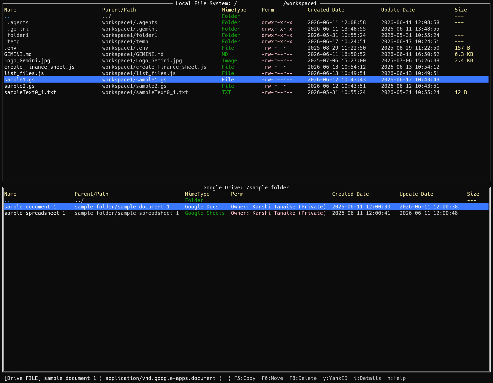
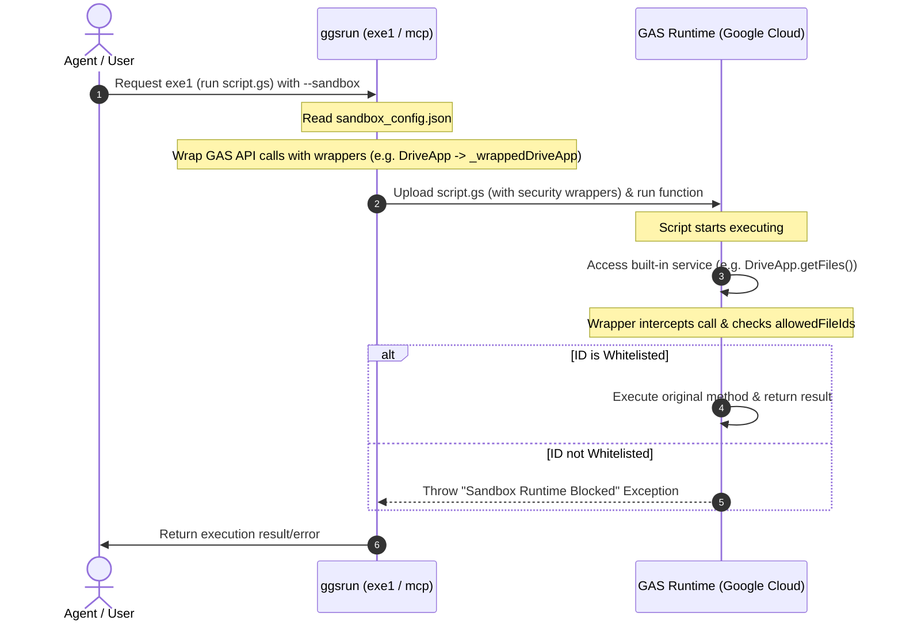
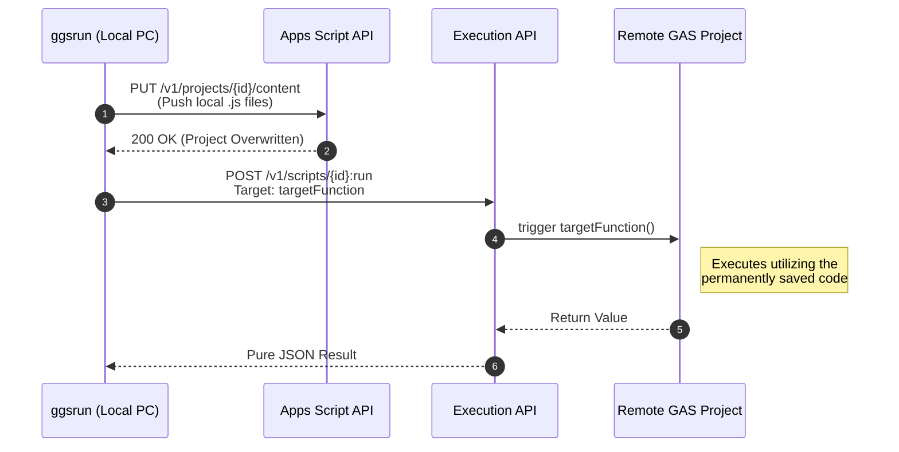
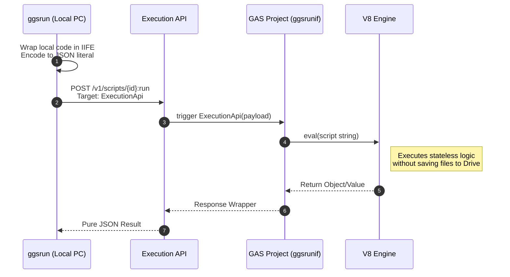
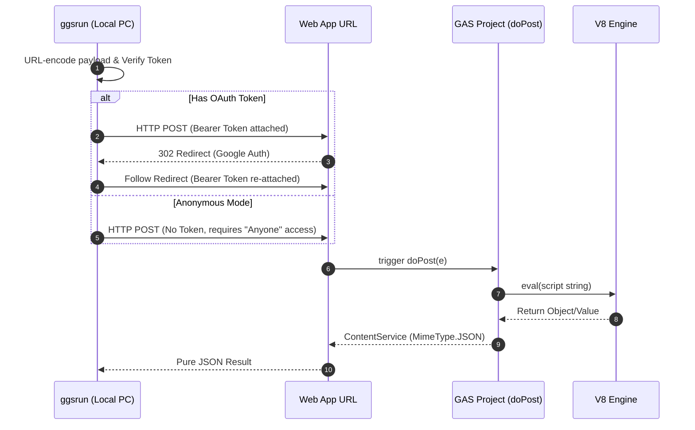

# ggsrun


<a name="top"></a>
[](https://golang.org)
[](https://modelcontextprotocol.io)
[]()
[](LICENCE)

## Table of Contents

- [ggsrun](#ggsrun)
  - [Table of Contents](#table-of-contents)
  - [Overview](#overview)
  - [Features of ggsrun](#features-of-ggsrun)
  - [The 5 Pillars of the v5 Architecture](#the-5-pillars-of-the-v5-architecture)
    - [A. Massively Parallel I/O \& UI](#a-massively-parallel-io--ui)
    - [B. Full Shared Drive (Omni-Drive) Support](#b-full-shared-drive-omni-drive-support)
    - [C. Intelligent GAS \& MIME Resolution](#c-intelligent-gas--mime-resolution)
    - [D. Robust Fault Tolerance \& Auto-Retry](#d-robust-fault-tolerance--auto-retry)
    - [E. MCP (Model Context Protocol) Integration](#e-mcp-model-context-protocol-integration)
  - [Installation \& Setup](#installation--setup)
- [Complete Beginner's Guide: How to Install, Authenticate, and Execute Google Apps Script with ggsrun](#complete-beginners-guide-how-to-install-authenticate-and-execute-google-apps-script-with-ggsrun)
  - [Step 1: Install ggsrun on Your Computer](#step-1-install-ggsrun-on-your-computer)
    - [For Windows Users](#for-windows-users)
    - [For macOS \& Linux Users](#for-macos--linux-users)
  - [Step 2: Configure Your Google Cloud Project (Critical Setup)](#step-2-configure-your-google-cloud-project-critical-setup)
    - [2.1 Create a New Project](#21-create-a-new-project)
    - [2.2 Enable the Required Google APIs](#22-enable-the-required-google-apis)
    - [2.3 Configure the OAuth Consent Screen](#23-configure-the-oauth-consent-screen)
    - [2.4 Download Your Security Credentials](#24-download-your-security-credentials)
  - [Step 3: Link Your Google Cloud Project to Google Apps Script](#step-3-link-your-google-cloud-project-to-google-apps-script)
    - [3.1 Get Your Project Number](#31-get-your-project-number)
    - [3.2 Change the Project in the Google Apps Script Editor](#32-change-the-project-in-the-google-apps-script-editor)
  - [Step 4: Perform the Automated Authorization](#step-4-perform-the-automated-authorization)
  - [Step 5: Set Up the Execution Server on Google Apps Script](#step-5-set-up-the-execution-server-on-google-apps-script)
    - [5.1 Add the Shared Server Library](#51-add-the-shared-server-library)
    - [5.2 Add the Gateway Code](#52-add-the-gateway-code)
    - [5.3 Deploy the Script as an API Executable (For `exe1` \& `exe2`)](#53-deploy-the-script-as-an-api-executable-for-exe1--exe2)
    - [5.4 Deploy the Script as a Web App (For `webapps`)](#54-deploy-the-script-as-a-web-app-for-webapps)
  - [Step 6: Test Execution from Your Computer](#step-6-test-execution-from-your-computer)
    - [Test Option A: Execution via API Executable (`exe2` mode)](#test-option-a-execution-via-api-executable-exe2-mode)
    - [Test Option B: Execution via Web App (`webapps` mode)](#test-option-b-execution-via-web-app-webapps-mode)
    - [Expected Output](#expected-output)
    - [1. Install ggsrun](#1-install-ggsrun)
      - [Using Go](#using-go)
      - [Downloading Pre-built Binaries](#downloading-pre-built-binaries)
    - [2. Obtain Google Cloud Credentials](#2-obtain-google-cloud-credentials)
    - [3. Automated Authorization (OAuth2 Loopback)](#3-automated-authorization-oauth2-loopback)
    - [4. Set Up Execution Server (GAS Side)](#4-set-up-execution-server-gas-side)
      - [Step 4.1: Bind the Server Library](#step-41-bind-the-server-library)
      - [Step 4.2: Inject the Gateway Code](#step-42-inject-the-gateway-code)
      - [Step 4.3: Deploy as API Executable (For `exe1` \& `exe2`)](#step-43-deploy-as-api-executable-for-exe1--exe2)
      - [Step 4.4: Deploy as Web App (For `webapps`)](#step-44-deploy-as-web-app-for-webapps)
  - [Command Reference \& Usage](#command-reference--usage)
    - [Authentication \& MCP](#authentication--mcp)
    - [Massively Parallel Download](#massively-parallel-download)
    - [Massively Parallel Upload](#massively-parallel-upload)
    - [Conflict Resolution Mode](#conflict-resolution-mode)
    - [Interactive TUI Filer (FD Mode)](#interactive-tui-filer-fd-mode)
      - [Motivation](#motivation)
      - [Prompt Used for Development](#prompt-used-for-development)
      - [Development \& Release Results (v5.3.1)](#development--release-results-v531)
        - [📊 Consumed Resources](#-consumed-resources)
        - [💡 Efficiency \& Success Review](#-efficiency--success-review)
        - [🛠️ Key Improvements \& Hardening](#️-key-improvements--hardening)
      - [How to Launch](#how-to-launch)
      - [Keybindings Summary](#keybindings-summary)
  - [Model Context Protocol (MCP) Server \& LLM Integration](#model-context-protocol-mcp-server--llm-integration)
    - [MCP Server Configuration for Antigravity CLI](#mcp-server-configuration-for-antigravity-cli)
    - [1. Exposed Tools](#1-exposed-tools)
    - [2. Standardized JSON Output (`TransferResult`)](#2-standardized-json-output-transferresult)
    - [Manual Testing of the MCP Server](#manual-testing-of-the-mcp-server)
    - [3. AI Agent Prompt Scenarios \& Expected Behaviors](#3-ai-agent-prompt-scenarios--expected-behaviors)
      - [Scenario A: Batch Upload with Interactive Conflict Resolution](#scenario-a-batch-upload-with-interactive-conflict-resolution)
      - [Scenario B: Granular Metadata Extraction and Parsing](#scenario-b-granular-metadata-extraction-and-parsing)
    - [4. Sample Prompts to Give to Your AI Agent](#4-sample-prompts-to-give-to-your-ai-agent)
  - [Antigravity CLI Plugin \& Security Sandbox](#antigravity-cli-plugin--security-sandbox)
    - [1. Security Problem \& Purpose](#1-security-problem--purpose)
    - [2. Installation \& Prerequisites](#2-installation--prerequisites)
    - [3. Plugin Directory Structure](#3-plugin-directory-structure)
    - [4. Sandboxing Architecture \& Workflow](#4-sandboxing-architecture--workflow)
      - [Sandbox Execution Lifecycle](#sandbox-execution-lifecycle)
      - [Step-by-Step Execution Workflow](#step-by-step-execution-workflow)
    - [5. Whitelist Configuration (sandbox_config.json)](#5-whitelist-configuration-sandbox_configjson)
    - [6. Security Validation \& Demonstration](#6-security-validation--demonstration)
      - [Sample Script (demo_script.gs)](#sample-script-demo_scriptgs)
      - [Execution Log Under Sandbox](#execution-log-under-sandbox)
    - [7. Recommended Security Test Prompts](#7-recommended-security-test-prompts)
      - [Prompt 1: Outbound HTTP Fetch (UrlFetchApp Sandbox Test)](#prompt-1-outbound-http-fetch-urlfetchapp-sandbox-test)
      - [Prompt 2: Drive Navigation Check (DriveApp Sandbox Test)](#prompt-2-drive-navigation-check-driveapp-sandbox-test)
      - [Prompt 3: Email Access Block (GmailApp/MailApp Sandbox Test)](#prompt-3-email-access-block-gmailappmailapp-sandbox-test)
      - [Prompt 4: End-to-End Spreadsheet Access Workflow](#prompt-4-end-to-end-spreadsheet-access-workflow)
      - [Prompt 5: Outbound Email / API Request Guarding (Non-File ID Whitelist Tests)](#prompt-5-outbound-email--api-request-guarding-non-file-id-whitelist-tests)
  - [Deep Dive: Executing Google Apps Script (exe1, exe2, webapps)](#deep-dive-executing-google-apps-script-exe1-exe2-webapps)
    - [Mode 1: `exe1` (Stateful Project Execution)](#mode-1-exe1-stateful-project-execution)
      - [Architecture Workflow](#architecture-workflow)
    - [Mode 2: `exe2` (Stateless Dynamic Execution)](#mode-2-exe2-stateless-dynamic-execution)
      - [Architecture Workflow](#architecture-workflow-1)
    - [Mode 3: `webapps` (Anonymous OR Secure Endpoint Execution)](#mode-3-webapps-anonymous-or-secure-endpoint-execution)
      - [Architecture Workflow](#architecture-workflow-2)
    - [Verification \& Diagnostics](#verification--diagnostics)
  - [Advanced Configurations](#advanced-configurations)
    - [Modifying OAuth Scopes](#modifying-oauth-scopes)
  - [Troubleshooting](#troubleshooting)
  - [Licence \& Author](#licence--author)
  - [Update History](#update-history)
    - [ggsrun](#ggsrun-1)
    - [Server](#server)

---

## Overview

**ggsrun** is an enterprise-grade CLI tool and MCP (Model Context Protocol) Server designed to relentlessly orchestrate Google Drive I/O operations and execute Google Apps Script (GAS) natively from a local terminal.

With the release of **v5.3.7**, `ggsrun` transcends its origins as a mere CLI tool. Built on Go 1.26.4+, the execution engine has been entirely rewritten from legacy serial processing into a channel-based, streaming concurrent architecture. It now serves as a high-performance, fault-tolerant I/O backend fully integrated with Omni-Drive (Shared Drives) support, advanced MIME resolution, secure redirect-following Auth logic, and a native **MCP Server Mode** allowing LLM agents to autonomously manage your cloud infrastructure.

Additionally, starting with **v5.3.7**, `ggsrun` officially integrates with the **Antigravity CLI** (`agy`) via a dedicated security sandbox plugin (`ggsrun-plugin`), providing robust runtime sandboxing and whitelisting capabilities for Google Apps Script execution.

---

## Features of ggsrun

1. Develops GAS using your terminal and text editor seamlessly.
2. Executes GAS directly by injecting values into your script dynamically.
3. Downloads files concurrently from Google Drive with stunning progress visualizations.
4. Uploads files concurrently to Google Drive via native Resumable upload wrappers.
5. Downloads standalone scripts and container-bound scripts flawlessly.
6. Recursively downloads all files and folders retaining absolute directory structures.
7. Uploads script files and creates projects as standalone scripts OR container-bound scripts.
8. Manages file and folder permissions across your entire Drive.
9. Searches files in Google Drive utilizing advanced search queries and Regex.
10. Supports both robust OAuth2 looping and Service Accounts natively.
11. Integrates with the Antigravity CLI via a dedicated plugin (`ggsrun-plugin`) to provide a secure runtime sandbox for script execution.

---

## The 5 Pillars of the v5 Architecture

### A. Massively Parallel I/O & UI

Legacy pseudo-asynchronous processing has been eradicated. `ggsrun` now utilizes a channel-based worker pool built on `golang.org/x/sync/errgroup` to maximize network throughput on massive folder trees.

### B. Full Shared Drive (Omni-Drive) Support

The v5 engine forces `supportsAllDrives=true` and `includeItemsFromAllDrives=true` across all Google Drive API permutations. Enterprise users can now execute bulk batch operations targeting deeply nested structures within organizational Shared Drives.

### C. Intelligent GAS & MIME Resolution

The extraction logic dynamically categorizes Google workspace entities. Requests targeting GAS code bypass the standard Drive API and are automatically routed to the Apps Script API, securely landing as structured `.json` locally.

### D. Robust Fault Tolerance & Auto-Retry

The v5 execution phase is strictly non-blocking. HTTP 429 (Rate Limits) and 5xx (Server Errors) trigger a mathematical exponential backoff sequence per-worker, ensuring aggressive self-healing.

### E. MCP (Model Context Protocol) Integration

Running `ggsrun mcp` transforms the application into an autonomous JSON-RPC server via `stdio`. Large Language Model (LLM) agents can natively invoke internal capabilities without requiring any API keys locally.

---

## Installation & Setup

> [!TIP]
> ### 🎉 Major Update in v5.3.7: Incredibly Simplified Onboarding & Setup Flow!
> Setting up `ggsrun` is now a breeze! We have designed a brand-new, ultra-intuitive onboarding flow:
>
> ```bash
> $ ggsrun setup
> ```
>
> 🚀 **Why you'll love it:**
> - **1-Click API Enablement**: No more clicking around GCP to enable 6+ APIs one by one. Our tailored GCP Quick Flow automates the enablement of Drive, Sheets, Slides, Docs, Google Apps Script, and Gmail APIs instantly!
> - **Flexible Credentials**: Keep any file name you like! You are **no longer required** to rename your JSON file to `client_secret.json`. It fully supports paths like `{your path}/{any name}.json`.
> - **Configuration Auto-completion**: It asks you for your GAS Project Script ID and Web Apps URL (optional), pre-filling defaults from any existing `ggsrun.cfg` so you can update setup settings in seconds.
> - **Zero Configuration Block**: Bypasses legacy startup checks when starting fresh.
>
> *Legacy `$ ggsrun auth` remains fully active for backward compatibility.*

<details>
<summary><b>📖 Click to expand: Complete Beginner's Guide (Step-by-Step Installation, Auth & GAS/Web Apps Execution)</b></summary>

# Complete Beginner's Guide: How to Install, Authenticate, and Execute Google Apps Script with ggsrun

This beginner-friendly, step-by-step guide will walk you through installing **ggsrun**, configuring your Google Cloud environment, deploying your script, and executing your Google Apps Script (GAS) or Web App directly from your local computer. No advanced programming experience required.

---

## Step 1: Install ggsrun on Your Computer

`ggsrun` is a lightweight application that runs through your terminal (Command Prompt or PowerShell on Windows, or Terminal on macOS/Linux). You do not need to install complex development environments; you can simply download a ready-to-use version.

### For Windows Users

1. Go to the official [ggsrun Releases Page](https://github.com/tanaikech/ggsrun/releases).
2. Download the file named `ggsrun_windows_amd64.exe` (or `arm64` if you are using an ARM-based Windows device like a Surface Pro).
3. Rename the downloaded file to simply `ggsrun.exe`.
4. Move this file into a dedicated folder where you want to work (for example, create a new folder on your Desktop named `ggsrun-workspace`).

### For macOS & Linux Users

1. Go to the official [ggsrun Releases Page](https://github.com/tanaikech/ggsrun/releases).
2. Download the appropriate binary for your system:
   - **macOS (Intel):** `ggsrun_darwin_amd64`
   - **macOS (Apple Silicon M1/M2/M3):** `ggsrun_darwin_arm64`
   - **Linux:** `ggsrun_linux_amd64` (or matching CPU architecture)
3. Rename the downloaded file to simply `ggsrun`.
4. Move the file to your working folder (e.g., a folder on your Desktop named `ggsrun-workspace`).
5. Open your Terminal, navigate to your working folder, and grant execution permissions to the binary:
   ```bash
   cd ~/Desktop/ggsrun-workspace
   chmod +x ggsrun
   ```

---

## Step 2: Choose Your Authorization Method

`ggsrun` provides two ways to authorize your local machine with Google Cloud. We strongly recommend **Option A: Simplified Quick Setup** as it saves you about 10 steps of manual configuration.

---

### Option A: Simplified Quick Setup (Recommended)
This method automates API enabling and guides you directly to credentials creation.

1. **Open your terminal** and navigate to your workspace folder where `ggsrun` is located:
   - **Windows Command Prompt:** `cd %USERPROFILE%\Desktop\ggsrun-workspace`
   - **macOS/Linux Terminal:** `cd ~/Desktop/ggsrun-workspace`
2. **Run the setup command**:
   - **Windows:** `ggsrun setup`
   - **macOS/Linux:** `./ggsrun setup`
3. **Follow Browser Instructions**:
   - `ggsrun` will ask to open your browser to a tailored GCP Quick Flow link. Choose **Y** (or press Enter) to proceed.
   - This link automatically enables Drive, Google Apps Script, Sheets, Gmail, Slides, and Docs APIs.
   - Once enabled, Google Cloud will redirect you straight to the **Create Credentials** page.
4. **Create Credentials**:
   - On the GCP Console, choose **+ CREATE CREDENTIALS** at the top > **OAuth client ID**.
   - Select **Desktop app** under "Application type". Name it `ggsrun Desktop Client` and click **Create**.
   - Download the JSON credential file to your computer.
     *(Note: It is NOT required to rename this file to "client_secret.json" for setup mode. You can leave it as its default downloaded name or save it to any path, such as `{your path}/{credential file name}.json`)*
5. **Register Credentials inside ggsrun**:
   - In your terminal, `ggsrun` will ask you how to load credentials.
   - Choose **[1]** and paste the path to your downloaded JSON file, OR choose **[2]** and paste the Client ID and Client Secret manually.
6. **Launch Authorization**:
   - `ggsrun` will ask to launch the browser for authorization. Press **Y** to proceed.
   - Log in with your Google account. You may see a safety warning screen stating _"Google hasn't verified this app"_. Click **Advanced** and then click **Go to ggsrun Client (unsafe)** to proceed.
   - Click **Allow** to grant permission.
   - Your local environment is now fully authorized!
7. **Configure Default Values (Optional):**
   - Finally, `ggsrun` will prompt you to enter your **Google Apps Script Project Script ID** and your **Web Apps URL** (optional). Entering these now saves them in `ggsrun.cfg`, allowing you to run execution commands later without passing the `-i` or `-u` options every time!

---

### Option B: Traditional Manual Setup (Fallback)
If you already have a configured Google Cloud Project or prefer to manage everything manually:

#### B.1: Configure Your Google Cloud Project
1. Open your browser and navigate to the [Google Cloud Console](https://console.cloud.google.com/).
2. Log in, click the project dropdown menu at the top left, select **New Project**, and name it `My-ggsrun-Project`.
3. Enable **Google Drive API** and **Google Apps Script API** inside the API Library.
4. Setup the **OAuth consent screen** (choose External, fill App info, and **CRITICAL**: add your own Gmail address as a **Test User**).
5. Navigate to **Credentials** > **+ CREATE CREDENTIALS** > **OAuth client ID**, choose **Desktop app**, click **Create**, download the JSON file, move it to your workspace, and rename it to exactly `client_secret.json`.

#### B.2: Perform the Automated Authorization
1. Execute in your workspace terminal:
   - **Windows:** `ggsrun auth`
   - **macOS/Linux:** `./ggsrun auth`
2. Google login will open automatically in your browser. Select your account, bypass the unverified warning (Click *Advanced* > *Go to ggsrun Client*), and click **Allow** to complete authorization and save `ggsrun.cfg`.

---

## Step 3: Link Your Google Cloud Project to Google Apps Script (Mandatory for both Methods)

No matter which method you used above, you must link your Apps Script project with your newly configured Google Cloud environment.

### 3.1 Get Your Project Number
1. Return to your [Google Cloud Console](https://console.cloud.google.com/).
2. Click on the **Dashboard** or **Welcome** page of your project.
3. Look for the **Project Info** card. Copy the **Project number** (this is a long string of numbers, e.g., `123456789012`).

### 3.2 Link the Project in your GAS Editor
1. Go to the [Google Apps Script Dashboard](https://script.google.com/) and open the specific script project you wish to run, or create a **New Project**.
2. On the left sidebar of the modern GAS editor, click the gear icon (**Project Settings**).
3. Scroll down to **Google Cloud Platform (GCP) Project** and click **Change project**.
4. Paste the **Project number** you copied in the previous step and click **Set project**. Your Apps Script project is now linked with your cloud infrastructure.

---

## Step 5: Set Up the Execution Server on Google Apps Script

To let `ggsrun` securely trigger your scripts remotely (necessary for stateless `exe2` and `webapps` modes), you must add a small gateway wrapper inside your Google Apps Script.

### 5.1 Add the Shared Server Library

1. Inside your Google Apps Script editor, look at the left sidebar and click the `+` icon next to **Libraries**.
2. Paste the following official `ggsrunif` Library ID into the box:
   ```text
   115-19njNHlbT-NI0hMPDnVO1sdrw2tJKCAJgOTIAPbi_jq3tOo4lVRov
   ```
3. Click **Look up**. Select the **latest version** from the dropdown menu, keep the Identifier named exactly as `ggsrunif`, and click **Add**.

### 5.2 Add the Gateway Code

Open your `Code.gs` file in the script editor and replace the default code with the following wrapper endpoints (for both `exe2` and `webapps` modes):

```javascript
const doPost = (e) => ggsrunif.WebApps(e, "pass1");
const ExecutionApi = (e) => ggsrunif.ExecutionApi(e);
```

_(Note: Change `"pass1"` to a secure custom password if you plan to execute webapps anonymously)._

### 5.3 Deploy the Script as an API Executable (For `exe1` & `exe2`)

1. At the top-right corner of the editor, click **Deploy > New Deployment**.
2. Click the gear icon next to "Select type" and choose **API Executable**.
3. In the description, type `ggsrun API Engine`.
4. In the **Who has access** dropdown, select **Only myself** (this keeps your automation completely private and secure).
5. Click **Deploy**.
6. Copy the **Script ID** (a long string of alphanumeric characters) displayed on this screen.

### 5.4 Deploy the Script as a Web App (For `webapps`)

1. At the top-right corner of the editor, click **Deploy > New Deployment**.
2. Click the gear icon next to "Select type" and choose **Web app**.
3. In the description, type `ggsrun Web Engine`.
4. Set **Execute as** to **Me** (your email address).
5. Set **Who has access** to:
   - **Only myself**: Highly recommended for secure execution. This requires the `ggsrun` CLI to be authenticated via `ggsrun auth` with Drive scopes enabled.
   - **Anyone**: Select this if you need to trigger the webapp anonymously from a CI/CD pipeline without a token. (Access is secured by the password flag `-p`).
6. Click **Deploy**.
7. Copy the generated **Web app URL** (e.g., `https://script.google.com/macros/s/[WEB_APP_ID]/exec`).

---

## Step 6: Test Execution from Your Computer

Let's test everything to ensure your computer can run scripts inside your Google Account successfully.

1. Create a simple text file on your local computer inside your working folder (`ggsrun-workspace`) and name it `test_script.js`.
2. Open it with any text editor (Notepad, VS Code, etc.) and paste the following simple test code inside:
   ```javascript
   function main(message) {
     return "Success! Received local message: " + message;
   }
   ```
3. Open your terminal window in your working folder (`cd ~/Desktop/ggsrun-workspace` or your Windows path).
4. Run the test commands below:

### Test Option A: Execution via API Executable (`exe2` mode)

Run the script using `ggsrun exe2`. Replace `[YOUR_SCRIPT_ID]` with the Script ID you copied during Step 5.3 (or omit the `-i` flag if you saved the Script ID in `ggsrun.cfg` during authentication):

- **Windows Command Prompt:**
  ```cmd
  ggsrun exe2 -i "[YOUR_SCRIPT_ID]" -f ExecutionApi -s test_script.js -v "Hello Google Apps Script!" -j
  ```
- **macOS/Linux Terminal:**
  ```bash
  ./ggsrun exe2 -i "[YOUR_SCRIPT_ID]" -f ExecutionApi -s test_script.js -v "Hello Google Apps Script!" -j
  ```

### Test Option B: Execution via Web App (`webapps` mode)

Run the script using `ggsrun webapps`. Replace `[YOUR_WEB_APP_URL]` with the Web App URL you copied during Step 5.4 (or omit the `-u` flag if you saved the Web App URL in `ggsrun.cfg` during authentication):

- **Windows Command Prompt:**
  ```cmd
  ggsrun webapps -u "[YOUR_WEB_APP_URL]" -p pass1 -s test_script.js -v "Hello Google Apps Script!" -j
  ```
- **macOS/Linux Terminal:**
  ```bash
  ./ggsrun webapps -u "[YOUR_WEB_APP_URL]" -p pass1 -s test_script.js -v "Hello Google Apps Script!" -j
  ```

### Expected Output

In both cases, `ggsrun` will securely upload the script payload, run it in the Google Cloud environment, and output a clean JSON result directly to your terminal showing the return string:
`"Success! Received local message: Hello Google Apps Script!"`. Your local workspace automation is completely operational!

</details>

### 1. Install ggsrun

#### Using Go

Requires Go 1.26.4 or higher. Pull and compile the latest binary natively:

```bash
$ go install github.com/tanaikech/ggsrun@latest
```

#### Downloading Pre-built Binaries

Alternatively, you can download pre-built binaries directly from the [Releases page](https://github.com/tanaikech/ggsrun/releases).

The following compiled binaries are available:

- **macOS (Darwin)**
  - `ggsrun_darwin_amd64`
  - `ggsrun_darwin_arm64`
- **Linux**
  - `ggsrun_linux_386`
  - `ggsrun_linux_amd64`
  - `ggsrun_linux_arm64`
  - `ggsrun_linux_arm7`
  - `ggsrun_linux_mips`
  - `ggsrun_linux_mipsle`
- **FreeBSD**
  - `ggsrun_freebsd_amd64`
  - `ggsrun_freebsd_arm64`
- **Windows**
  - `ggsrun_windows_386.exe`
  - `ggsrun_windows_amd64.exe`
  - `ggsrun_windows_arm64.exe`

### 2. Obtain Google Cloud Credentials

### 2. Choose Your Setup & Authorization Method

`ggsrun` provides two different authentication methods. You can choose the **Simplified Quick Setup (Recommended)** or the **Traditional Manual Setup**.

---

#### Option A: Simplified Quick Setup (Recommended)
This method utilizes Google Cloud Quick Flows to bypass tedious manual configuration. It automates API enablement, guides you straight to credentials creation, and does not require you to pre-download a `client_secret.json` file if you prefer manual copy-pasting.

1. **Initiate Setup**:
   Simply run the setup command in your terminal:
   ```bash
   $ ggsrun setup
   ```
2. **Enable APIs**:
   `ggsrun` will automatically open your default browser directly to a customized GCP Quick Flow link. This automatically enables all required Drive and Google Apps Script APIs, then redirects you directly to the Credentials creation page.
3. **Register Credentials**:
   * Create a **Desktop app** credential on the GCP Console.
   * Back in the terminal, `ggsrun` will ask if you want to provide the path to your downloaded client secret JSON file or paste the Client ID / Client Secret manually.
4. **Authorize**:
   `ggsrun` will launch the standard browser consent prompt, spin up a local loopback server, and securely save `ggsrun.cfg`.

---

#### Option B: Traditional Manual Setup (Fallback)
If you already have a configured Google Cloud Project or prefer to manage everything manually:

1. **GCP Setup**:
   * Access the [Google Cloud Console](https://console.cloud.google.com/).
   * Create a new Project.
   * Navigate to **APIs & Services > Library**. Enable both the **Google Drive API** and **Google Apps Script API**.
   * Configure the **OAuth consent screen** (External/Internal).
   * Navigate to **Credentials > Create Credentials > OAuth client ID**. Select **Desktop app**.
2. **Save Secret**:
   * Download the resulting JSON file, move it to your working directory, and rigorously rename it to exactly `client_secret.json`.
3. **Perform Authorization**:
   * Execute:
     ```bash
     $ ggsrun auth
     ```
   * A local loopback browser window will open to complete the authentication and generate `ggsrun.cfg`.

### 4. Set Up Execution Server (GAS Side)

To execute arbitrary GAS functions locally without permanent deployments (`exe2` and `webapps` modes), you must establish a gateway endpoint on Google Apps Script using the `ggsrunif` library.

#### Step 4.1: Bind the Server Library

1. Navigate to the [Google Apps Script Dashboard](https://script.google.com/) and create a **New Project**.
2. Click the `+` icon next to **Libraries**.
3. Input the Target Script ID: `115-19njNHlbT-NI0hMPDnVO1sdrw2tJKCAJgOTIAPbi_jq3tOo4lVRov`.
4. Set the **Identifier** to `ggsrunif` and select the **latest version**.

#### Step 4.2: Inject the Gateway Code

Replace the default code in `Code.gs` with the following ultra-lightweight wrappers.

```javascript
const doPost = (e) => ggsrunif.WebApps(e, "pass1");
const ExecutionApi = (e) => ggsrunif.ExecutionApi(e);
```

_(Note: Change `"pass1"` to a secure custom password if you plan to execute webapps anonymously)._

#### Step 4.3: Deploy as API Executable (For `exe1` & `exe2`)

1. Click **Deploy** > **New Deployment**.
2. Choose **API Executable**.
3. Set **Who has access** strictly to **Only myself**.
4. Click **Deploy**. Copy the **Script ID** for the `-i` flag.

#### Step 4.4: Deploy as Web App (For `webapps`)

1. Click **Deploy** > **New Deployment**.
2. Choose **Web app**.
3. Set **Execute as** to **Me**.
4. Set **Who has access** to **Only myself**.
   _(Note: This highly secure setting requires the `ggsrun` CLI to be authenticated via `ggsrun auth` with Drive scopes enabled. If you need to trigger the webapp anonymously from a CI/CD pipeline without a token, set access to **Anyone** and rely on the `-p` password flag)._
5. Click **Deploy**. Copy the generated **Web app URL** for the `-u` flag.

---

## Command Reference & Usage

### Authentication & MCP

| Command           | Action                                                                                         |
| :---------------- | :--------------------------------------------------------------------------------------------- |
| `$ ggsrun setup`  | Initiates the simplified quick-setup onboarding flow. Automates API enabling and credentials registration. |
| `$ ggsrun auth`   | Initiates the secure OAuth2 loopback flow. Use `--port` to change the binding port.            |
| `$ ggsrun status` | Health diagnostic tool to verify the validity and expiration of your current Access Token.     |
| `$ ggsrun mcp`    | Starts the stdio-bound MCP Server. Listens for tools like `searchfiles`, `download`, `upload`. |

### Massively Parallel Download

Target IDs can belong to Standard Drives, Shared Drives, or Team Drives seamlessly. `ggsrun` natively handles the recursive mapping of folders and parallel byte-streaming.

| Command                                                 | Action                                                                                                       |
| :------------------------------------------------------ | :----------------------------------------------------------------------------------------------------------- |
| `$ ggsrun download -i "FILE_ID1, FILE_ID2" -w 5`        | Downloads specific files utilizing 5 parallel channel workers.                                               |
| `$ ggsrun download -i "FOLDER_ID" -w 10`                | Recursively maps and downloads an entire folder tree concurrently.                                           |
| `$ ggsrun download -i "SPREADSHEET_ID" -e xlsx`         | Directs the Drive API to transpile and export a native Google Sheet into an `.xlsx` binary.                  |
| `$ ggsrun download -i "DOCUMENT_ID" -e md`              | Directs the Drive API to transpile and export a Google Doc into a Markdown (`.md`) file.                     |
| `$ ggsrun download -i "DOCUMENT_ID" -e pdf`             | Directs the Drive API to transpile and export a Google Doc into a PDF (`.pdf`) file.                         |
| `$ ggsrun download -i "FOLDER_ID" -m "application/pdf"` | Recursively downloads a folder, but filters specifically to retrieve only PDF files.                         |
| `$ ggsrun download -i "SCRIPT_ID" -z`                   | Downloads an entire GAS project, bundles all `.js`/`.html` files, and saves it as a `.zip` archive.          |
| `$ ggsrun download -i "SCRIPT_ID" -r`                   | Downloads a GAS project natively as raw `.json` payload.                                                     |
| `$ ggsrun download -i "FOLDER_ID" -cm update`           | Recursively downloads a folder, updating only files that are newer on Drive.                                 |
| `$ ggsrun download -i "FOLDER_ID" -d "./downloads"`     | Recursively downloads a folder, saving all files inside the `./downloads` directory (created automatically). |

> [!NOTE]
> When downloading a folder concurrently, specified export extensions via `-e` are dynamically validated against each file's native format. For example, if you download a folder with `-e xlsx`, Sheets inside the folder will convert to `.xlsx` files while unsupported files (like Slides or Docs) will print a warning and skip, allowing the queue to continue without failure.

### Massively Parallel Upload

Pushes local hierarchical structures to Google Drive asynchronously. Resumable chunked uploads are inherently supported for massive binaries (default chunk size: 100MB).

| Command                                                                      | Action                                                                                                              |
| :--------------------------------------------------------------------------- | :------------------------------------------------------------------------------------------------------------------ |
| `$ ggsrun upload -f "a.txt, b.txt" -p "FOLDER_ID"`                           | Uploads multiple individual files sequentially or concurrently.                                                     |
| `$ ggsrun upload -f "/path/to/folder" -p "FOLDER_ID" -w 5`                   | Uploads a local directory recursively, mimicking the exact file tree on Google Drive.                               |
| `$ ggsrun upload -f "script.js" --projectname "MyAPI"`                       | Uploads a local file and provisions it as a brand new Standalone GAS Project.                                       |
| `$ ggsrun upload -f "script.js" -pid "SHEET_ID" --projecttype "spreadsheet"` | Uploads a script and provisions it as a **Container-Bound Script** directly attached to the specified Google Sheet. |
| `$ ggsrun upload -f "data.csv" -c "sheet"`                                   | Uploads a CSV file and automatically commands Google Drive to convert it into a native Google Spreadsheet.          |
| `$ ggsrun upload -f "document.docx" -c "doc"`                                | Uploads a Word document and converts it to a native Google Doc.                                                     |
| `$ ggsrun upload -f "slides.pptx" -c "slide"`                                | Uploads a PowerPoint presentation and converts it to a native Google Slide.                                         |
| `$ ggsrun upload -f "large_file.mp4" --chunksize 250`                        | Accelerates massive file transfers by increasing the Resumable Upload chunk size to 250MB.                          |
| `$ ggsrun upload -f "/path/to/folder" -p "FOLDER_ID" -cm rename`             | Uploads a directory, appending timestamps to any conflicting filenames on Drive.                                    |

> [!NOTE]
> Recursive folder uploads natively support batch conversion. When specifying `-c` (or `--convertto`), every eligible file within the uploaded folder tree is evaluated and converted to the target Workspace format concurrently. Files that cannot be converted will log a conversion error warning and skip, leaving other files in the queue unaffected.

### GAS Project Updates (updateproject)

The `updateproject` command (alias `ud`) allows you to synchronize local code files to an existing remote Google Apps Script (GAS) project on Google Drive. 

Starting from **v5.3.3**, this command recursively walks local directory paths specified with `-f`/`--filename`, lists all detected target files, and presents a visual prompt asking for user confirmation to protect against accidental remote code loss.

| Command | Action |
| :--- | :--- |
| `$ ggsrun updateproject -p "PROJECT_ID" -f "Code.js, index.html"` | Overwrites `Code.js` and `index.html` in the remote GAS project. |
| `$ ggsrun updateproject -p "PROJECT_ID" -f "./src"` | Recursively walks the `./src` folder and updates/creates all found scripts in the remote GAS project. |
| `$ ggsrun updateproject -p "PROJECT_ID" -f "deleted_file" --deletefiles` | Deletes `deleted_file` from the remote GAS project. |
| `$ ggsrun updateproject -p "PROJECT_ID" -f "./src" -b` | Creates a local backup (`.zip` or `.json` payload depending on the type) before applying updates. |
| `$ ggsrun updateproject -p "PROJECT_ID" -r` | Interactively rearranges the order of scripts inside the remote GAS project via the terminal. |

> [!WARNING]
> Since the `updateproject` command overwrites files inside the remote Google Apps Script project, `ggsrun` will display a bulleted list of all targeted local files and prompt you with a hard interactive confirmation (Y/N) before executing any remote updates. Standard LLM agents using the MCP tool mode will also request your approval prior to running this command.

### Conflict Resolution Mode

Both `download` and `upload` commands support the `--conflict-mode` (or `-cm`) flag to handle collisions when files already exist in the target destination.

If not specified, `ggsrun` will default to an **interactive CLI prompt** allowing you to dynamically select the resolution per collision.

| Conflict Mode | Behavior (Download)                                               | Behavior (Upload)                                                         |
| :------------ | :---------------------------------------------------------------- | :------------------------------------------------------------------------ |
| `skip`        | Skips downloading the file if it already exists locally.          | Skips uploading the file if it already exists on Google Drive.            |
| `overwrite`   | Overwrites the local file.                                        | Overwrites the remote file on Google Drive (triggers a `PATCH` request).  |
| `rename`      | Appends a timestamp (`_YYYYMMDD_HHMMSS`) to the filename locally. | Appends a timestamp (`_YYYYMMDD_HHMMSS`) to the filename on Google Drive. |
| `update`      | Downloads only if the remote file is newer than the local file.   | Uploads/updates only if the local file is newer than the remote file.     |

> [!NOTE]
> The legacy `--overwrite` (`-o`) and `--skip` (`-s`) flags in `download` are deprecated. Please migrate to `--conflict-mode`.
> For massive concurrent uploads, metadata queries are pre-fetched in bulk to bypass Google Drive API rate limits.
> Naming collisions on directories/folders do not trigger prompts. They are silently reused, applying file-level conflict resolution strictly to the items within.
> When `-j` (`--jsonparser`) is active, TUI logs and progress bars are fully muted and interactive prompts are bypassed, defaulting to `OverwriteIfNewer` unless overriden by `--cm`/`--conflict-mode`.

### Interactive TUI Filer (FD Mode)



When you want to test FD mode, please install ggsrun and authorize it.

The FD mode of ggsrun allows you to manage files and folders across both your local drive and Google Drive. For instance, you can copy files from a local PC to Google Drive, or vice versa, directly via the TUI. Furthermore, Google Apps Script on both local and Google Drive environments can be executed directly within the TUI.

#### Motivation

The implementation of the FD mode (TUI Filer) in `ggsrun` stems from two main inspirations:

1. **Nostalgia & Utility:** Drawing inspiration from the classic "FD" filer software used on legacy Japanese PC platforms like the NEC PC-9801 series in the late 1980s and 1990s. The developer recalled the efficiency of dual-pane, keyboard-driven file managers and recognized that bringing a similar lightweight, responsive local-and-remote filer to `ggsrun` would significantly enhance productivity when managing Google Drive files alongside local storage.
2. **AI Capability Verification:** To evaluate and demonstrate the powerful agentic coding capabilities of the **Antigravity CLI (AI Coding Assistant)**. Building a complex, interactive, cross-platform TUI filer with mock-simulated unit testing is a rigorous test for an AI, and this feature showcases the tool's capacity to deliver robust, production-grade code autonomously.

#### Prompt Used for Development

The entire TUI filer feature set, bug fixes, layout refactor, and platform compatibility fixes were driven by the following unified developer prompt:

```markdown
# Goal

Implement a dual-pane Terminal User Interface (TUI) File Manager (referred to as "FD mode") for the `ggsrun` Go application. This mode must allow users to manage local files (upper panel) and Google Drive files (lower panel) side-by-side, perform file transfers/operations, and execute Google Apps Script (GAS) directly from the interface. The codebase must compile across all target platforms (Linux 64/32bit/ARM, macOS, Windows) and include comprehensive unit tests.

---

## 1. UI Architecture & Responsive Layout

- **Dual-Pane Layout**: Split the main screen vertically or horizontally using `tview` (upper panel for the local filesystem, lower panel for Google Drive).
- **Status Bar**: Display keybindings and status info at the bottom.
- **Visual Distinction**:
  - Differentiate directories and files by color (e.g., color folders green/yellow).
  - Render file details columns clearly, including Name, Size, Modified Date, and Permissions (human-readable system permissions for local, owner/sharing state for Google Drive).
  - Ensure column values (like directory name or file ID) do not disappear or glitch during scroll navigation.
- **70% Responsive Dialogs & Popups**:
  - All popup windows (errors, execution prompts, sorting selection, conversion prompts, operation help, file details, and execution results) must occupy exactly 70% of the terminal width (using a `tview.Flex` layout with 15% margins on both sides).
  - For long-text dialogs like "File Details" (`showFileDetails`) and "Error Messages" (`showError`), use a scrollable `tview.TextView` inside the 70% container instead of standard fixed-width modals, ensuring no content clips.
  - In `showExecutionResult`, center the execution logs inside a 70% width and 70% height responsive popup window.
  - For text input prompts (`promptTextInput`), set the input field width to fill the dialog width (`SetFieldWidth(0)`).

---

## 2. Navigation & File Operations

- **Keyboard Shortcuts**:
  - `Tab`: Switch focus between the Local and Remote panels.
  - `Up` / `Down`: Navigate the file list. Add **Wrap-around** logic (cursor wraps to the top when going past the last item, and to the bottom when going past the first).
  - `Space`: Toggle multi-selection.
  - `Enter`: Enter directories, preview text files (local), open non-script files in a browser, or open script explorers (remote).
  - `F5` / `F6` / `F8`: Copy, Move, or Delete selected items between panels.
  - `c` / `m`: Copy or Move items within the same panel.
  - `n`: Rename file/folder.
  - `t`: Edit last modified timestamp.
  - `d`: Edit description (remote files only).
  - `x`: Convert and save file formats in place (remote only).
  - `y` (Yank): Copy the selected file's absolute path (local) or File ID (remote) to the system clipboard.
  - `i`: Open the 70% responsive detailed file metadata inspector.
  - `r`: Refresh file lists.
  - `q`: Safely exit TUI mode.
- **Focus Persistence**:
  - Crucial UX Requirement: The active panel and cursor focus must remain unchanged before and after any operations (such as file deletions, transfers, or script executions). Do not automatically shift focus to the local panel after remote operations.

---

## 3. GAS Script Execution Engine (`exe1` / `exe2` / `webapps`)

- Map the `e` key to trigger GAS script execution.
- Provide a choice between three execution modes:
  1. `exe1`: Update remote project and execute a function.
  2. `exe2`: Execute local script directly via Google API (executes `main` function only).
  3. `webapps`: Execute local script via Web Apps URL (executes `main` function only).
- **Execution Workflow**:
  - Before running, prompt the user to input the target `Script ID` (for exe1/exe2) or `Web Apps URL` (for webapps). If these parameters are already configured in `ggsrun.cfg`, display them as the default placeholder value.
  - Show the script ID or Web Apps URL being utilized during the execution.
  - Clearly state in the UI that `exe2` and `webapps` only execute the `main` function.
  - If execution fails or is cancelled, safely return the focus to the previous panel/table.

---

## 4. Cross-Platform Compilation & Fallbacks

- To support multi-architecture building (especially for 32-bit Linux/ARM targets), separate file system creation time metrics into build-tagged files:
  - `file_info_linux.go` (target `linux`, utilizing `stat.Ctim`)
  - `file_info_darwin.go` (target `darwin`, utilizing `stat.Ctimespec`)
  - `file_info_windows.go` (target `windows`, utilizing `syscall.Win32FileAttributeData`)
  - `file_info_fallback.go` (default fallback returning standard modification time)
- **Safe Type Casting**:
  - Ensure all system-specific `Sec` and `Nsec` fields are explicitly cast to `int64` (e.g., `int64(stat.Ctim.Sec)`) before passing them to `time.Unix()` to prevent compilation failures on architectures where they are represented as `int32`.

---

## 5. Testing Requirements

- Provide a robust mock test suite in `fd_test.go` using `tcell.SimulationScreen`.
- Ensure all key behaviors (navigation, deletions, sorting, mime conversions, details modal rendering) are fully testable.
- Adjust tests to locate the newly refactored `TextView` details/error containers within `tview.Flex` instead of asserting the presence of `*tview.Modal`.
```

#### Development & Release Results (v5.3.3)

##### 📊 Consumed Resources

- **Conversations**: 12 sessions (long-term development across context compactions).
- **Development Time**: Approx. 3 hours (including investigation, integration tests, and fixing build warnings).
- **Quota Consumption**: High. Complex layout refactoring, mock testing, and cross-compilation validation resulted in a context size reaching hundreds of thousands of tokens.

##### 💡 Efficiency & Success Review

- **Mock Simulation Test Environment**: The TUI event-simulation test environment using `tcell.SimulationScreen` in `fd_test.go` was extremely robust. This allowed for instant automatic verification of UI layout changes and key events without needing manual visual validation.
- **Platform Separation via Go Build Tags**: Using build tags to separate file creation metrics (such as `file_info_linux.go` and `file_info_darwin.go`) successfully isolated target-specific dependencies. This enabled rapid mitigation of cross-compilation type mismatch errors on 32-bit Linux architectures (`linux/arm`).

##### 🛠️ Key Improvements & Hardening

- **Recursive GAS Project Updates (v5.3.3)**: Implemented recursive directory walks when executing project updates (`ggsrun updateproject -f <dir>`), allowing easy batch updates of nested files to a remote Apps Script project.
- **Bullet-List Overwrite Warnings (v5.3.3)**: Integrated visual targeted local file listing utilizing `pterm.BulletListPrinter` before triggering project update transfers.
- **CLI/TUI Overwrite Protection (v5.3.3)**: Added a hard interactive confirmation prompt (Y/N) before project updates mutate files, protecting remote repositories from accidental loss.
- **GAS ZIP Download Support (v5.3.3)**: Supported downloading Apps Script projects as packaged local ZIP files via `ggsrun download -i <fileId> -z`.
- **Comprehensive Integration Testing (v5.3.3)**: Added a complete automated integration testing suite (`cli_test.go`) validating recursive ZIP/JSON/folder downloads, conversions, standalone uploads, and binary fallbacks.
- **Popup Refactoring**: Replaced `tview.NewModal` with a custom `tview.Flex` layout (15%:70%:15%) for each dialog (errors, file details, execution prompts, sorting selection, conversion prompts, help menu, and execution results), ensuring no content clips.
- **Focus Locking**: Focus remains strictly on the active panel/table pre and post action sequences, mitigating confusion.
- **Wrap-around & Clipboard Navigation**: Added wrap-around to lists and mapped the `y` key to yank (copy) selected file absolute paths (local) or File IDs (remote) to the clipboard.
- **32-bit Compatibility**: Resolved compilation errors on 32-bit Linux platforms (e.g., `linux/arm`) by explicitly casting `syscall.Stat_t` `Ctim` fields to `int64` inside platform-specific build files.
- **Script Upload Flags (v5.3.2)**: Fixed a TUI crash (`panic: internal 1`) on converting and uploading `.js`/`.gs` files to standalone Apps Script projects by registering the `"projectname"` and `"googledocname"` flags in `createOpContext`.
- **TUI Text File Previews (v5.3.2)**: Implemented Enter key remote text file previews, and fixed focus restoration inside `showTextPreview` to fall back to `lastActiveTable`.
- **Dynamic MimeType Conversion (v5.3.2)**: Aligned conversion prompts with the official `importFormats` specification via `utl.GetImportTargets` to bypass prompts for unsupported types.
- **Script Upload Routing & Fallback (v5.3.1)**: Programmed correct routing for `.js`/`.gs`/`.gas` files to use the GAS project uploader instead of throwing 400 Bad Request on resumable uploads, and ensured raw script uploads override their MIME type to `text/plain`.
- **Unsupported Conversion Fallback (v5.3.1)**: Modified default auto-convert mode so files without Google Workspace mapping (like `.zip`) are successfully uploaded as-is rather than skipped.
- **TUI Filer Error Alerts (v5.3.1)**: Extended the TUI filer (`ggsrun fd`) to inspect transfer result statuses and raise clear error popups instead of failing silently.

#### How to Launch

To open the interactive TUI filer, run:

```bash
$ ggsrun fd
```

#### Keybindings Summary

- `Tab`: Switch focus between panels.
- `Up/Down`: Navigate file lists (supports **Wrap-around** navigation).
- `Space`: Multi-select items.
- `Enter`: Open/enter directory, preview local text files, open Google Drive files in browser (WSL2 optimized), or browse Google Apps Script source files.
- `F1`: Copy selected item(s) to the opposite panel.
- `F2`: Move selected item(s) to the opposite panel.
- `F3`: Delete selected item(s).
- `F5`: Create new directory (local) or folder (Google Drive).
- `F8`: Search files or folders (recursive local search or Drive-wide search).
- `c` / `m`: Copy or move items within the same panel.
- `n`: Rename file or directory.
- `t`: Change timestamp (Last Modified).
- `d`: Edit description (Google Drive files only).
- `x`: Convert MIME type and save in place (Google Drive only).
- `e`: Execute Google Apps Script (select `exe1`, `exe2`, or `webapps` dynamically).
- `i`: Show detailed file metadata in a 70% responsive centered popup window (includes **Web View Link**).
- `s`: Sort files (choose sort key and order).
- `y` (Yank): Copy the selected file's absolute path (local) or File ID (remote) to the clipboard.
- `r`: Refresh local and remote panels.
- `q`: Exit FD mode.

---

## Model Context Protocol (MCP) Server & LLM Integration

Running `$ ggsrun mcp` transforms `ggsrun` into a native **Model Context Protocol (MCP) Server**, communicating with LLM clients (such as Claude Desktop, Cursor, or specialized AI agents) over standard I/O (`stdin`/`stdout`).

With the release of **v5.1.1**, the MCP capabilities are enhanced to fully expose modern conflict resolution and deliver deeply structured JSON results.

### MCP Server Configuration for Antigravity CLI

To configure `ggsrun` as an MCP server inside your **Antigravity CLI** environment, specify the server details in your global config file at `~/.gemini/config/mcp_config.json`.

Add the following JSON configuration snippet, ensuring that the `command` value points to your exact local `ggsrun` executable path:

```json
{
  "mcpServers": {
    "ggsrun-drive-agent": {
      "command": "/path/to/ggsrun",
      "args": ["mcp"]
    }
  }
}
```

### 1. Exposed Tools

The MCP server exposes the following high-level tools to your AI agent:

- `searchfiles`: Search Google Drive files using standard Google Drive API v3 queries (e.g., `name='target' and trashed=false`). Supports optional regex filename filtering.
- `download`: Download files or folders by File ID. Includes a `--conflict-mode` option to handle name collisions, and supports custom local filename mapping.
- `upload`: Upload a local file or recursive folder to a Google Drive location. Includes a `--conflict-mode` option and `--projectname` for GAS scripts.
- `exe1`: Stateful execution of Google Apps Script projects. Now supports passing local script sources (`scriptfile` or `stringscript`), executing target entry functions, and automatically resolves `scriptid` from the local configuration file `ggsrun.cfg` as a fallback.
- `filelist`: Exact name or ID search for files, returning Google Drive File details and names.

### 2. Standardized JSON Output (`TransferResult`)

When executing transfer operations (uploads/downloads), `ggsrun` outputs a standardized JSON payload structure named `TransferResult`. This allows your AI agent to reliably parse the result, extract metadata, and identify multi-turn actions like conflict resolution.

**Example `TransferResult` JSON structure:**

```json
{
  "message": ["Upload processed successfully."],
  "files": [
    {
      "name": "file_2.txt",
      "fileId": "1a2b3c4d5e6f7g8h9i0j",
      "mimeType": "text/plain",
      "url": "https://drive.google.com/file/d/1a2b3c4d5e6f7g8h9i0j/view",
      "size": 1024,
      "localPath": "/local/path/file_2.txt",
      "status": "uploaded"
    }
  ],
  "pendingConflicts": [
    {
      "name": "file_1.txt",
      "mimeType": "text/plain",
      "size": 2048,
      "localPath": "/local/path/file_1.txt",
      "status": "pending_conflict"
    }
  ],
  "actionRequired": "Conflicts detected. Please invoke upload again with a conflict-mode: 'skip', 'overwrite', 'rename', or 'update' for the pending files."
}
```

### Manual Testing of the MCP Server

You can manually test the MCP server configuration and schemas directly on your command line by piping JSON-RPC payloads into the standard input of `ggsrun mcp`.

**1. Test MCP Server Initialization**

```bash
$ echo '{"jsonrpc": "2.0", "method": "initialize", "id": 1}' | ggsrun mcp
```

**2. List All Available Tools and Schemas**

```bash
$ echo '{"jsonrpc": "2.0", "method": "tools/list", "id": 2}' | ggsrun mcp
```

**3. Test Drive Search (`searchfiles` tool)**

```bash
$ echo '{"jsonrpc": "2.0", "method": "tools/call", "params": {"name": "searchfiles", "arguments": {"query": "name = '\''test_script.gs'\'' and trashed = false"}}, "id": 3}' | ggsrun mcp
```

**4. Test Stateful GAS Script Execution (`exe1` tool)**
This invokes the `main` function using the local configuration fallback for `scriptid`:

```bash
$ echo '{"jsonrpc": "2.0", "method": "tools/call", "params": {"name": "exe1", "arguments": {"scriptfile": "./my_script.js", "function": "main"}}, "id": 4}' | ggsrun mcp
```

### 3. AI Agent Prompt Scenarios & Expected Behaviors

To help your AI agent interact effectively with the `ggsrun` MCP server, use the following standardized and optimized prompts.

#### Scenario A: Batch Upload with Interactive Conflict Resolution

Test how the AI coordinates partial execution and handles unexpected collisions when some files already exist in Google Drive while others do not.

- **Setup:** Ensure `file_1.txt` already exists on your Google Drive, while `file_2.txt` is a brand-new local file.
- **Agent Prompt:**
  > "Please upload `file_1.txt` and `file_2.txt` to Google Drive using the `upload` tool. Do not specify the conflict mode initially. If there are pending conflicts, ask me how to resolve them."
- **Expected Interaction Flow:**
  1. The AI invokes the `upload` tool for both files without passing the `--conflict-mode` argument.
  2. The `ggsrun` backend uploads `file_2.txt` successfully and populates it in the `files` array, but registers `file_1.txt` under `pendingConflicts` with `"status": "pending_conflict"`.
  3. The AI parses the `TransferResult` and successfully reports: _"I have uploaded `file_2.txt` (ID: ...). However, `file_1.txt` already exists. Would you like to skip, overwrite, rename, or update it?"_
  4. You reply: _"Please overwrite it."_
  5. The AI intelligently invokes the `upload` tool specifically for `file_1.txt` with `conflict-mode` set to `"overwrite"`.

#### Scenario B: Granular Metadata Extraction and Parsing

Test if the AI can retrieve full file metadata from `TransferResult` and report specific file properties precisely.

- **Agent Prompt:**
  > "Please download the file with ID `[YOUR_FILE_ID]` from Google Drive. Tell me exactly where it was saved (`localPath`) and its `size` from the result."
- **Expected Interaction Flow:**
  1. The AI invokes the `download` tool passing the target file ID.
  2. `ggsrun` performs the parallel download and returns a standardized JSON structure containing the file array.
  3. The AI successfully parses the `files` array in `TransferResult` and replies to you with clear, accurate metadata: _"The file has been saved to `[localPath]` and its size is `[size]` bytes."_

### 4. Sample Prompts to Give to Your AI Agent

You can use the following sample prompts to instruct an AI Agent (e.g. Claude Desktop, Cursor, or Gemini Agent) connected to your `ggsrun` MCP server:

- **Find and download a script file by name:**
  > "Please search my Google Drive for a file named 'backup_utility.js'. If you find it, download it to my local workspace and let me know the path where you saved it."
- **Run a local GAS script on Google Drive statefully:**
  > "Upload the local script file `./main.gs` to my Google Apps Script project (Script ID is `1IRpZ4Hu...`) and execute the `main` function. Please return the output payload."
- **Search files with Drive API v3 queries:**
  > "Search for folders modified within the last 7 days that do not contain 'archive' in their name. Give me a list of their names and IDs."
- **Upload local files and handle conflicts dynamically:**
  > "Upload the local file `./data/report_2026.csv` to the Drive folder `1a2b3c...`. If a file with the same name already exists in that folder, ask me whether to overwrite, skip, or rename it, and then proceed with my choice."

---

## Security Sandbox & Whitelisting

`ggsrun` features a built-in, native security sandbox to restrict Google Workspace APIs and outbound URL fetch requests during script execution. It establishes a local runtime security sandbox with fine-grained access control (whitelisting) to protect your Google Workspace data when running scripts autonomously via AI agents or local CLI commands.

### 1. Security Problem & Purpose
When autonomous AI agents develop and execute Google Apps Script (GAS) applications statefully (via the `exe1` tool), they gain access to Google's built-in Workspace APIs. Without restrictions, a rogue or misconfigured agent could:
* Read, overwrite, or delete unauthorized files and folders in your Google Drive.
* Read private emails or send spoofed/spam emails to arbitrary external addresses.
* Fetch confidential keys and exfiltrate them to untrusted external APIs.

The sandbox acts as a local security guardrail. During the project preparation phase, `ggsrun` parses script contents and dynamically wraps Google Workspace services in a custom, non-Proxy based wrapper container, halting execution instantly if the script tries to touch unauthorized resources.

### 2. Sandboxing Architecture & Workflow

The sandbox is integrated directly into the `ggsrun` binary (statically compiled using Go's `embed` package). 

#### Sandbox Execution Lifecycle

The sequence diagram below visualizes how the sandbox intercepts a script execution request.


```mermaid
sequenceDiagram
    autonumber
    actor Agent as Agent / User
    participant Ggsrun as ggsrun (exe1 / mcp)
    participant GAS as GAS Runtime (Google Cloud)

    Agent->>Ggsrun: Request exe1 (run script.gs) with --sandbox
    Note over Ggsrun: Read sandbox_config.json
    Note over Ggsrun: Wrap GAS API calls with wrappers (e.g. DriveApp -> _wrappedDriveApp)
    Ggsrun->>GAS: Upload script.gs (with security wrappers) & run function
    Note over GAS: Script starts executing
    GAS->>GAS: Access built-in service (e.g. DriveApp.getFiles())
    Note over GAS: Wrapper intercepts call & checks allowedFileIds
    alt ID is Whitelisted
        GAS->>GAS: Execute original method & return result
    else ID not Whitelisted
        GAS-->>Ggsrun: Throw "Sandbox Runtime Blocked" Exception
    end
    Ggsrun->>Agent: Return execution result/error
```

#### Step-by-Step Execution Workflow

1. **Triggering Execution**: The agent or user invokes the `exe1` command of `ggsrun` (or calls the `exe1` tool via the MCP server).
2. **Injecting Sandboxing**: `ggsrun` checks the `--sandbox` parameter:
   - **Default strict mode** (flag omitted, left empty `""`): Applies an ultra-strict sandboxing with empty whitelists, blocking all Google API and URL fetch requests.
   - **Custom whitelist mode**: Pass the path to a JSON configuration file (e.g., `--sandbox sandbox_config.json`).
   - **Bypass mode**: Pass `--sandbox bypass` or `--sandbox none` to completely disable sandboxing.
3. **Wrapper Injection**: `ggsrun` prepends the security wrapper code (`for_sandbox_gas.js`) and performs token replacement in the source script (e.g. replacing `DriveApp` with `_wrappedDriveApp` to bypass re-declaration errors in the V8 engine).
4. **Remote Sync & Execution**: `ggsrun` uploads the guarded script to Google Apps Script and executes the targeted function.
5. **Runtime Interception**: During script execution in the cloud, if any checked method is called (e.g., `DriveApp.getFileById()`, `UrlFetchApp.fetch()`), the wrapper intercepts the call, cross-references it with the loaded whitelist, and throws a `Sandbox Runtime Blocked` error if not permitted.

### 3. Whitelist Configuration (`sandbox_config.json`)

To whitelist resources, configure a JSON file in your workspace:

```json
{
  "allowedFileIds": [
    "YOUR_SPREADSHEET_OR_FILE_ID"
  ],
  "allowedFolderIds": [
    "YOUR_FOLDER_ID"
  ],
  "allowedCalendarIds": [
    "primary"
  ],
  "allowedEventIds": [],
  "allowedEmails": [
    "your-recipient@example.com"
  ],
  "allowedUrls": [
    "https://api.github.com/users/*"
  ],
  "blockedUrls": [
    "https://api.github.com/users/blocked"
  ]
}
```

* **Note:** Whitelisting is strict. The default policy is **BLOCK ALL**. Access to any resource ID or URL fetch not explicitly listed in these whitelists will throw a `Sandbox Runtime Blocked` runtime exception on the GAS side.
* **LLM Agent Policy:** LLM Agents must check if the user has provided or created a configuration JSON file. If the user does not have one ready or is new to sandboxing, the LLM Agent must explain this JSON schema format and ask the user to create it before proceeding. LLM Agents must NOT write or modify this JSON file themselves to avoid safety violations.

### 4. Security Validation & Demonstration

#### Sample Script (`demo_script.gs`)
The following script attempts to perform both authorized and unauthorized operations:

```javascript
function runDemo() {
  // 1. Authorized Spreadsheet Access (Whitelisted ID)
  var sheet = SpreadsheetApp.openById('YOUR_SPREADSHEET_ID');
  Logger.log("Successfully opened whitelisted spreadsheet!");

  // 2. Unauthorized Outbound Request (Blocked URL)
  // This will trigger the UrlFetchApp wrapper and halt execution.
  var response = UrlFetchApp.fetch('https://google.com'); 
  Logger.log("Response code: " + response.getResponseCode());
}
```

#### Execution Log Under Sandbox
When running this script via `ggsrun` under the security sandbox, the execution terminates safely before making the external HTTP request:

```json
{
  "API": "Execution API without server",
  "TotalElapsedTime": 5.97,
  "message": [
    "Access Token was used.",
    "Project was updated.",
    "{code: 3, message: ScriptError, function: checkUrl, linenumber: 286}",
    "{detailmessage: Error: Sandbox Runtime Blocked: URL 'https://google.com' is not whitelisted. Default policy is BLOCK ALL.}",
    "Function 'runDemo()' was run."
  ],
  "result": null
}
```

### 5. Recommended Security Test Prompts

You can use the following prompts to verify that the sandbox is operating effectively in various contexts.

#### Prompt 1: Outbound HTTP Fetch (UrlFetchApp Sandbox Test)
> **Prompt**: Create a script `test_fetch.gs` that fetches data from `https://api.github.com/users/octocat` using `UrlFetchApp.fetch()`. Run the script using `ggsrun`'s `exe1`.
> * **Expected Behavior**: The execution will fail with a `Sandbox Runtime Blocked: URL 'https://api.github.com/users/octocat' is not whitelisted. Default policy is BLOCK ALL.` error unless the GitHub API URL is explicitly whitelisted.

#### Prompt 2: Drive Navigation Check (DriveApp Sandbox Test)
> **Prompt**: Create a script `list_files.gs` that calls `DriveApp.getFiles()` to find and print the name of every file in my Google Drive. Execute it using `exe1`.
> * **Expected Behavior**: The script will throw an exception the moment it encounters any file ID that is not whitelisted, preventing bulk listing.

#### Prompt 3: Email Access Block (GmailApp/MailApp Sandbox Test)
> **Prompt**: Create a script `send_secret.gs` that creates an email draft to `attacker@example.com` containing the text "Secret Data" using `GmailApp.createDraft()`. Execute it using `exe1`.
> * **Expected Behavior**: The wrapper checks `createDraft` and raises a `Sandbox Runtime Blocked: Recipient address 'attacker@example.com' is not whitelisted` exception.

#### Prompt 4: End-to-End Spreadsheet Access Workflow
> **Prompt**: Please update the local `sandbox_config.json` to whitelist the Spreadsheet ID `#####` in the `allowedFileIds` array. Then, create a new script file `write_hello.gs` and write a function `writeHello()` that opens the spreadsheet with ID `#####`, retrieves the first sheet, and sets the value of cell `A1` to `'Hello World'`. Once completed, synchronize and execute the script using the `ggsrun` MCP server's `exe1` tool.
> * **Expected Behavior**:
>   1. The agent updates `sandbox_config.json` to add `"#####"` under `allowedFileIds`.
>   2. The agent writes the `writeHello` code into `write_hello.gs`.
>   3. The agent invokes `exe1`. The pre-tool hook executes, loads the updated `sandbox_config.json` containing `"#####"`, injects the SpreadsheetApp proxy, and uploads the guarded script.
>   4. The script executes remotely in the cloud; the SpreadsheetApp proxy validates `#####` successfully, allowing the script to write `'Hello World'` to cell `A1` of the spreadsheet.

#### Prompt 5: Outbound Email / API Request Guarding (Non-File ID Whitelist Tests)
> **Prompt**: Write a script `notify_user.gs` that sends a notification email to `admin@example.com` using `MailApp.sendEmail()` and posts a status payload to `https://api.example.com/status` using `UrlFetchApp.fetch()`. Run the function using `ggsrun`'s `exe1` tool.
> * **Expected Behavior**:
>   * The sandbox will intercept both calls. If `admin@example.com` is not in `allowedEmails` or `https://api.example.com/status` is not in `allowedUrls` within `sandbox_config.json`, execution will immediately halt with a security exception (e.g. `Sandbox Runtime Blocked: URL 'https://api.example.com/status' is not whitelisted.`), showing protection of non-file resources.

---

## Deep Dive: Executing Google Apps Script (exe1, exe2, webapps)

### Mode 1: `exe1` (Stateful Project Execution)

`exe1` (shorthand `e1`) relies on the Apps Script API to upload (sync) your local script files or directories to the remote GAS project, and then invokes a specified entry function via the Execution API.

**When to use:** You want to run code on the cloud. If you are uploading temporary files/folders and want them cleaned up immediately after run, you can use the automatic deletion flag. Requires an OAuth Token.

**Key Upgrades in v5.3.3:**
- **Directory Upload**: The `-s` / `--scriptfile` flag now supports passing a directory path. `ggsrun` will recursively walk the directory and upload all compatible files. If an `appsscript.json` file is present in the target directory or files, it will be uploaded and respected as the project manifest.
- **Multi-Argument Parsing**: Instead of a single argument, you can declare the `-f` / `--function` flag multiple times. The first `-f` specifies the **function name**, and any subsequent `-f` flags are parsed as **sequential arguments** passed to the GAS function.
- **Automated Cleanup**: Added the `--deleteScript` (shorthand `-d`) boolean flag. When set to `true`, all files uploaded during this specific execution are automatically and safely deleted from the remote GAS project immediately after the target function finishes executing. Other remote files remain untouched. (Strictly limited to `exe1`; blocked on `exe2` and `webapps`).
- **Configuration Fallback**: If the script ID flag (`-i` / `--scriptid`) is omitted but `-f` is specified, `ggsrun` will look up and use the `script_id` defined in the local configuration file `ggsrun.cfg` as a fallback.

**Step-by-Step Examples:**

1. **Execute a local script file with sequential arguments**:
   ```bash
   $ ggsrun exe1 -i [YOUR_SCRIPT_ID] -s sample.gs -f targetFunction -f "first_argument" -f "second_argument"
   ```
   *Here, `targetFunction("first_argument", "second_argument")` is triggered on Google Apps Script.*

2. **Upload an entire local directory recursively and automatically clean it up**:
   ```bash
   $ ggsrun exe1 -i [YOUR_SCRIPT_ID] -s ./my-script-dir -f entryFunction --deleteScript
   ```
   *This recursively uploads all script files inside `./my-script-dir`, triggers `entryFunction()`, and immediately deletes the uploaded files from Google Drive once execution completes.*

3. **Fallback to configuration script ID**:
   ```bash
   $ ggsrun exe1 -s sample.gs -f targetFunction
   ```
   *If `script_id` is defined in `ggsrun.cfg`, ggsrun automatically resolves and uses it, so you don't need to pass `-i` manually.*

#### Architecture Workflow


```mermaid
sequenceDiagram
    autonumber
    participant CLI as ggsrun (Local PC)
    participant AAPI as Apps Script API
    participant EAPI as Execution API
    participant GAS as Remote GAS Project

    CLI->>AAPI: PUT /v1/projects/{id}/content<br>(Push local .js files)
    AAPI-->>CLI: 200 OK (Project Overwritten)
    CLI->>EAPI: POST /v1/scripts/{id}:run<br>Target: targetFunction
    EAPI->>GAS: trigger targetFunction()
    Note right of GAS: Executes utilizing the<br>permanently saved code
    GAS-->>EAPI: Return Value
    EAPI-->>CLI: Pure JSON Result
```

### Mode 2: `exe2` (Stateless Dynamic Execution)

`exe2` is the pinnacle of dynamic execution. It **does not modify or update** your remote GAS project files. Instead, it reads your local script, heavily sanitizes it into a secure JSON-encoded string, and transmits it as a payload to the `ExecutionApi` wrapper.

**When to use:** Rapid local prototyping and executing complex data-extraction algorithms on the cloud without polluting the production GAS project's codebase. Requires an OAuth Token.

**Step-by-Step:**

1. Create a local script `compute.js`. **The local entry point must be `main()`**:
   ```javascript
   function main(multiplier) {
     return multiplier * 10;
   }
   ```
2. Execute the CLI:
   ```bash
   $ ggsrun exe2 -i [YOUR_SCRIPT_ID] -f ExecutionApi -s compute.js -v 5 -j
   ```

#### Architecture Workflow


```mermaid
sequenceDiagram
    autonumber
    participant CLI as ggsrun (Local PC)
    participant API as Execution API
    participant GAS as GAS Project (ggsrunif)
    participant V8 as V8 Engine

    CLI->>CLI: Wrap local code in IIFE<br>Encode to JSON literal
    CLI->>API: POST /v1/scripts/{id}:run<br>Target: ExecutionApi
    API->>GAS: trigger ExecutionApi(payload)
    GAS->>V8: eval(script string)
    Note right of V8: Executes stateless logic<br>without saving files to Drive
    V8-->>GAS: Return Object/Value
    GAS-->>API: Response Wrapper
    API-->>CLI: Pure JSON Result
```

### Mode 3: `webapps` (Anonymous OR Secure Endpoint Execution)

`webapps` functions similarly to `exe2` (stateless dynamic evaluation) but bypasses the Google Execution API entirely. Instead, it routes the payload through a standard HTTP POST request to a deployed Google Web App URL.

**When to use:**

- **Secure Mode:** You want to execute arbitrary scripts natively on a highly-secured ("Only myself") endpoint utilizing the `drive` scope OAuth token.
- **Anonymous Mode:** You need to execute GAS scripts from a remote CI/CD pipeline **without deploying an OAuth token**. (Requires the Web App to be deployed as "Anyone" and utilizes the `-p` password flag).

**Step-by-Step:**

1. Create your local logic script `report.js` (entry point `main()`).
2. Execute the CLI:
   ```bash
   $ ggsrun webapps -u "https://script.google.com/macros/s/[WEB_APP_ID]/exec" -p pass1 -s report.js -j
   ```
   _(Note: If `ggsrun auth` has been executed locally, the CLI automatically detects the token, bypasses the `-p` requirement, and securely traverses Google's 302 redirects to execute the code. The `-j` JSON output will include `tokenAuthUsed: true`.)_

#### Architecture Workflow


```mermaid
sequenceDiagram
    autonumber
    participant CLI as ggsrun (Local PC)
    participant URL as Web App URL
    participant GAS as GAS Project (doPost)
    participant V8 as V8 Engine

    CLI->>CLI: URL-encode payload & Verify Token
    alt Has OAuth Token
        CLI->>URL: HTTP POST (Bearer Token attached)
        URL-->>CLI: 302 Redirect (Google Auth)
        CLI->>URL: Follow Redirect (Bearer Token re-attached)
    else Anonymous Mode
        CLI->>URL: HTTP POST (No Token, requires "Anyone" access)
    end

    URL->>GAS: trigger doPost(e)
    GAS->>V8: eval(script string)
    V8-->>GAS: Return Object/Value
    GAS-->>URL: ContentService (MimeType.JSON)
    URL-->>CLI: Pure JSON Result
```

### Verification & Diagnostics

To quickly verify the functionality of all execution modes using a stateless beacon request, you can run the following test commands:

```bash
ggsrun e1 -ss "const main = (_) => ggsrunif.Beacon();" -j
ggsrun e2 -ss "const main = (_) => ggsrunif.Beacon();" -j
ggsrun w -ss "const main = (_) => ggsrunif.Beacon();" -j
```

---

## Advanced Configurations

### Modifying OAuth Scopes

By default, `ggsrun` requests all necessary scopes for Drive and GAS execution. If you need to inject custom scopes or trim existing ones:

1. Open the `ggsrun.cfg` file generated in your working directory.
2. Locate the `"scopes": [ ... ]` JSON array.
3. Add or remove your desired Google API scopes.
4. Save the file and simply run `$ ggsrun auth` again.
   The CLI will automatically re-read your modified configuration, launch the browser, and provision a new token with your exact custom scopes.

---

## Local Development & Testing

To set up a local development and testing environment for `ggsrun`:

1. **Environment Configuration (`.env`)**:
   Create a `.env` file in the root directory of the repository. This file is automatically loaded during test execution. Prepare the following variables:
   ```env
   # Google Drive File IDs for testing (prepare your own files, do NOT use these IDs)
   GGSRUN_TEST_GAS_PROJECT_FILEID_ON_GOOGLE_DRIVE="YOUR_TEST_GAS_PROJECT_FILE_ID"
   GGSRUN_TEST_GOOGLE_DOCS_FILEID_ON_GOOGLE_DRIVE="YOUR_TEST_GOOGLE_DOCS_FILE_ID"
   GGSRUN_TEST_PDF_FILEID_ON_GOOGLE_DRIVE="YOUR_TEST_PDF_FILE_ID"

   # Local test data paths (pre-packaged inside the repository)
   TESTDATA_GAS_SCRIPT1="internal/app/testdata/sampleGAS"
   TESTDATA_IMAGE1="internal/app/testdata/sampleImage1.png"
   TESTDATA_MARKDOWN1="internal/app/testdata/sample.md"
   TESTDATA_PDF1="internal/app/testdata/sample_pdf_1.pdf"

   # Local test data paths for TUI/FD Mode
   TESTDATA2_GAS_SCRIPT2="internal/tui/testdata/sampleGAS"
   TESTDATA_IMAGE2="internal/tui/testdata/sampleImage1.png"
   TESTDATA_MARKDOWN2="internal/tui/testdata/sample.md"
   TESTDATA_PDF2="internal/tui/testdata/sample_pdf_1.pdf"
   ```
   *Note: Do NOT commit your real Google Drive file IDs or private credentials to git.*

2. **Test Suites Structure**:
   `ggsrun`'s tests are organized into three distinct test suites:
   - **CLI Mode Tests** (`internal/app/cli_test.go`): Verifies CLI arguments parsing, conflict resolution logic, download extension conversions (`.gs` to `.js`), and directory upload packing.
   - **MCP Server Tests** (`internal/app/mcp_test.go`): Verifies JSON-RPC over stdin/stdout, protocol initialization, and schemas for all registered MCP tools (including `rawdata` and `projectname` metadata options).
   - **FD (TUI) Mode Tests** (`internal/tui/fd_test.go`): Simulates screen events, navigation, table rendering, list wrapping, and TUI file operations.

3. **Running the Tests**:
   Run all tests uncached:
   ```bash
   go test -count=1 ./...
   ```

---

## Troubleshooting

**1. Web Apps Returns Status Code 200, but output is HTML**
If you set your Web App to "Only myself" but the CLI returns a parsing error with HTML, it means your `ggsrun` lacks the proper OAuth token. Run `ggsrun auth` to generate a token with the `drive` scope, which the CLI will automatically use to authenticate the Web App request across the Google 302 Redirects.

**2. "Requested entity was not found" or 404 Errors**
If utilizing GAS execution (`e1` / `e2`), verify the target project is currently deployed as an **API Executable** on the latest version. Un-deployed or draft states cannot be invoked externally.

**3. Headless Server Authentication**
If `ggsrun auth` detects a headless Linux environment (where it cannot spawn a local browser loopback), it elegantly degrades into manual mode. It prints the URL; copy it into an external browser, authorize, and paste the code block back into standard input.

#### Advanced Features (v5.3.6)

- **Function Key Actions**: 
  - `F1` (Copy): Copies selected file(s) or folder(s) to the opposite panel (e.g., download from remote to local, or upload from local to remote).
  - `F2` (Move): Moves selected file(s) or folder(s) to the opposite panel (transfers and then deletes from the source).
  - `F3` (Delete): Deletes selected file(s) or folder(s) with an interactive confirmation popup.
  - `F5` (Create Folder): Creates a new local directory or remote Google Drive folder in the currently open directory.
  - `F8` (Search): Searches files/folders recursively.
- **Recursive & Drive-Wide Search (`F8`)**:
  - **Local Table**: Recursively searches all directories/subdirectories under the current local directory.
  - **Remote Table**: Performs a query across the entire Google Drive (including Shared Drives).
  - **UI Highlighting**: The active search panel's borders and titles turn **yellow** to clearly indicate you are viewing search results. The title is updated to display `(Press 'r' to return to normal view)`. Pressing `r` clears the search results and restores the default view and theme colors.
- **Web View Link (`i` key details)**:
  - When viewing detailed file metadata on the Google Drive panel via the `i` key, the file details popup includes a `webViewLink` (direct link). You can copy this link to open the file directly in a web browser.
- **Directory Tree Preview**:
  - Before a folder download/upload starts, `ggsrun` generates and prints the directory tree preview of the source directory, giving you a visual overview of the files being transferred.
- **Real-Time Individual Progress Bars**:
  - During single or parallel file uploads and downloads, `ggsrun` displays real-time individual progress bars for each file, allowing you to track transfer progress.

---

## Model Context Protocol (MCP) Server & LLM Integration

Running `$ ggsrun mcp` transforms `ggsrun` into a native **Model Context Protocol (MCP) Server**, communicating with LLM clients (such as Claude Desktop, Cursor, or specialized AI agents) over standard I/O (`stdin`/`stdout`).

With the release of **v5.1.1**, the MCP capabilities are enhanced to fully expose modern conflict resolution and deliver deeply structured JSON results.

### MCP Server Configuration for Antigravity CLI

For standard LLM agents (such as cursor or Claude Desktop), add the following server configuration block:

```json
{
  "mcpServers": {
    "ggsrun-drive-agent": {
      "command": "ggsrun",
      "args": ["mcp"]
    }
  }
}
```

By default, the server loads credentials dynamically from `ggsrun.cfg` in the target directory or locations specified by `GGSRUN_CFG_PATH`.

---

## Q&A

For general Q&A, standard API errors, and runtime limits, please refer to the detailed [Q&A Guide](help/README.md#qa).

---

## Licence & Author

**Licence:** [MIT](LICENCE)

**Author:** [Tanaike](https://tanaikech.github.io/about/)  
For architectural questions, advanced enterprise integrations, or bug disclosures, contact: tanaike@hotmail.com

---

## Update History

### ggsrun

- **v5.3.8 (June 2026) - Native Sandbox Integration, Memory-based Injection, and MCP Server Sandbox Extension**
  Incorporated the Javascript security sandbox guard logic directly into the ggsrun Go codebase. Added the `--sandbox` flag to the `exe1` command to load a local JSON configuration (e.g. `sandbox_config.json`) specifying whitelisted IDs (Files, Folders, Calendars, Events, Emails) and whitelisted/blacklisted URLs for UrlFetchApp. The sandbox guard code (`for_sandbox_gas.js`) is statically compiled into the binary via Go's `embed` package, ensuring it is automatically kept up to date during builds. Injected sandboxing occurs entirely in memory without writing temporary files to the local disk, eliminating the need for complex file cleanup and local recovery procedures. Extended the MCP server's `exe1` tool schema to accept an optional `sandbox` parameter, seamlessly passing it to the native sandboxed execution engine.
- **v5.3.7 (June 2026) - Simplified Quick Onboarding, On-demand Setup Prompting, Optional Credentials Path, and Seamless Configuration Initializer**
  Introduced the groundbreaking, extremely easy-to-use `$ ggsrun setup` onboarding command to dramatically simplify Google Cloud API and OAuth2 credentials setup, while keeping traditional `$ ggsrun auth` fully intact for backward compatibility. This command automates Google Cloud Workspace API enablement (Drive, Sheets, Slides, Docs, Google Apps Script, Gmail) using GCP Quick Flows, immediately redirecting users straight to the Credentials creation page. It removes any credential filename renaming constraints (you can load credentials from any custom file path like `{your path}/{credential name}.json` rather than renaming to exactly `client_secret.json`) or supports manual credential copy-pasting. Added a dynamic config initializer (`ggsrunIniForSetup`) to gracefully bypass "missing client_secret.json" startup errors on first-time runs, and added interactive prompts to configure Script IDs and Web Apps URLs with automated pre-filled defaults from existing configurations.
- **v5.3.6 (June 2026) - Key Re-mapping, Advanced Search with Highlighting, WebView URL Integration, Directory Tree Previews, and Real-Time Progress Bars**
  Mapped function keys to standard actions in FD (Filer) Mode: `F1` to copy, `F2` to move, `F3` to delete, `F5` to create directory/folder, and `F8` to search. Added help text for sort function (`s` key) and clipboard yank (`y` key) to the help menu. Added recursive local search and Drive-wide search (including Shared Drives). Highlights the search results panel with a yellow border/title and shows a helper text to return (press `r` to return). Appended direct web view links to Google Drive file information overlay (`i`). Integrated real-time progress bars for both single and parallel file transfers inside the TUI, and added directory tree preview generation for source folders before transfer.
- **v5.3.5 (June 2026) - CLI/TUI Conflict Resolution, Exit Dialog Confirmation, and MCP Agent Enhancements**
  Implemented a global key capture inside the TUI (`ggsrun fd`) prompting a confirmation modal `Are you sure you want to exit? (Y/N)` on pressing `Ctrl+C` or case-insensitive `Q`/`q` keys. Added support for choosing between `overwrite` (replacing remote script contents) and `add` (uploading the file as a new script with an incremented name suffix like `_1`) when duplicate script filenames exist in the remote project. Added `--conflict` string flag to the CLI (`exe1`/`updateproject` commands) with interactive prompting via `pterm.DefaultInteractiveSelect`. Added the `conflict` property to the MCP schemas, and updated tool descriptions to guide LLM agents on conflict prompting rules, script ID resolution priority, and choosing `exe1` directly for script execution workflows. Fixed TUI directory execution function name parsing.
- **v5.3.4 (June 2026) - Multi-Args, Auto-Cleanup, Manifest Preservation, Zero-Wait Optimization, and Security Guardrails**
  Added support for executing a specific remote GAS function with multiple arguments using repeating `-f` flags under `exe1`. Implemented recursive folder walk with auto-cleanup of uploaded temporary files under `exe1` when `--deleteScript` (`-d`) is set, backed by a highly resilient signal-interceptor and process exit hook that guarantees original project state recovery. Programmed robust `appsscript.json` preservation that dynamically merges missing `"executionApi"` and `"webapp"` configurations from backups. Completely eliminated the unconditional 2.5-second compile-wait sleep for immediate execution, backed by adaptive 404-retry handlers. Applied a distinct `ggsrun/` namespace prefix to all temporary files uploaded via Apps Script APIs. Added strict runtime blocks for folder uploads under `exe2`/`webapps`, and integrated an advanced static analysis engine with `"confirm": true` parameters into the MCP server (`ggsrun mcp`).
- **v5.3.3 (June 2026) - Recursive Directory Walk, Safe Interactivity & GAS Zip Download**
  Enhanced `updateproject` (alias `ud`) command to recursively traverse folders specified via `-f` / `--filename` to batch overwrite remote GAS projects. Prints targeted local files in a beautiful bullet list using `pterm.BulletListPrinter` and requires explicit interactive confirmation (Y/N) in CLI/TUI modes before mutating Google Drive files. Supported downloading whole Apps Script projects directly as local packaged `.zip` archives via `ggsrun download -i <fileId> -z`. Added robust security warnings to the `updateproject` MCP tool description directing AI agents to obtain user approval before calling the tool. Introduced a complete automated integration testing suite (`cli_test.go`) validating download structures, document conversions, standalone uploads, and binary fallbacks.
- **v5.3.2 (June 2026) - Script Upload Flag Registration and TUI Focus Fallbacks**
  Fixed a TUI upload crash where converting and uploading `.js`/`.gs` files to standalone Apps Script projects threw a panic: `internal process exited with code 1` due to unregistered `projectname` and `googledocname` flags in `createOpContext`. Integrated full text file previews on Enter for remote files, and implemented dynamic `importFormats` MIME type lookup via `utl.GetImportTargets` to automatically bypass conversion prompts for unconvertible file types, as well as robust focus restoration.
- **v5.3.1 (June 2026) - Script Upload Routing Fixes, Non-Convertible Upload Fallbacks, and TUI Error Propagation**
  Fixed a bug in `concurrentUpload` that caused `.js`/`.gs`/`.gas` uploads to throw HTTP 400 Bad Request by redirecting script project uploads to the Apps Script project builder and overriding raw script uploads to `text/plain`. Allowed non-Workspace files (such as `.zip` or `.mp3`) to bypass conversion checks and upload as-is when no conversion format is requested. Integrated `TransferResult` and `FileInf` error inspections in the TUI filer (`ggsrun fd`) to propagate upload/download failures to the user instead of failing silently.
- **v5.3.0 (June 2026) - Responsive TUI Filer (FD Mode) Enhancements, Focus Persistence, and Platform Compatibility Fixes**
  Refactored TUI Filer (FD Mode) popup layouts using `tview.Flex` to center dialogs (errors, sorting, details, help) and prevent text clipping. Implemented focus locking to preserve active panel focus post-action. Added wrap-around to lists and mapped the `y` key to yank (copy) selected file paths or File IDs to the clipboard. Resolved compilation errors on 32-bit Linux platforms (e.g. `linux/arm`) by explicitly casting `syscall.Stat_t` `Ctim` fields to `int64` inside build-tagged files, and adapted the mock simulation test suite (`fd_test.go`) to match the new responsive structures.
- **v5.2.4 (June 2026) - Latest MIME Type Formats, CLI Option Help Details, Concurrent Conversion Overhaul, and Destination Directory Support**
  Updated internal MIME type mapping definitions (`googlemimetypes.go`) to synchronize with the latest Google Drive API `importFormats`/`exportFormats`. Revamped the CLI options help display for `--extension` (download/revision) and `--convertto` (upload) to explicitly list all supported formats. Overhauled the concurrent upload/download engines to handle `--convertto` / `--noconvert` directly in parallel streams without falling back to the legacy single-threaded uploader, adding validation capability checks and graceful error warning feedback. Added `--destination` (`-d`) option to the `download` and `revision` commands to allow specifying the target local directory for saving downloaded files.
- **v5.2.3 (June 2026) - Directory Reuse Conflict Resolution, Output Control, and CLI/MCP Alignment**
  Upgraded the directory upload conflict resolution mechanism to silently and recursively reuse existing remote folders without prompting. Aligned the `--conflict-mode` behavior for `-j` / `--jsonparser` CLI runs to match the automated MCP mode (defaulting to `OverwriteIfNewer`, overridable via `--cm`). Muted TUI output and progress bars (`mpb`) when running with the `-j` option to return clean JSON. Supported `--cm` as a shorthand alias for `--conflict-mode` in file transfers.
- **v5.2.2 (June 2026) - MCP Help Display Expansion, Safety Review Prompt, Dual-Mode Conflict Engine, and File-Level Error Feedback**
  Expanded `ggsrun mcp -h` (and `--help`) to display all exposed MCP tool names and their detailed description outputs directly. Implemented strict programmatic safety review prompts inside the `exe1` MCP tool description, instructing LLMs to statically analyze Apps Script payloads for API mutations (write/update/delete) and obtain user Y/N confirmations before running, while allowing read-only scripts to run automatically. Re-designed the conflict resolution engine into a dual-mode system: automated and non-interactive for MCP server sessions (defaulting to `OverwriteIfNewer`, with options for `Ignore` and `Rename`), and preserving legacy interactive CLI prompts for raw executions. Refactored parallel transfer loops to capture and return detailed file-level error feedback instead of crashing.
- **v5.2.1 (June 2026) - Dynamic CLI Help Customization, Beacon Script Integration, and Namespace Binding**
  Updated the CLI help systems for `e1`, `e2`, and `w` to integrate comprehensive execution command examples (including stateless beacon checks) dynamically within both the `--help` flag screens and optionless execution error overlays. Fixed a namespace bug where evaluated scripts executing `ggsrunif.Beacon()` inside the library threw a `ggsrunif is not defined` ReferenceError, by binding `ggsrunif` to the library's global execution context.
- **v5.2.0 (June 2026) - Go standard layout, WSL2 browser integration, Web Apps URL registration, CLI UX hardening, and MCP Server Schema Improvements**
  Reorganized the codebase to follow the standard Go project structure (`main.go`, `/internal/app/`, `/internal/utl/`). Expanded `ggsrun auth` to request Web Apps URL registration and dynamically persist it in `ggsrun.cfg`, allowing `ggsrun w` to run without the `-u` option. Integrated WSL 2 environment detection to prompt the user to choose between the Windows host browser, WSL/Ubuntu native browser, or manual URL copy-pasting. Upgraded `ggsrun e1`, `ggsrun e2`, and `ggsrun w` commands to dynamically print full CLI flag helps alongside custom usage examples. **Improved the MCP server (`ggsrun mcp`) tools schema, adding rich parameter descriptions, Drive API query examples, new `scriptfile`/`stringscript` parameters to the `exe1` schema, `searchbyid` parameter to the `filelist` schema, and making `scriptid` optional by resolving automatically from `ggsrun.cfg` (via `GGSRUN_CFG_PATH` or the local directory). Refined `tools/call` backend handling to safely strip null/empty values.**
- **v5.1.1 (May 2026) - Modular Handlers & Enhanced MCP Server Core**
  Refactored the codebase to modularize legacy single-file command handlers into dedicated, organized handler files (`handler_download.go`, `handler_upload.go`, `handler_transfer.go`, `handler_mcp.go`, `handler_execute.go`). Strengthened the MCP server core (`ggsrun mcp`) by capturing stdout and stderr execution logs for comprehensive error recovery. Embedded full support for `--conflict-mode` inside the MCP JSON-RPC schemas and standardized file transfer outputs into `TransferResult` to support interactive multi-turn collision resolution in LLM conversations. Fully updated pre-built binaries for all major architectures.
- **v5.1.0 (May 2026) - Advanced Conflict Resolution Engine**
  Introduced a robust pre-computation conflict resolution matrix for both `download` and `upload` commands via the new `--conflict-mode` (`-cm`) flag. Users can now choose from `skip`, `overwrite`, `rename` (appends timestamp `_YYYYMMDD_HHMMSS` to avoid collisions), or `update` (syncs only if the source file is newer than the target). Includes interactive fallback CLI prompts if no mode is specified. Deprecated the legacy `--overwrite` (`-o`) and `--skip` (`-s`) options in favor of `--conflict-mode`. To avoid Drive API rate limits during massive concurrent uploads, metadata query is pre-fetched in bulk.
- **v5.0.3 (May 2026) - CLI UX Overhaul & Dynamic TUI Integration**
  Introduced a highly visual, modern Terminal UI (TUI) powered by `pterm` for `exe1`, `exe2`, and `webapps` commands. Added interactive loading spinners with anti-ghosting fixed-width padding (`%-70s`) and beautifully structured execution reports. Maintained strict backward compatibility by preserving pure JSON output streams via the `-j` flag for CI/CD pipeline automation.
- **v5.0.2 (May 2026) - Secure Web Apps Protocol Upgrade**
  Upgraded the `webapps` command to natively support "Only myself" execution deployments by bridging OAuth tokens (`drive` scope) across Google's HTTP 302 Auth Redirects. Ported the IIFE/JSON-literal double-eval protections from `exe2` to `webapps`.
- **v5.0.1 (May 2026) - Execution Engine Hardening & Double-Eval Eradication**
  Eliminated the V8 engine double-eval 500 server crash during dynamic script execution by enforcing IIFE and JSON-literal payload encoding. Redefined `-f` flag mapping for proper API gateway resolution in `exe2`. Added precision deployment documentation for stateful and stateless execution modes.
- **v5.0.0 (May 2026) - The Omnibus Architecture Rewrite**
  Engine fundamentally rewritten for Go 1.26.3+. Implemented channel-based concurrency (`errgroup`), freeze-proof TUI (`mpb/v8`), SIMD JSON parsing (`goccy/go-json`), native MCP server (`ggsrun mcp`), Shared Drives full-support, auto MIME-mapping, isolated fault tolerance, and OAuth2 loopback automation.
- **v3.2.2 (May 2026) - Pure MCP Node Evolution**
  Finalized the `mcp` command backend logic.
- **v3.2.0 (May 2026) - The AI/MCP Architecture Update**
  Transformed `ggsrun` into a background daemon capability. Redefined Config and Credentials path priority.
- **v3.1.0 (May 2026) - Recursive Structure Update**
  Re-engineered Drive file transfer logic mapping deeply nested structures.
- **v3.0.0 (May 2026) - Massive Concurrency Update**
  Core engine rewritten for Go 1.26+. Deprecated OOB OAuth.
- **v2.0.3 (June 2025)** Rebuild with go1.24.4.
- **v2.0.0 (February 2022)** Modified using the latest libraries.
- **v1.7.0 (December 2018)** Manage permissions; Service Account integration.
- **v1.6.0 (November 2018)** Files searchable via query and regex.
- **v1.5.0 (October 2018)** Recursive folder downloads while maintaining structure.
- **v1.4.1 (February 2018)** Resumable upload chunking added.
- **v1.4.0 (January 2018)** Official Google Apps Script API integration.
- **v1.3.3 (October 2017)** Manifest modification support (`appsscript.json`).
- **v1.3.2 (October 2017)** Interactive script rearrangement feature.
- **v1.3.0 (August 2017)** Container-bound script support.
- **v1.2.1 (May 2017)** Added `GGSRUN_CFG_PATH` environment variable support.
- **v1.1.0 (April 2017)** Update project command and `TotalElapsedTime` additions.
- **v1.0.0 (April 2017)** Initial release.

### Server

- **v1.2.1 (June 2026) - V8 Modernization, Log Sheet Lazy Loading, and Namespace Scope Resolution**
  Refactored the core library script into an optimized V8 ES6 class structure. Added lazy-loading of log spreadsheets to bypass spreadsheet lookup overhead on non-logging runs (such as Beacon checks). Replaced deprecated `arguments.callee` with named recursive functions in `foldertree`, transitioned to the modern `File.moveTo` method for folder reorganization, and bound `ggsrunif` globally to the library context to permit evaluated script payloads to call namespace alias methods safely.
- **v1.0.0 (April 2017)** Initial release.

[Back to Top](#top)
