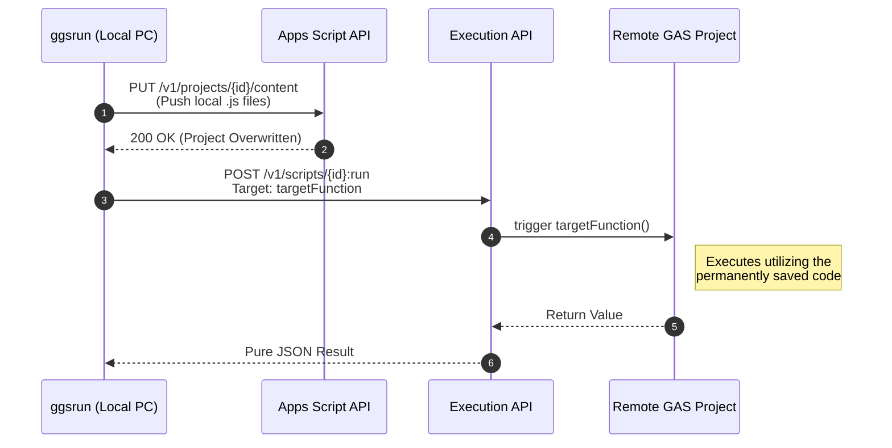
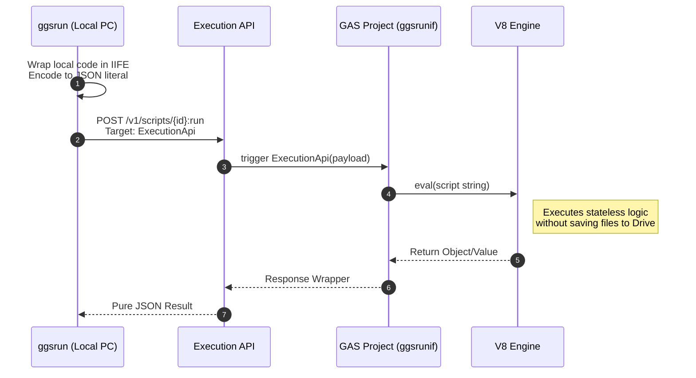
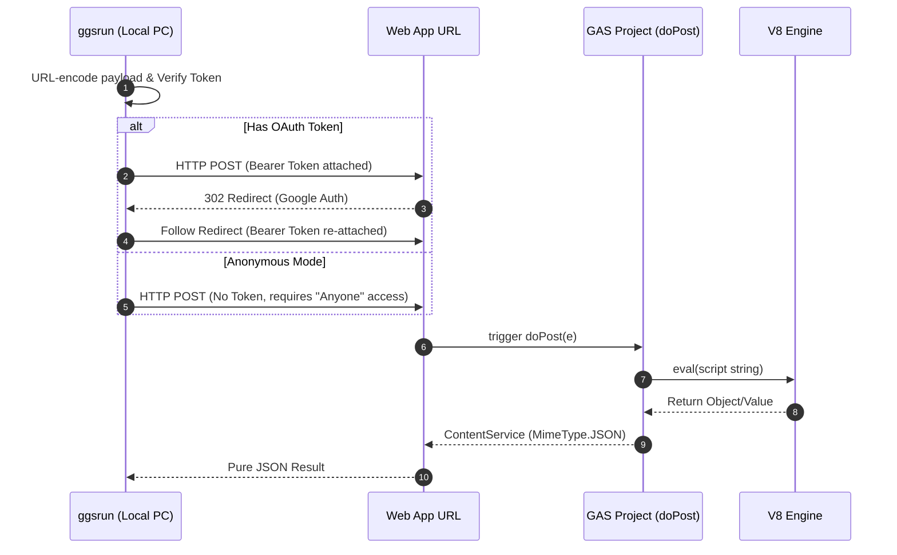

# ggsrun


<a name="top"></a>
[](https://golang.org)
[](https://modelcontextprotocol.io)
[]()
[](LICENCE)

## Table of Contents

- [ggsrun](#ggsrun)
  - [Table of Contents](#table-of-contents)
  - [Overview](#overview)
  - [Features of ggsrun](#features-of-ggsrun)
  - [The 5 Pillars of the v5 Architecture](#the-5-pillars-of-the-v5-architecture)
    - [A. Massively Parallel I/O \& UI](#a-massively-parallel-io--ui)
    - [B. Full Shared Drive (Omni-Drive) Support](#b-full-shared-drive-omni-drive-support)
    - [C. Intelligent GAS \& MIME Resolution](#c-intelligent-gas--mime-resolution)
    - [D. Robust Fault Tolerance \& Auto-Retry](#d-robust-fault-tolerance--auto-retry)
    - [E. MCP (Model Context Protocol) Integration](#e-mcp-model-context-protocol-integration)
  - [Installation \& Setup](#installation--setup)
    - [Beginner's Guide (Dropdown)](#complete-beginners-guide-how-to-install-authenticate-and-execute-google-apps-script-with-ggsrun)
    - [1. Install ggsrun](#1-install-ggsrun)
    - [2. Obtain Google Cloud Credentials](#2-obtain-google-cloud-credentials)
    - [3. Automated Authorization (OAuth2 Loopback)](#3-automated-authorization-oauth2-loopback)
    - [4. Set Up Execution Server (GAS Side)](#4-set-up-execution-server-gas-side)
      - [Step 4.1: Bind the Server Library](#step-41-bind-the-server-library)
      - [Step 4.2: Inject the Gateway Code](#step-42-inject-the-gateway-code)
      - [Step 4.3: Deploy as API Executable (For `exe1` \& `exe2`)](#step-43-deploy-as-api-executable-for-exe1--exe2)
      - [Step 4.4: Deploy as Web App (For `webapps`)](#step-44-deploy-as-web-app-for-webapps)
  - [Command Reference \& Usage](#command-reference--usage)
    - [Authentication \& MCP](#authentication--mcp)
    - [Massively Parallel Download](#massively-parallel-download)
    - [Massively Parallel Upload](#massively-parallel-upload)
  - [Model Context Protocol (MCP) Server \& LLM Integration](#model-context-protocol-mcp-server--llm-integration)
    - [MCP Server Configuration for Antigravity CLI](#mcp-server-configuration-for-antigravity-cli)
    - [1. Exposed Tools](#1-exposed-tools)
    - [2. Standardized JSON Output (TransferResult)](#2-standardized-json-output-transferresult)
    - [3. AI Agent Prompt Scenarios \& Expected Behaviors](#3-ai-agent-prompt-scenarios--expected-behaviors)
  - [Deep Dive: Executing Google Apps Script (exe1, exe2, webapps)](#deep-dive-executing-google-apps-script-exe1-exe2-webapps)
    - [Mode 1: `exe1` (Stateful Project Execution)](#mode-1-exe1-stateful-project-execution)
      - [Architecture Workflow](#architecture-workflow)
    - [Mode 2: `exe2` (Stateless Dynamic Execution)](#mode-2-exe2-stateless-dynamic-execution)
      - [Architecture Workflow](#architecture-workflow-1)
    - [Mode 3: `webapps` (Anonymous OR Secure Endpoint Execution)](#mode-3-webapps-anonymous-or-secure-endpoint-execution)
      - [Architecture Workflow](#architecture-workflow-2)
  - [Advanced Configurations](#advanced-configurations)
    - [Modifying OAuth Scopes](#modifying-oauth-scopes)
  - [Troubleshooting](#troubleshooting)
  - [Licence \& Author](#licence--author)
  - [Update History](#update-history)
    - [ggsrun](#ggsrun-1)
    - [Server](#server)

---

## Overview

**ggsrun** is an enterprise-grade CLI tool and MCP (Model Context Protocol) Server designed to relentlessly orchestrate Google Drive I/O operations and execute Google Apps Script (GAS) natively from a local terminal.

With the release of **v5.2.0**, `ggsrun` transcends its origins as a mere CLI tool. Built on Go 1.26.4+, the execution engine has been entirely rewritten from legacy serial processing into a channel-based, streaming concurrent architecture. It now serves as a high-performance, fault-tolerant I/O backend fully integrated with Omni-Drive (Shared Drives) support, advanced MIME resolution, secure redirect-following Auth logic, and a native **MCP Server Mode** allowing LLM agents to autonomously manage your cloud infrastructure.

---

## Features of ggsrun

1. Develops GAS using your terminal and text editor seamlessly.
2. Executes GAS directly by injecting values into your script dynamically.
3. Downloads files concurrently from Google Drive with stunning progress visualizations.
4. Uploads files concurrently to Google Drive via native Resumable upload wrappers.
5. Downloads standalone scripts and container-bound scripts flawlessly.
6. Recursively downloads all files and folders retaining absolute directory structures.
7. Uploads script files and creates projects as standalone scripts OR container-bound scripts.
8. Manages file and folder permissions across your entire Drive.
9. Searches files in Google Drive utilizing advanced search queries and Regex.
10. Supports both robust OAuth2 looping and Service Accounts natively.

---

## The 5 Pillars of the v5 Architecture

### A. Massively Parallel I/O & UI

Legacy pseudo-asynchronous processing has been eradicated. `ggsrun` now utilizes a channel-based worker pool built on `golang.org/x/sync/errgroup` to maximize network throughput on massive folder trees.

### B. Full Shared Drive (Omni-Drive) Support

The v5 engine forces `supportsAllDrives=true` and `includeItemsFromAllDrives=true` across all Google Drive API permutations. Enterprise users can now execute bulk batch operations targeting deeply nested structures within organizational Shared Drives.

### C. Intelligent GAS & MIME Resolution

The extraction logic dynamically categorizes Google workspace entities. Requests targeting GAS code bypass the standard Drive API and are automatically routed to the Apps Script API, securely landing as structured `.json` locally.

### D. Robust Fault Tolerance & Auto-Retry

The v5 execution phase is strictly non-blocking. HTTP 429 (Rate Limits) and 5xx (Server Errors) trigger a mathematical exponential backoff sequence per-worker, ensuring aggressive self-healing.

### E. MCP (Model Context Protocol) Integration

Running `ggsrun mcp` transforms the application into an autonomous JSON-RPC server via `stdio`. Large Language Model (LLM) agents can natively invoke internal capabilities without requiring any API keys locally.

---

## Installation & Setup

<details>
<summary><b>📖 Click to expand: Complete Beginner's Guide (Step-by-Step Installation, Auth & GAS/Web Apps Execution)</b></summary>

# Complete Beginner's Guide: How to Install, Authenticate, and Execute Google Apps Script with ggsrun

This beginner-friendly, step-by-step guide will walk you through installing **ggsrun**, configuring your Google Cloud environment, deploying your script, and executing your Google Apps Script (GAS) or Web App directly from your local computer. No advanced programming experience required.

---

## Step 1: Install ggsrun on Your Computer

`ggsrun` is a lightweight application that runs through your terminal (Command Prompt or PowerShell on Windows, or Terminal on macOS/Linux). You do not need to install complex development environments; you can simply download a ready-to-use version.

### For Windows Users

1. Go to the official [ggsrun Releases Page](https://github.com/tanaikech/ggsrun/releases).
2. Download the file named `ggsrun_windows_amd64.exe` (or `arm64` if you are using an ARM-based Windows device like a Surface Pro).
3. Rename the downloaded file to simply `ggsrun.exe`.
4. Move this file into a dedicated folder where you want to work (for example, create a new folder on your Desktop named `ggsrun-workspace`).

### For macOS & Linux Users

1. Go to the official [ggsrun Releases Page](https://github.com/tanaikech/ggsrun/releases).
2. Download the appropriate binary for your system:
   * **macOS (Intel):** `ggsrun_darwin_amd64`
   * **macOS (Apple Silicon M1/M2/M3):** `ggsrun_darwin_arm64`
   * **Linux:** `ggsrun_linux_amd64` (or matching CPU architecture)
3. Rename the downloaded file to simply `ggsrun`.
4. Move the file to your working folder (e.g., a folder on your Desktop named `ggsrun-workspace`).
5. Open your Terminal, navigate to your working folder, and grant execution permissions to the binary:
   ```bash
   cd ~/Desktop/ggsrun-workspace
   chmod +x ggsrun
   ```

---

## Step 2: Configure Your Google Cloud Project (Critical Setup)

To allow `ggsrun` to securely communicate with your Google account, you must create a private connection keyset inside the Google Cloud Console.

### 2.1 Create a New Project
1. Open your browser and navigate to the [Google Cloud Console](https://console.cloud.google.com/).
2. Log in with the same Google/Gmail account you use for Google Apps Script.
3. Click the project dropdown menu at the top left corner of the screen and select **New Project**.
4. Give your project an easy-to-remember name (e.g., `My-ggsrun-Project`) and click **Create**. Ensure this newly created project is selected in the top dropdown menu before moving forward.

### 2.2 Enable the Required Google APIs
1. In the search bar at the top, search for **Google Drive API** and click on it from the results.
2. Click the blue **Enable** button.
3. Next, search for **Google Apps Script API** in the top search bar, click on it, and click **Enable**.

### 2.3 Configure the OAuth Consent Screen
Google requires you to set up an authorization screen that pops up when you link your account.
1. Click the **Navigation Menu** (the three horizontal lines at the top-left) and navigate to **APIs & Services > OAuth consent screen**.
2. Select **User Type**:
   * If you use a regular `@gmail.com` account, choose **External** and click **Create**.
   * If you use a Google Workspace business/school account, you can choose **Internal** (which simplifies the process).
3. Fill out the required App Information fields:
   * **App name**: `ggsrun Client`
   * **User support email**: Select your own Gmail address.
   * **Developer contact information**: Enter your own Gmail address again.
4. Click **Save and Continue**. Skip the "Scopes" page by clicking **Save and Continue** again.
5. **CRITICAL STEP (For External Type):** On the **Test users** page, click **+ ADD USERS**. Type your exact Gmail address and click **Add / Save**. 
   > ⚠️ **Warning:** If you skip adding your email as a test user, Google will block you with an `Error 400: invalid_scope` later during the authorization process.
6. Click **Save and Continue** to finish.

### 2.4 Download Your Security Credentials
1. In the left-hand sidebar, click **Credentials**.
2. Click the **+ CREATE CREDENTIALS** button at the top and select **OAuth client ID**.
3. Under **Application type**, select **Desktop app**.
4. In the **Name** field, type `ggsrun Desktop Client`. Click **Create**.
5. A popup window will show your Client ID and Client Secret. Click **OK**.
6. Look at the list under "OAuth 2.0 Client IDs". Click the **Download icon** (a down arrow pointing into a tray) on the far right side of your newly created credentials.
7. A file with a long name ending in `.json` will download. 
8. Move this downloaded file directly into your working folder (`ggsrun-workspace`).
9. **Rename the file to exactly:** `client_secret.json`

---

## Step 3: Link Your Google Cloud Project to Google Apps Script

Now, you must tell your Google Apps Script project to use the specific cloud credentials you just generated.

### 3.1 Get Your Project Number
1. Return to your [Google Cloud Console](https://console.cloud.google.com/).
2. Click on the **Dashboard** or **Welcome** page of your project.
3. Look for the **Project Info** card. Copy the **Project number** (this is a long string of numbers, e.g., `123456789012`). Do not copy the Project ID text; you specifically need the numerical number.

### 3.2 Change the Project in the Google Apps Script Editor
1. Go to the [Google Apps Script Dashboard](https://script.google.com/) and open the specific script project you wish to run, or create a **New Project**.
2. On the left sidebar of the modern GAS editor, click the gear icon (**Project Settings**).
3. Scroll down to the section titled **Google Cloud Platform (GCP) Project**.
4. Click the **Change project** button.
5. Paste the **Project number** you copied in the previous step into the text box.
6. Click **Set project**. Your Apps Script project is now linked with your cloud infrastructure.

---

## Step 4: Perform the Automated Authorization

1. Open your terminal application and change your directory to your working folder where `ggsrun` and `client_secret.json` are placed:
   * **Windows Command Prompt:** `cd %USERPROFILE%\Desktop\ggsrun-workspace`
   * **macOS/Linux Terminal:** `cd ~/Desktop/ggsrun-workspace`
2. Run the authentication command:
   * **Windows:** `ggsrun auth`
   * **macOS/Linux:** `./ggsrun auth`
3. `ggsrun` will automatically open your default web browser and present a standard Google login page.
4. Select your Google account. You may see a safety warning screen stating *"Google hasn't verified this app"*. Since this is your own private project, click **Advanced** and then click **Go to ggsrun Client (unsafe)** to proceed.
5. Click **Allow** to grant permission.
6. The browser will display a success message saying authentication is complete. You can close the browser window.
7. **Configure Default Values (Highly Recommended):** In the terminal, the latest version of `ggsrun` will prompt you to enter your **Google Apps Script Project Script ID** and your **Web Apps URL** (optional). 
   * Entering these now saves them in `ggsrun.cfg`, allowing you to run execution commands later without passing the `-i` or `-u` options every time!
   * A file named `ggsrun.cfg` is automatically generated in your folder; this stores your login session and configurations securely.

---

## Step 5: Set Up the Execution Server on Google Apps Script

To let `ggsrun` securely trigger your scripts remotely (necessary for stateless `exe2` and `webapps` modes), you must add a small gateway wrapper inside your Google Apps Script.

### 5.1 Add the Shared Server Library

1. Inside your Google Apps Script editor, look at the left sidebar and click the `+` icon next to **Libraries**.
2. Paste the following official `ggsrunif` Library ID into the box:
   ```text
   115-19njNHlbT-NI0hMPDnVO1sdrw2tJKCAJgOTIAPbi_jq3tOo4lVRov
   ```
3. Click **Look up**. Select the **latest version** from the dropdown menu, keep the Identifier named exactly as `ggsrunif`, and click **Add**.

### 5.2 Add the Gateway Code
Open your `Code.gs` file in the script editor and replace the default code with the following wrapper endpoints (for both `exe2` and `webapps` modes):

```javascript
const doPost = (e) => ggsrunif.WebApps(e, "pass1");
const ExecutionApi = (e) => ggsrunif.ExecutionApi(e);
```
*(Note: Change `"pass1"` to a secure custom password if you plan to execute webapps anonymously).*

### 5.3 Deploy the Script as an API Executable (For `exe1` & `exe2`)

1. At the top-right corner of the editor, click **Deploy > New Deployment**.
2. Click the gear icon next to "Select type" and choose **API Executable**.
3. In the description, type `ggsrun API Engine`.
4. In the **Who has access** dropdown, select **Only myself** (this keeps your automation completely private and secure).
5. Click **Deploy**.
6. Copy the **Script ID** (a long string of alphanumeric characters) displayed on this screen.

### 5.4 Deploy the Script as a Web App (For `webapps`)

1. At the top-right corner of the editor, click **Deploy > New Deployment**.
2. Click the gear icon next to "Select type" and choose **Web app**.
3. In the description, type `ggsrun Web Engine`.
4. Set **Execute as** to **Me** (your email address).
5. Set **Who has access** to:
   * **Only myself**: Highly recommended for secure execution. This requires the `ggsrun` CLI to be authenticated via `ggsrun auth` with Drive scopes enabled.
   * **Anyone**: Select this if you need to trigger the webapp anonymously from a CI/CD pipeline without a token. (Access is secured by the password flag `-p`).
6. Click **Deploy**.
7. Copy the generated **Web app URL** (e.g., `https://script.google.com/macros/s/[WEB_APP_ID]/exec`).

---

## Step 6: Test Execution from Your Computer

Let's test everything to ensure your computer can run scripts inside your Google Account successfully.

1. Create a simple text file on your local computer inside your working folder (`ggsrun-workspace`) and name it `test_script.js`.
2. Open it with any text editor (Notepad, VS Code, etc.) and paste the following simple test code inside:
   ```javascript
   function main(message) {
     return "Success! Received local message: " + message;
   }
   ```
3. Open your terminal window in your working folder (`cd ~/Desktop/ggsrun-workspace` or your Windows path).
4. Run the test commands below:

### Test Option A: Execution via API Executable (`exe2` mode)
Run the script using `ggsrun exe2`. Replace `[YOUR_SCRIPT_ID]` with the Script ID you copied during Step 5.3 (or omit the `-i` flag if you saved the Script ID in `ggsrun.cfg` during authentication):

* **Windows Command Prompt:**
  ```cmd
  ggsrun exe2 -i "[YOUR_SCRIPT_ID]" -f ExecutionApi -s test_script.js -v "Hello Google Apps Script!" -j
  ```
* **macOS/Linux Terminal:**
  ```bash
  ./ggsrun exe2 -i "[YOUR_SCRIPT_ID]" -f ExecutionApi -s test_script.js -v "Hello Google Apps Script!" -j
  ```

### Test Option B: Execution via Web App (`webapps` mode)
Run the script using `ggsrun webapps`. Replace `[YOUR_WEB_APP_URL]` with the Web App URL you copied during Step 5.4 (or omit the `-u` flag if you saved the Web App URL in `ggsrun.cfg` during authentication):

* **Windows Command Prompt:**
  ```cmd
  ggsrun webapps -u "[YOUR_WEB_APP_URL]" -p pass1 -s test_script.js -v "Hello Google Apps Script!" -j
  ```
* **macOS/Linux Terminal:**
  ```bash
  ./ggsrun webapps -u "[YOUR_WEB_APP_URL]" -p pass1 -s test_script.js -v "Hello Google Apps Script!" -j
  ```

### Expected Output
In both cases, `ggsrun` will securely upload the script payload, run it in the Google Cloud environment, and output a clean JSON result directly to your terminal showing the return string:
`"Success! Received local message: Hello Google Apps Script!"`. Your local workspace automation is completely operational!

</details>

### 1. Install ggsrun

#### Using Go

Requires Go 1.26.4 or higher. Pull and compile the latest binary natively:

```bash
$ go install github.com/tanaikech/ggsrun@latest
```

#### Downloading Pre-built Binaries

Alternatively, you can download pre-built binaries directly from the [Releases page](https://github.com/tanaikech/ggsrun/releases).

The following compiled binaries are available:

* **macOS (Darwin)**
  * `ggsrun_darwin_amd64`
  * `ggsrun_darwin_arm64`
* **Linux**
  * `ggsrun_linux_386`
  * `ggsrun_linux_amd64`
  * `ggsrun_linux_arm64`
  * `ggsrun_linux_arm7`
  * `ggsrun_linux_mips`
  * `ggsrun_linux_mipsle`
* **FreeBSD**
  * `ggsrun_freebsd_amd64`
  * `ggsrun_freebsd_arm64`
* **Windows**
  * `ggsrun_windows_386.exe`
  * `ggsrun_windows_amd64.exe`
  * `ggsrun_windows_arm64.exe`

### 2. Obtain Google Cloud Credentials

1. Access the [Google Cloud Console](https://console.cloud.google.com/).
2. Create a new Project.
3. Navigate to **APIs & Services > Library**. Enable both the **Google Drive API** and **Google Apps Script API**.
4. Configure the **OAuth consent screen** (External/Internal).
5. Navigate to **Credentials > Create Credentials > OAuth client ID**. Select **Desktop app**.
6. Download the resulting JSON file, move it to your working directory, and rigorously rename it to exactly `client_secret.json`.

### 3. Automated Authorization (OAuth2 Loopback)

With your `client_secret.json` in the current directory, execute:

```bash
$ ggsrun auth
```

`ggsrun` spins up a secure local loopback listener. Your default browser will launch, request authorization, and securely hand the token back to the CLI. A persistent `ggsrun.cfg` file is generated.

### 4. Set Up Execution Server (GAS Side)

To execute arbitrary GAS functions locally without permanent deployments (`exe2` and `webapps` modes), you must establish a gateway endpoint on Google Apps Script using the `ggsrunif` library.

#### Step 4.1: Bind the Server Library

1. Navigate to the [Google Apps Script Dashboard](https://script.google.com/) and create a **New Project**.
2. Click the `+` icon next to **Libraries**.
3. Input the Target Script ID: `115-19njNHlbT-NI0hMPDnVO1sdrw2tJKCAJgOTIAPbi_jq3tOo4lVRov`.
4. Set the **Identifier** to `ggsrunif` and select the **latest version**.

#### Step 4.2: Inject the Gateway Code

Replace the default code in `Code.gs` with the following ultra-lightweight wrappers.

```javascript
const doPost = (e) => ggsrunif.WebApps(e, "pass1");
const ExecutionApi = (e) => ggsrunif.ExecutionApi(e);
```

_(Note: Change `"pass1"` to a secure custom password if you plan to execute webapps anonymously)._

#### Step 4.3: Deploy as API Executable (For `exe1` & `exe2`)

1. Click **Deploy** > **New Deployment**.
2. Choose **API Executable**.
3. Set **Who has access** strictly to **Only myself**.
4. Click **Deploy**. Copy the **Script ID** for the `-i` flag.

#### Step 4.4: Deploy as Web App (For `webapps`)

1. Click **Deploy** > **New Deployment**.
2. Choose **Web app**.
3. Set **Execute as** to **Me**.
4. Set **Who has access** to **Only myself**.
   _(Note: This highly secure setting requires the `ggsrun` CLI to be authenticated via `ggsrun auth` with Drive scopes enabled. If you need to trigger the webapp anonymously from a CI/CD pipeline without a token, set access to **Anyone** and rely on the `-p` password flag)._
5. Click **Deploy**. Copy the generated **Web app URL** for the `-u` flag.

---

## Command Reference & Usage

### Authentication & MCP

| Command           | Action                                                                                         |
| :---------------- | :--------------------------------------------------------------------------------------------- |
| `$ ggsrun auth`   | Initiates the secure OAuth2 loopback flow. Use `--port` to change the binding port.            |
| `$ ggsrun status` | Health diagnostic tool to verify the validity and expiration of your current Access Token.     |
| `$ ggsrun mcp`    | Starts the stdio-bound MCP Server. Listens for tools like `searchfiles`, `download`, `upload`. |

### Massively Parallel Download

Target IDs can belong to Standard Drives, Shared Drives, or Team Drives seamlessly. `ggsrun` natively handles the recursive mapping of folders and parallel byte-streaming.

| Command                                                 | Action                                                                                              |
| :------------------------------------------------------ | :-------------------------------------------------------------------------------------------------- |
| `$ ggsrun download -i "FILE_ID1, FILE_ID2" -w 5`        | Downloads specific files utilizing 5 parallel channel workers.                                      |
| `$ ggsrun download -i "FOLDER_ID" -w 10`                | Recursively maps and downloads an entire folder tree concurrently.                                  |
| `$ ggsrun download -i "SPREADSHEET_ID" -e xlsx`         | Directs the Drive API to transpile and export a native Google Sheet into an `.xlsx` binary.         |
| `$ ggsrun download -i "DOCUMENT_ID" -e md`              | Directs the Drive API to transpile and export a Google Doc into a Markdown (`.md`) file.             |
| `$ ggsrun download -i "DOCUMENT_ID" -e pdf`              | Directs the Drive API to transpile and export a Google Doc into a PDF (`.pdf`) file.                 |
| `$ ggsrun download -i "FOLDER_ID" -m "application/pdf"` | Recursively downloads a folder, but filters specifically to retrieve only PDF files.                |
| `$ ggsrun download -i "SCRIPT_ID" -z`                   | Downloads an entire GAS project, bundles all `.js`/`.html` files, and saves it as a `.zip` archive. |
| `$ ggsrun download -i "SCRIPT_ID" -r`                   | Downloads a GAS project natively as raw `.json` payload.                                            |
| `$ ggsrun download -i "FOLDER_ID" -cm update`            | Recursively downloads a folder, updating only files that are newer on Drive.                        |
| `$ ggsrun download -i "FOLDER_ID" -d "./downloads"`    | Recursively downloads a folder, saving all files inside the `./downloads` directory (created automatically). |

> [!NOTE]
> When downloading a folder concurrently, specified export extensions via `-e` are dynamically validated against each file's native format. For example, if you download a folder with `-e xlsx`, Sheets inside the folder will convert to `.xlsx` files while unsupported files (like Slides or Docs) will print a warning and skip, allowing the queue to continue without failure.

### Massively Parallel Upload

Pushes local hierarchical structures to Google Drive asynchronously. Resumable chunked uploads are inherently supported for massive binaries (default chunk size: 100MB).

| Command                                                                      | Action                                                                                                              |
| :--------------------------------------------------------------------------- | :------------------------------------------------------------------------------------------------------------------ |
| `$ ggsrun upload -f "a.txt, b.txt" -p "FOLDER_ID"`                           | Uploads multiple individual files sequentially or concurrently.                                                     |
| `$ ggsrun upload -f "/path/to/folder" -p "FOLDER_ID" -w 5`                   | Uploads a local directory recursively, mimicking the exact file tree on Google Drive.                               |
| `$ ggsrun upload -f "script.js" --projectname "MyAPI"`                       | Uploads a local file and provisions it as a brand new Standalone GAS Project.                                       |
| `$ ggsrun upload -f "script.js" -pid "SHEET_ID" --projecttype "spreadsheet"` | Uploads a script and provisions it as a **Container-Bound Script** directly attached to the specified Google Sheet. |
| `$ ggsrun upload -f "data.csv" -c "sheet"`                                   | Uploads a CSV file and automatically commands Google Drive to convert it into a native Google Spreadsheet.          |
| `$ ggsrun upload -f "document.docx" -c "doc"`                                | Uploads a Word document and converts it to a native Google Doc.                                                     |
| `$ ggsrun upload -f "slides.pptx" -c "slide"`                                | Uploads a PowerPoint presentation and converts it to a native Google Slide.                                         |
| `$ ggsrun upload -f "large_file.mp4" --chunksize 250`                        | Accelerates massive file transfers by increasing the Resumable Upload chunk size to 250MB.                          |
| `$ ggsrun upload -f "/path/to/folder" -p "FOLDER_ID" -cm rename`             | Uploads a directory, appending timestamps to any conflicting filenames on Drive.                                    |

> [!NOTE]
> Recursive folder uploads natively support batch conversion. When specifying `-c` (or `--convertto`), every eligible file within the uploaded folder tree is evaluated and converted to the target Workspace format concurrently. Files that cannot be converted will log a conversion error warning and skip, leaving other files in the queue unaffected.

### Conflict Resolution Mode

Both `download` and `upload` commands support the `--conflict-mode` (or `-cm`) flag to handle collisions when files already exist in the target destination.

If not specified, `ggsrun` will default to an **interactive CLI prompt** allowing you to dynamically select the resolution per collision.

| Conflict Mode | Behavior (Download) | Behavior (Upload) |
| :--- | :--- | :--- |
| `skip` | Skips downloading the file if it already exists locally. | Skips uploading the file if it already exists on Google Drive. |
| `overwrite` | Overwrites the local file. | Overwrites the remote file on Google Drive (triggers a `PATCH` request). |
| `rename` | Appends a timestamp (`_YYYYMMDD_HHMMSS`) to the filename locally. | Appends a timestamp (`_YYYYMMDD_HHMMSS`) to the filename on Google Drive. |
| `update` | Downloads only if the remote file is newer than the local file. | Uploads/updates only if the local file is newer than the remote file. |

> [!NOTE]
> The legacy `--overwrite` (`-o`) and `--skip` (`-s`) flags in `download` are deprecated. Please migrate to `--conflict-mode`.
> For massive concurrent uploads, metadata queries are pre-fetched in bulk to bypass Google Drive API rate limits.
> Naming collisions on directories/folders do not trigger prompts. They are silently reused, applying file-level conflict resolution strictly to the items within.
> When `-j` (`--jsonparser`) is active, TUI logs and progress bars are fully muted and interactive prompts are bypassed, defaulting to `OverwriteIfNewer` unless overriden by `--cm`/`--conflict-mode`.

---

## Model Context Protocol (MCP) Server & LLM Integration

Running `$ ggsrun mcp` transforms `ggsrun` into a native **Model Context Protocol (MCP) Server**, communicating with LLM clients (such as Claude Desktop, Cursor, or specialized AI agents) over standard I/O (`stdin`/`stdout`). 

With the release of **v5.1.1**, the MCP capabilities are enhanced to fully expose modern conflict resolution and deliver deeply structured JSON results.

### MCP Server Configuration for Antigravity CLI

To configure `ggsrun` as an MCP server inside your **Antigravity CLI** environment, specify the server details in your global config file at `~/.gemini/config/mcp_config.json`.

Add the following JSON configuration snippet, ensuring that the `command` value points to your exact local `ggsrun` executable path:

```json
{
  "mcpServers": {
    "ggsrun-drive-agent": {
      "command": "/path/to/ggsrun",
      "args": ["mcp"]
    }
  }
}
```

### 1. Exposed Tools
The MCP server exposes the following high-level tools to your AI agent:
- `searchfiles`: Search Google Drive files using standard Google Drive API v3 queries (e.g., `name='target' and trashed=false`). Supports optional regex filename filtering.
- `download`: Download files or folders by File ID. Includes a `--conflict-mode` option to handle name collisions, and supports custom local filename mapping.
- `upload`: Upload a local file or recursive folder to a Google Drive location. Includes a `--conflict-mode` option and `--projectname` for GAS scripts.
- `exe1`: Stateful execution of Google Apps Script projects. Now supports passing local script sources (`scriptfile` or `stringscript`), executing target entry functions, and automatically resolves `scriptid` from the local configuration file `ggsrun.cfg` as a fallback.
- `filelist`: Exact name or ID search for files, returning Google Drive File details and names.

### 2. Standardized JSON Output (`TransferResult`)
When executing transfer operations (uploads/downloads), `ggsrun` outputs a standardized JSON payload structure named `TransferResult`. This allows your AI agent to reliably parse the result, extract metadata, and identify multi-turn actions like conflict resolution.

**Example `TransferResult` JSON structure:**
```json
{
  "message": [
    "Upload processed successfully."
  ],
  "files": [
    {
      "name": "file_2.txt",
      "fileId": "1a2b3c4d5e6f7g8h9i0j",
      "mimeType": "text/plain",
      "url": "https://drive.google.com/file/d/1a2b3c4d5e6f7g8h9i0j/view",
      "size": 1024,
      "localPath": "/local/path/file_2.txt",
      "status": "uploaded"
    }
  ],
  "pendingConflicts": [
    {
      "name": "file_1.txt",
      "mimeType": "text/plain",
      "size": 2048,
      "localPath": "/local/path/file_1.txt",
      "status": "pending_conflict"
    }
  ],
  "actionRequired": "Conflicts detected. Please invoke upload again with a conflict-mode: 'skip', 'overwrite', 'rename', or 'update' for the pending files."
}
```

### Manual Testing of the MCP Server

You can manually test the MCP server configuration and schemas directly on your command line by piping JSON-RPC payloads into the standard input of `ggsrun mcp`.

**1. Test MCP Server Initialization**
```bash
$ echo '{"jsonrpc": "2.0", "method": "initialize", "id": 1}' | ggsrun mcp
```

**2. List All Available Tools and Schemas**
```bash
$ echo '{"jsonrpc": "2.0", "method": "tools/list", "id": 2}' | ggsrun mcp
```

**3. Test Drive Search (`searchfiles` tool)**
```bash
$ echo '{"jsonrpc": "2.0", "method": "tools/call", "params": {"name": "searchfiles", "arguments": {"query": "name = '\''test_script.gs'\'' and trashed = false"}}, "id": 3}' | ggsrun mcp
```

**4. Test Stateful GAS Script Execution (`exe1` tool)**
This invokes the `main` function using the local configuration fallback for `scriptid`:
```bash
$ echo '{"jsonrpc": "2.0", "method": "tools/call", "params": {"name": "exe1", "arguments": {"scriptfile": "./my_script.js", "function": "main"}}, "id": 4}' | ggsrun mcp
```

### 3. AI Agent Prompt Scenarios & Expected Behaviors

To help your AI agent interact effectively with the `ggsrun` MCP server, use the following standardized and optimized prompts.

#### Scenario A: Batch Upload with Interactive Conflict Resolution
Test how the AI coordinates partial execution and handles unexpected collisions when some files already exist in Google Drive while others do not.

* **Setup:** Ensure `file_1.txt` already exists on your Google Drive, while `file_2.txt` is a brand-new local file.
* **Agent Prompt:**
  > "Please upload `file_1.txt` and `file_2.txt` to Google Drive using the `upload` tool. Do not specify the conflict mode initially. If there are pending conflicts, ask me how to resolve them."
* **Expected Interaction Flow:**
  1. The AI invokes the `upload` tool for both files without passing the `--conflict-mode` argument.
  2. The `ggsrun` backend uploads `file_2.txt` successfully and populates it in the `files` array, but registers `file_1.txt` under `pendingConflicts` with `"status": "pending_conflict"`.
  3. The AI parses the `TransferResult` and successfully reports: *"I have uploaded `file_2.txt` (ID: ...). However, `file_1.txt` already exists. Would you like to skip, overwrite, rename, or update it?"*
  4. You reply: *"Please overwrite it."*
  5. The AI intelligently invokes the `upload` tool specifically for `file_1.txt` with `conflict-mode` set to `"overwrite"`.

#### Scenario B: Granular Metadata Extraction and Parsing
Test if the AI can retrieve full file metadata from `TransferResult` and report specific file properties precisely.

* **Agent Prompt:**
  > "Please download the file with ID `[YOUR_FILE_ID]` from Google Drive. Tell me exactly where it was saved (`localPath`) and its `size` from the result."
* **Expected Interaction Flow:**
  1. The AI invokes the `download` tool passing the target file ID.
  2. `ggsrun` performs the parallel download and returns a standardized JSON structure containing the file array.
  3. The AI successfully parses the `files` array in `TransferResult` and replies to you with clear, accurate metadata: *"The file has been saved to `[localPath]` and its size is `[size]` bytes."*

### 4. Sample Prompts to Give to Your AI Agent

You can use the following sample prompts to instruct an AI Agent (e.g. Claude Desktop, Cursor, or Gemini Agent) connected to your `ggsrun` MCP server:

* **Find and download a script file by name:**
  > "Please search my Google Drive for a file named 'backup_utility.js'. If you find it, download it to my local workspace and let me know the path where you saved it."
* **Run a local GAS script on Google Drive statefully:**
  > "Upload the local script file `./main.gs` to my Google Apps Script project (Script ID is `1IRpZ4Hu...`) and execute the `main` function. Please return the output payload."
* **Search files with Drive API v3 queries:**
  > "Search for folders modified within the last 7 days that do not contain 'archive' in their name. Give me a list of their names and IDs."
* **Upload local files and handle conflicts dynamically:**
  > "Upload the local file `./data/report_2026.csv` to the Drive folder `1a2b3c...`. If a file with the same name already exists in that folder, ask me whether to overwrite, skip, or rename it, and then proceed with my choice."

---

## Deep Dive: Executing Google Apps Script (exe1, exe2, webapps)

### Mode 1: `exe1` (Stateful Project Execution)

`exe1` relies on the Apps Script API to permanently upload (sync) your local `.js/.gs` file to the remote GAS project, and then invokes a specific function via the Execution API.

**When to use:** You want to permanently update the code on the cloud and run it. Requires an OAuth Token.

**Step-by-Step:**

1. Create a local script `sample.gs`:
   ```javascript
   function targetFunction(data) {
     return "Processed data: " + data;
   }
   ```
2. Execute the CLI:
   ```bash
   $ ggsrun exe1 -i [YOUR_SCRIPT_ID] -s sample.gs -f targetFunction -v "Hello World"
   ```

#### Architecture Workflow


```mermaid
sequenceDiagram
    autonumber
    participant CLI as ggsrun (Local PC)
    participant AAPI as Apps Script API
    participant EAPI as Execution API
    participant GAS as Remote GAS Project

    CLI->>AAPI: PUT /v1/projects/{id}/content<br>(Push local .js files)
    AAPI-->>CLI: 200 OK (Project Overwritten)
    CLI->>EAPI: POST /v1/scripts/{id}:run<br>Target: targetFunction
    EAPI->>GAS: trigger targetFunction()
    Note right of GAS: Executes utilizing the<br>permanently saved code
    GAS-->>EAPI: Return Value
    EAPI-->>CLI: Pure JSON Result
```

### Mode 2: `exe2` (Stateless Dynamic Execution)

`exe2` is the pinnacle of dynamic execution. It **does not modify or update** your remote GAS project files. Instead, it reads your local script, heavily sanitizes it into a secure JSON-encoded string, and transmits it as a payload to the `ExecutionApi` wrapper.

**When to use:** Rapid local prototyping and executing complex data-extraction algorithms on the cloud without polluting the production GAS project's codebase. Requires an OAuth Token.

**Step-by-Step:**

1. Create a local script `compute.js`. **The local entry point must be `main()`**:
   ```javascript
   function main(multiplier) {
     return multiplier * 10;
   }
   ```
2. Execute the CLI:
   ```bash
   $ ggsrun exe2 -i [YOUR_SCRIPT_ID] -f ExecutionApi -s compute.js -v 5 -j
   ```

#### Architecture Workflow


```mermaid
sequenceDiagram
    autonumber
    participant CLI as ggsrun (Local PC)
    participant API as Execution API
    participant GAS as GAS Project (ggsrunif)
    participant V8 as V8 Engine

    CLI->>CLI: Wrap local code in IIFE<br>Encode to JSON literal
    CLI->>API: POST /v1/scripts/{id}:run<br>Target: ExecutionApi
    API->>GAS: trigger ExecutionApi(payload)
    GAS->>V8: eval(script string)
    Note right of V8: Executes stateless logic<br>without saving files to Drive
    V8-->>GAS: Return Object/Value
    GAS-->>API: Response Wrapper
    API-->>CLI: Pure JSON Result
```

### Mode 3: `webapps` (Anonymous OR Secure Endpoint Execution)

`webapps` functions similarly to `exe2` (stateless dynamic evaluation) but bypasses the Google Execution API entirely. Instead, it routes the payload through a standard HTTP POST request to a deployed Google Web App URL.

**When to use:**

- **Secure Mode:** You want to execute arbitrary scripts natively on a highly-secured ("Only myself") endpoint utilizing the `drive` scope OAuth token.
- **Anonymous Mode:** You need to execute GAS scripts from a remote CI/CD pipeline **without deploying an OAuth token**. (Requires the Web App to be deployed as "Anyone" and utilizes the `-p` password flag).

**Step-by-Step:**

1. Create your local logic script `report.js` (entry point `main()`).
2. Execute the CLI:
   ```bash
   $ ggsrun webapps -u "https://script.google.com/macros/s/[WEB_APP_ID]/exec" -p pass1 -s report.js -j
   ```
   _(Note: If `ggsrun auth` has been executed locally, the CLI automatically detects the token, bypasses the `-p` requirement, and securely traverses Google's 302 redirects to execute the code. The `-j` JSON output will include `tokenAuthUsed: true`.)_

#### Architecture Workflow


```mermaid
sequenceDiagram
    autonumber
    participant CLI as ggsrun (Local PC)
    participant URL as Web App URL
    participant GAS as GAS Project (doPost)
    participant V8 as V8 Engine

    CLI->>CLI: URL-encode payload & Verify Token
    alt Has OAuth Token
        CLI->>URL: HTTP POST (Bearer Token attached)
        URL-->>CLI: 302 Redirect (Google Auth)
        CLI->>URL: Follow Redirect (Bearer Token re-attached)
    else Anonymous Mode
        CLI->>URL: HTTP POST (No Token, requires "Anyone" access)
    end

    URL->>GAS: trigger doPost(e)
    GAS->>V8: eval(script string)
    V8-->>GAS: Return Object/Value
    GAS-->>URL: ContentService (MimeType.JSON)
    URL-->>CLI: Pure JSON Result
```

### Verification & Diagnostics

To quickly verify the functionality of all execution modes using a stateless beacon request, you can run the following test commands:

```bash
ggsrun e1 -ss "const main = (_) => ggsrunif.Beacon();" -j
ggsrun e2 -ss "const main = (_) => ggsrunif.Beacon();" -j
ggsrun w -ss "const main = (_) => ggsrunif.Beacon();" -j
```

---

## Advanced Configurations

### Modifying OAuth Scopes

By default, `ggsrun` requests all necessary scopes for Drive and GAS execution. If you need to inject custom scopes or trim existing ones:

1. Open the `ggsrun.cfg` file generated in your working directory.
2. Locate the `"scopes": [ ... ]` JSON array.
3. Add or remove your desired Google API scopes.
4. Save the file and simply run `$ ggsrun auth` again.
   The CLI will automatically re-read your modified configuration, launch the browser, and provision a new token with your exact custom scopes.

---

## Troubleshooting

**1. Web Apps Returns Status Code 200, but output is HTML**
If you set your Web App to "Only myself" but the CLI returns a parsing error with HTML, it means your `ggsrun` lacks the proper OAuth token. Run `ggsrun auth` to generate a token with the `drive` scope, which the CLI will automatically use to authenticate the Web App request across the Google 302 Redirects.

**2. "Requested entity was not found" or 404 Errors**
If utilizing GAS execution (`e1` / `e2`), verify the target project is currently deployed as an **API Executable** on the latest version. Un-deployed or draft states cannot be invoked externally.

**3. Headless Server Authentication**
If `ggsrun auth` detects a headless Linux environment (where it cannot spawn a local browser loopback), it elegantly degrades into manual mode. It prints the URL; copy it into an external browser, authorize, and paste the code block back into standard input.

---

## Licence & Author

**Licence:** [MIT](LICENCE)

**Author:** [Tanaike](https://tanaikech.github.io/about/)  
For architectural questions, advanced enterprise integrations, or bug disclosures, contact: tanaike@hotmail.com

---

## Update History

### ggsrun

- **v5.2.4 (June 2026) - Latest MIME Type Formats, CLI Option Help Details, Concurrent Conversion Overhaul, and Destination Directory Support**
  Updated internal MIME type mapping definitions (`googlemimetypes.go`) to synchronize with the latest Google Drive API `importFormats`/`exportFormats`. Revamped the CLI options help display for `--extension` (download/revision) and `--convertto` (upload) to explicitly list all supported formats. Overhauled the concurrent upload/download engines to handle `--convertto` / `--noconvert` directly in parallel streams without falling back to the legacy single-threaded uploader, adding validation capability checks and graceful error warning feedback. Added `--destination` (`-d`) option to the `download` and `revision` commands to allow specifying the target local directory for saving downloaded files.
- **v5.2.3 (June 2026) - Directory Reuse Conflict Resolution, Output Control, and CLI/MCP Alignment**
  Upgraded the directory upload conflict resolution mechanism to silently and recursively reuse existing remote folders without prompting. Aligned the `--conflict-mode` behavior for `-j` / `--jsonparser` CLI runs to match the automated MCP mode (defaulting to `OverwriteIfNewer`, overridable via `--cm`). Muted TUI output and progress bars (`mpb`) when running with the `-j` option to return clean JSON. Supported `--cm` as a shorthand alias for `--conflict-mode` in file transfers.
- **v5.2.2 (June 2026) - MCP Help Display Expansion, Safety Review Prompt, Dual-Mode Conflict Engine, and File-Level Error Feedback**
  Expanded `ggsrun mcp -h` (and `--help`) to display all exposed MCP tool names and their detailed description outputs directly. Implemented strict programmatic safety review prompts inside the `exe1` MCP tool description, instructing LLMs to statically analyze Apps Script payloads for API mutations (write/update/delete) and obtain user Y/N confirmations before running, while allowing read-only scripts to run automatically. Re-designed the conflict resolution engine into a dual-mode system: automated and non-interactive for MCP server sessions (defaulting to `OverwriteIfNewer`, with options for `Ignore` and `Rename`), and preserving legacy interactive CLI prompts for raw executions. Refactored parallel transfer loops to capture and return detailed file-level error feedback instead of crashing.
- **v5.2.1 (June 2026) - Dynamic CLI Help Customization, Beacon Script Integration, and Namespace Binding**
  Updated the CLI help systems for `e1`, `e2`, and `w` to integrate comprehensive execution command examples (including stateless beacon checks) dynamically within both the `--help` flag screens and optionless execution error overlays. Fixed a namespace bug where evaluated scripts executing `ggsrunif.Beacon()` inside the library threw a `ggsrunif is not defined` ReferenceError, by binding `ggsrunif` to the library's global execution context.
- **v5.2.0 (June 2026) - Go standard layout, WSL2 browser integration, Web Apps URL registration, CLI UX hardening, and MCP Server Schema Improvements**
  Reorganized the codebase to follow the standard Go project structure (`main.go`, `/internal/app/`, `/internal/utl/`). Expanded `ggsrun auth` to request Web Apps URL registration and dynamically persist it in `ggsrun.cfg`, allowing `ggsrun w` to run without the `-u` option. Integrated WSL 2 environment detection to prompt the user to choose between the Windows host browser, WSL/Ubuntu native browser, or manual URL copy-pasting. Upgraded `ggsrun e1`, `ggsrun e2`, and `ggsrun w` commands to dynamically print full CLI flag helps alongside custom usage examples. **Improved the MCP server (`ggsrun mcp`) tools schema, adding rich parameter descriptions, Drive API query examples, new `scriptfile`/`stringscript` parameters to the `exe1` schema, `searchbyid` parameter to the `filelist` schema, and making `scriptid` optional by resolving automatically from `ggsrun.cfg` (via `GGSRUN_CFG_PATH` or the local directory). Refined `tools/call` backend handling to safely strip null/empty values.**
- **v5.1.1 (May 2026) - Modular Handlers & Enhanced MCP Server Core**
  Refactored the codebase to modularize legacy single-file command handlers into dedicated, organized handler files (`handler_download.go`, `handler_upload.go`, `handler_transfer.go`, `handler_mcp.go`, `handler_execute.go`). Strengthened the MCP server core (`ggsrun mcp`) by capturing stdout and stderr execution logs for comprehensive error recovery. Embedded full support for `--conflict-mode` inside the MCP JSON-RPC schemas and standardized file transfer outputs into `TransferResult` to support interactive multi-turn collision resolution in LLM conversations. Fully updated pre-built binaries for all major architectures.
- **v5.1.0 (May 2026) - Advanced Conflict Resolution Engine**
  Introduced a robust pre-computation conflict resolution matrix for both `download` and `upload` commands via the new `--conflict-mode` (`-cm`) flag. Users can now choose from `skip`, `overwrite`, `rename` (appends timestamp `_YYYYMMDD_HHMMSS` to avoid collisions), or `update` (syncs only if the source file is newer than the target). Includes interactive fallback CLI prompts if no mode is specified. Deprecated the legacy `--overwrite` (`-o`) and `--skip` (`-s`) options in favor of `--conflict-mode`. To avoid Drive API rate limits during massive concurrent uploads, metadata query is pre-fetched in bulk.
- **v5.0.3 (May 2026) - CLI UX Overhaul & Dynamic TUI Integration**
  Introduced a highly visual, modern Terminal UI (TUI) powered by `pterm` for `exe1`, `exe2`, and `webapps` commands. Added interactive loading spinners with anti-ghosting fixed-width padding (`%-70s`) and beautifully structured execution reports. Maintained strict backward compatibility by preserving pure JSON output streams via the `-j` flag for CI/CD pipeline automation.
- **v5.0.2 (May 2026) - Secure Web Apps Protocol Upgrade**
  Upgraded the `webapps` command to natively support "Only myself" execution deployments by bridging OAuth tokens (`drive` scope) across Google's HTTP 302 Auth Redirects. Ported the IIFE/JSON-literal double-eval protections from `exe2` to `webapps`.
- **v5.0.1 (May 2026) - Execution Engine Hardening & Double-Eval Eradication**
  Eliminated the V8 engine double-eval 500 server crash during dynamic script execution by enforcing IIFE and JSON-literal payload encoding. Redefined `-f` flag mapping for proper API gateway resolution in `exe2`. Added precision deployment documentation for stateful and stateless execution modes.
- **v5.0.0 (May 2026) - The Omnibus Architecture Rewrite**
  Engine fundamentally rewritten for Go 1.26.3+. Implemented channel-based concurrency (`errgroup`), freeze-proof TUI (`mpb/v8`), SIMD JSON parsing (`goccy/go-json`), native MCP server (`ggsrun mcp`), Shared Drives full-support, auto MIME-mapping, isolated fault tolerance, and OAuth2 loopback automation.
- **v3.2.2 (May 2026) - Pure MCP Node Evolution**
  Finalized the `mcp` command backend logic.
- **v3.2.0 (May 2026) - The AI/MCP Architecture Update**
  Transformed `ggsrun` into a background daemon capability. Redefined Config and Credentials path priority.
- **v3.1.0 (May 2026) - Recursive Structure Update**
  Re-engineered Drive file transfer logic mapping deeply nested structures.
- **v3.0.0 (May 2026) - Massive Concurrency Update**
  Core engine rewritten for Go 1.26+. Deprecated OOB OAuth.
- **v2.0.3 (June 2025)** Rebuild with go1.24.4.
- **v2.0.0 (February 2022)** Modified using the latest libraries.
- **v1.7.0 (December 2018)** Manage permissions; Service Account integration.
- **v1.6.0 (November 2018)** Files searchable via query and regex.
- **v1.5.0 (October 2018)** Recursive folder downloads while maintaining structure.
- **v1.4.1 (February 2018)** Resumable upload chunking added.
- **v1.4.0 (January 2018)** Official Google Apps Script API integration.
- **v1.3.3 (October 2017)** Manifest modification support (`appsscript.json`).
- **v1.3.2 (October 2017)** Interactive script rearrangement feature.
- **v1.3.0 (August 2017)** Container-bound script support.
- **v1.2.1 (May 2017)** Added `GGSRUN_CFG_PATH` environment variable support.
- **v1.1.0 (April 2017)** Update project command and `TotalElapsedTime` additions.
- **v1.0.0 (April 2017)** Initial release.

### Server

- **v1.2.1 (June 2026) - V8 Modernization, Log Sheet Lazy Loading, and Namespace Scope Resolution**
  Refactored the core library script into an optimized V8 ES6 class structure. Added lazy-loading of log spreadsheets to bypass spreadsheet lookup overhead on non-logging runs (such as Beacon checks). Replaced deprecated `arguments.callee` with named recursive functions in `foldertree`, transitioned to the modern `File.moveTo` method for folder reorganization, and bound `ggsrunif` globally to the library context to permit evaluated script payloads to call namespace alias methods safely.
- **v1.0.0 (April 2017)** Initial release.

[Back to Top](#top)
