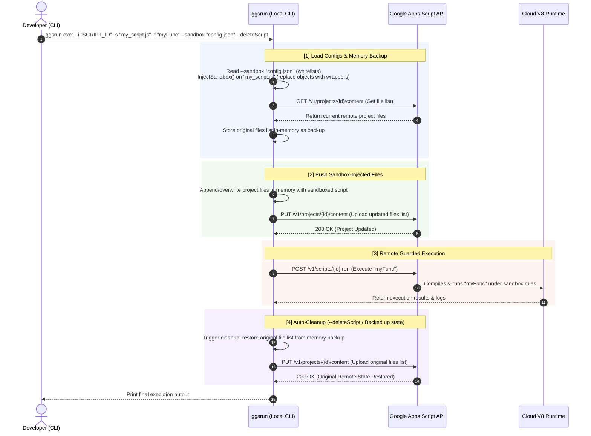
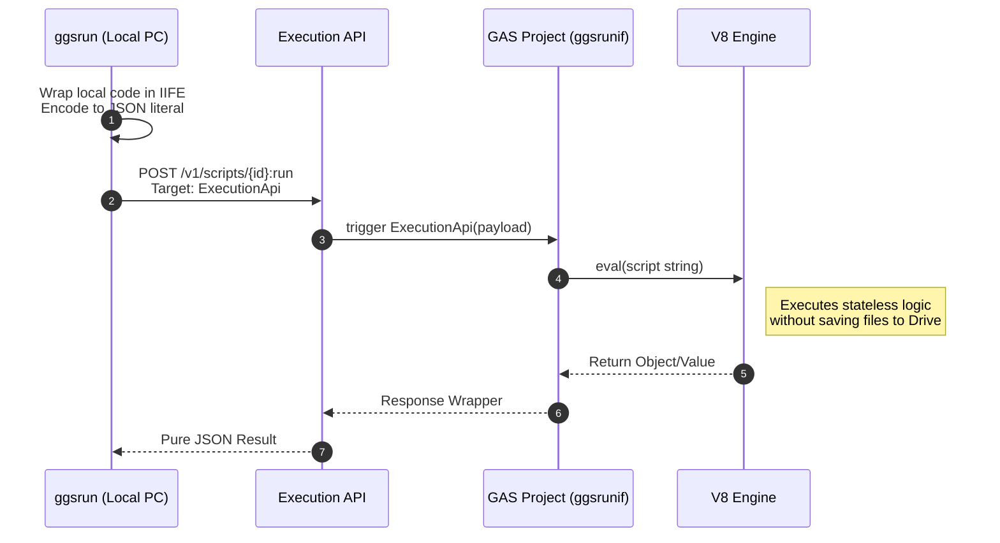
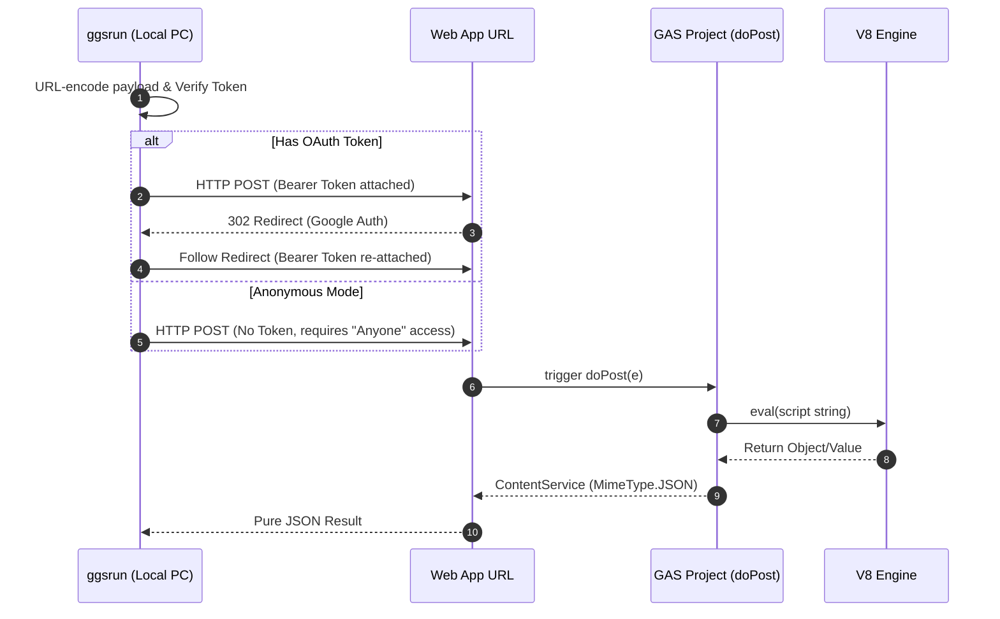

# ggsrun - Command Reference and Usage Guide

This document provides a highly detailed specification, flag listing, and practical execution examples (recipes) for all commands supported by `ggsrun`.

---

## Table of Contents
1. [General Command Layout](#1-general-command-layout)
2. [Command Categorization](#2-command-categorization)
3. [Deep Dive: Executing Google Apps Script (exe1, exe2, webapps)](#3-deep-dive-executing-google-apps-script-exe1-exe2-webapps)
   - [Mode 1: exe1 (Stateful Project Execution)](#mode-1-exe1-stateful-project-execution)
   - [Mode 2: exe2 (Stateless Dynamic Execution)](#mode-2-exe2-stateless-dynamic-execution)
   - [Mode 3: webapps (Anonymous or Secure Web App Execution)](#mode-3-webapps-anonymous-or-secure-web-app-execution)
   - [Verification & Diagnostics](#verification--diagnostics)
4. [File and Directory Transfers](#4-file-and-directory-transfers)
   - [download (Massively Parallel Pull)](#download-massively-parallel-pull)
   - [upload (Massively Parallel Push)](#upload-massively-parallel-push)
   - [updateproject (GAS Project Sync)](#updateproject-gas-project-sync)
5. [Drive Querying and Search](#5-drive-querying-and-search)
   - [filelist (Metadata Query)](#filelist-metadata-query)
   - [searchfiles (Advanced Query Syntax)](#searchfiles-advanced-query-syntax)
6. [Interactive Terminal File Manager](#6-interactive-terminal-file-manager)
   - [fd (PC-98 Filer Mode)](#fd-pc-98-filer-mode)
7. [System and Authentication Utilities](#7-system-and-authentication-utilities)
   - [setup (Simplified Onboarding)](#setup-simplified-onboarding)
   - [auth (OAuth Loopback Port)](#auth-oauth-loopback-port)
   - [status (Token Health Diagnostic)](#status-token-health-diagnostic)
8. [Conflict Resolution Guide](#8-conflict-resolution-guide)

---

## 1. General Command Layout

All `ggsrun` commands support the following global options to override configuration directories or point to explicit API credentials:

```bash
$ ggsrun <command> [options]
```

| Global Flag | Alias | Type | Description |
| :--- | :--- | :--- | :--- |
| `--credentials <path>` | `--cred` | String | Absolute path to a custom Google Cloud credentials JSON file. |
| `--config <dir>` | `--conf` | String | Custom folder containing `ggsrun.cfg` (overrides default search priorities). |

---

## 2. Command Categorization

`ggsrun` categorizes its operations into distinct high-performance modules:

* **Execution Engine**: `exe1`, `exe2`, `webapps`
* **Concurrency Transfers**: `download`, `upload`, `updateproject`
* **Metadata & Quota**: `filelist`, `searchfiles`
* **Interactive TUI**: `fd`
* **Onboarding & Auth**: `setup`, `auth`, `status`

---

## 3. Deep Dive: Executing Google Apps Script (exe1, exe2, webapps)

`ggsrun` provides three distinct modes for executing Google Apps Script. Each mode satisfies a specific architecture and security model:

### Mode 1: `exe1` (Stateful Project Execution)
* **Aliases**: `e1`
* **Purpose**: Relies on the Apps Script API to upload (synchronize) your local script files or directories to the remote GAS project on Google Drive, and then invokes a specified entry function via the Execution API.
* **When to Use**: You want to run code in the cloud. If you are uploading temporary files/folders and want them cleaned up immediately after execution, you can use the automatic deletion flag. Requires an OAuth Token.

#### Command-specific Flags
| Flag | Shorthand | Type | Description |
| :--- | :--- | :--- | :--- |
| `--scriptid` | `-i` | String | Target Google Apps Script Project Script ID. |
| `--scriptfile` | `-s` | String | Path to local script file (`.gs`, `.js`) or directory to upload. |
| `--stringscript`| `-ss` | String | Inline GAS script snippet provided as a raw string. |
| `--function` | `-f` | StringSlice | First declaration sets function name, subsequent declarations are sequential arguments. |
| `--deleteScript`| `-d` | Boolean | Safely auto-deletes uploaded files remotely post-execution. |
| `--conflict` | | String | Remote file conflict strategy: `overwrite` (default) or `add`. |
| `--jsonparser` | `-j` | Boolean | Mutes terminal UI spinners and returns pure JSON streams. |
| `--sandbox` | | String | Path to `sandbox_config.json` to sandbox APIs/URLs. Set to `bypass` to disable. |

#### Execution Recipes
* **Execute local script with sequential arguments**:
  ```bash
  $ ggsrun exe1 -i "SCRIPT_ID" -s "my_logic.js" -f "processData" -f "arg_val1" -f "arg_val2"
  ```
  *Here, `processData("arg_val1", "arg_val2")` is triggered remotely.*
* **Recursively upload a local directory, run a function, and auto-cleanup**:
  ```bash
  $ ggsrun exe1 -i "SCRIPT_ID" -s "./src" -f "main" --deleteScript
  ```
  *Recursively uploads `./src`, executes `main()`, and deletes the uploaded files immediately upon completion.*
* **Run inline script with default fallback script ID**:
  ```bash
  $ ggsrun exe1 -ss "function main() { return 'Hello!'; }" -f "main" -j
  ```
  *Retrieves `script_id` from local `ggsrun.cfg` as fallback, uploads inline string, executes `main()`, and yields clean JSON.*

#### Architecture Workflow (Stateful Execution with Sandboxing & Auto-Cleanup)



---

### Mode 2: `exe2` (Stateless Dynamic Execution)
* **Aliases**: `e2`
* **Purpose**: Transmits a local script payload inside a JSON-encoded string directly to the remote Google Apps Script `ExecutionApi` wrapper. Bypasses file updates completely.
* **When to Use**: Rapid local prototyping and executing complex data-extraction algorithms in the cloud without modifying or polluting the production GAS project's codebase. Requires an OAuth Token.

#### Command-specific Flags
| Flag | Shorthand | Type | Description |
| :--- | :--- | :--- | :--- |
| `--scriptid` | `-i` | String | Remote GAS Project ID containing the gateway server. |
| `--scriptfile` | `-s` | String | Path to local script file. **The local entry point must be named `main()`.** |
| `--value` | `-v` | String | A raw string or JSON string argument passed into the remote `main()` function. |

#### Execution Recipes
* **Stateless execution passing a JSON payload**:
  ```bash
  $ ggsrun exe2 -i "SCRIPT_ID" -f ExecutionApi -s "compute.js" -v '{"limit":10}' -j
  ```

#### Architecture Workflow



---

### Mode 3: `webapps` (Anonymous OR Secure Endpoint Execution)
* **Aliases**: `w`
* **Purpose**: Routes script payloads via HTTP POST directly to a deployed Google Web App gateway URL. Supports secure redirect authorization.
* **When to Use**: 
  - **Secure Mode**: You want to execute arbitrary scripts natively on a highly-secured ("Only myself") endpoint utilizing the `drive` scope OAuth token.
  - **Anonymous Mode**: You need to execute GAS scripts from a remote CI/CD pipeline **without deploying an OAuth token**. (Requires the Web App to be deployed as "Anyone" and utilizes the `-p` password flag).

#### Command-specific Flags
| Flag | Shorthand | Type | Description |
| :--- | :--- | :--- | :--- |
| `--webappurl` | `-u` | String | Target Web App URL deployment endpoint. |
| `--password` | `-p` | String | Security password parameter verifying execution on anonymous endpoints. |
| `--scriptfile` | `-s` | String | Local script file containing the entry `main()` function. |

#### Execution Recipes
* **Trigger secure Web App using OAuth loopback token**:
  ```bash
  $ ggsrun webapps -u "https://script.google.com/macros/s/XXX/exec" -s "job.js" -j
  ```
  *(Note: If `ggsrun auth` has been executed locally, the CLI automatically detects the token, bypasses the `-p` requirement, and securely traverses Google's 302 redirects to execute the code.)*

#### Architecture Workflow



---

### Verification & Diagnostics

To quickly verify the functionality of all execution modes using a stateless beacon request, run:

```bash
ggsrun e1 -ss "const main = (_) => ggsrunif.Beacon();" -j
ggsrun e2 -ss "const main = (_) => ggsrunif.Beacon();" -j
ggsrun w -ss "const main = (_) => ggsrunif.Beacon();" -j
```

---

## 4. File and Directory Transfers

`ggsrun` transfers directories and files using channel-based Go workers built on `golang.org/x/sync/errgroup` for high-throughput, concurrent I/O.

### `download` (Massively Parallel Pull)
* **Aliases**: `d`
* **Purpose**: Recursively pulls files or entire directory trees from Google Drive. Target IDs can belong to Standard Drives, Shared Drives, or Team Drives seamlessly.
* **Auto-Conversion**: Automatically exports native Google Workspace entities (Docs, Sheets, Slides) into user-defined formats (e.g., Markdown, XLSX, PDF) on-the-fly.

#### Command-specific Flags
| Flag | Shorthand | Type | Description |
| :--- | :--- | :--- | :--- |
| `--scriptid` | `-i` | String | Comma-separated File or Folder IDs to download concurrently. |
| `--workers` | `-w` | Integer | Parallel network workers to spawn (Default: 5). |
| `--extension` | `-e` | String | Export conversion targets: `xlsx`, `docx`, `pdf`, `md`, etc. |
| `--mimetype` | `-m` | String | Filter downloaded files recursively by specific MIME type. |
| `--conflict-mode`| `-cm` | String | Conflict resolution: `skip`, `overwrite`, `rename`, `update`. |
| `--destination`| `-d` | String | Destination folder directory path (Default: current directory). |
| `--zip` | `-z` | Boolean | Packages download files together into a clean local `.zip` file. |
| `--rawdata` | `-r` | Boolean | Downloads a GAS project natively as raw `.json` payload. |

#### Transfer Recipes
* **Download specific files concurrently**:
  ```bash
  $ ggsrun download -i "FILE_ID1, FILE_ID2" -w 5
  ```
* **Recursively map and download an entire folder tree**:
  ```bash
  $ ggsrun download -i "FOLDER_ID" -w 10
  ```
* **Convert and export a Google Sheet into an `.xlsx` binary**:
  ```bash
  $ ggsrun download -i "SPREADSHEET_ID" -e xlsx
  ```
* **Convert and export a Google Doc into a Markdown (`.md`) file**:
  ```bash
  $ ggsrun download -i "DOCUMENT_ID" -e md
  ```
* **Convert and export a Google Doc into a PDF (`.pdf`) file**:
  ```bash
  $ ggsrun download -i "DOCUMENT_ID" -e pdf
  ```
* **Recursively download folder but filter specifically for PDFs**:
  ```bash
  $ ggsrun download -i "FOLDER_ID" -m "application/pdf"
  ```
* **Download GAS project as a packaged local ZIP**:
  ```bash
  $ ggsrun download -i "SCRIPT_ID" -z
  ```
* **Download GAS project natively as a raw JSON payload**:
  ```bash
  $ ggsrun download -i "SCRIPT_ID" -r
  ```
* **Download folder recursively with collision updates**:
  ```bash
  $ ggsrun download -i "FOLDER_ID" -cm update
  ```
* **Download folder recursively and save inside a custom local directory**:
  ```bash
  $ ggsrun download -i "FOLDER_ID" -d "./downloads"
  ```

> [!NOTE]
> When downloading a folder concurrently, specified export extensions via `-e` are dynamically validated against each file's native format. For example, if you download a folder with `-e xlsx`, Sheets inside the folder will convert to `.xlsx` files while unsupported files (like Slides or Docs) will print a warning and skip, allowing the queue to continue without failure.

---

### `upload` (Massively Parallel Push)
* **Aliases**: `u`
* **Purpose**: Pushes local hierarchical structures to Google Drive recursively. Fully supports Resumable chunked uploading for massive binaries.

#### Command-specific Flags
| Flag | Shorthand | Type | Description |
| :--- | :--- | :--- | :--- |
| `--filename` | `-f` | String | Comma-separated local file or directory paths to upload. |
| `--parentid` | `-p` | String | Target Google Drive Parent Folder ID. |
| `--convertto` | `-c` | String | Convert to Drive format: `sheet`, `doc`, `slide`. |
| `--conflict-mode`| `-cm` | String | Conflict resolution: `skip`, `overwrite`, `rename`, `update`. |
| `--projectname`| | String | Sets the remote script title when uploading script files standalone. |
| `--projecttype`| | String | Used with `-pid` to upload scripts as Container-Bound scripts. |
| `--parentprojectid`| `-pid` | String | Parent ID of Google Document to bind the script to. |
| `--chunksize` | | Integer | Resumable Upload chunk size in Megabytes (Default: 100). |

#### Transfer Recipes
* **Upload multiple files sequentially or concurrently**:
  ```bash
  $ ggsrun upload -f "a.txt, b.txt" -p "FOLDER_ID"
  ```
* **Upload a local directory recursively, duplicating the tree on Drive**:
  ```bash
  $ ggsrun upload -f "/path/to/folder" -p "FOLDER_ID" -w 5
  ```
* **Upload a local script and provision as a standalone GAS Project**:
  ```bash
  $ ggsrun upload -f "script.js" --projectname "MyAPI"
  ```
* **Upload a local script as a Container-Bound Script attached to a Google Sheet**:
  ```bash
  $ ggsrun upload -f "script.js" -pid "SHEET_ID" --projecttype "spreadsheet"
  ```
* **Upload CSV and convert automatically to Google Spreadsheet**:
  ```bash
  $ ggsrun upload -f "data.csv" -c "sheet"
  ```
* **Upload Word Document and convert to native Google Doc**:
  ```bash
  $ ggsrun upload -f "document.docx" -c "doc"
  ```
* **Upload PowerPoint and convert to native Google Slide**:
  ```bash
  $ ggsrun upload -f "slides.pptx" -c "slide"
  ```
* **Upload massive files utilizing larger 250MB resumable chunks**:
  ```bash
  $ ggsrun upload -f "large_file.mp4" --chunksize 250
  ```
* **Upload directory, appending timestamps to any conflicting filenames**:
  ```bash
  $ ggsrun upload -f "/path/to/folder" -p "FOLDER_ID" -cm rename
  ```

> [!NOTE]
> Recursive folder uploads natively support batch conversion. When specifying `-c` (or `--convertto`), every eligible file within the uploaded folder tree is evaluated and converted to the target Workspace format concurrently. Files that cannot be converted will log a conversion error warning and skip, leaving other files in the queue unaffected.

---

### `updateproject` (GAS Project Sync)
* **Aliases**: `ud`
* **Purpose**: Synchronizes local directory structures or file groups to an existing remote GAS project.
* **User Safety**: Before updating, `ggsrun` lists all target modifications in a clean bullet list and requests hard terminal confirmation (Y/N) to protect remote files from accidental loss.

#### Command-specific Flags
| Flag | Shorthand | Type | Description |
| :--- | :--- | :--- | :--- |
| `--scriptid` | `-p` | String | Target GAS Project Script ID. |
| `--filename` | `-f` | String | Local file or folder paths to synchronize. |
| `--deletefiles`| | Boolean | Deletes files from remote project if they are missing locally. |
| `--backup` | `-b` | Boolean | Downloads a local backup (`.zip` or `.json`) before applying updates. |
| `--rearrange` | `-r` | Boolean | Interactively rearranges script order inside remote GAS project. |

#### Sync Recipes
* **Overwrite remote GAS files with local files**:
  ```bash
  $ ggsrun updateproject -p "PROJECT_ID" -f "Code.js, index.html"
  ```
* **Recursively synchronize local src folder structure**:
  ```bash
  $ ggsrun updateproject -p "SCRIPT_ID" -f "./src"
  ```
* **Sync folder and delete omitted remote files with local backup**:
  ```bash
  $ ggsrun updateproject -p "SCRIPT_ID" -f "./src" --deletefiles -b
  ```
* **Interactively rearrange order of scripts inside remote project**:
  ```bash
  $ ggsrun updateproject -p "PROJECT_ID" -r
  ```

> [!WARNING]
> Since the `updateproject` command overwrites files inside the remote Google Apps Script project, `ggsrun` will display a bulleted list of all targeted local files and prompt you with a hard interactive confirmation (Y/N) before executing any remote updates. Standard LLM agents using the MCP tool mode will also request your approval prior to running this command.

---

## 5. Drive Querying and Search

Query Google Drive using Standard Google Drive API v3 queries and regex patterns.

### `filelist` (Metadata Query)
* **Aliases**: `ls`
* **Purpose**: Lists files and folders available on Google Drive.
* **Flag**: `--limit` (Default: 100), `--searchbyid` (Direct ID lookup).

```bash
$ ggsrun filelist --limit 10
```

---

### `searchfiles` (Advanced Query Syntax)
* **Aliases**: `sf`
* **Purpose**: Searches Google Drive using standard query schemas and local regex filters. Supports Shared Drives seamlessly.

#### Command-specific Flags
| Flag | Shorthand | Type | Description |
| :--- | :--- | :--- | :--- |
| `--query` | `-q` | String | Google Drive API v3 standard query string. |
| `--regex` | `-r` | String | Local regex filter applied over matching file names. |

#### Search Recipes
* **Search for non-trashed spreadsheets**:
  ```bash
  $ ggsrun searchfiles --query "mimeType = 'application/vnd.google-apps.spreadsheet' and trashed = false"
  ```
* **Search folders using Regex filter**:
  ```bash
  $ ggsrun searchfiles --query "mimeType = 'application/vnd.google-apps.folder'" --regex "^Test_.*"
  ```

---

## 6. Interactive Terminal File Manager

### `fd` (PC-98 Filer Mode)
* **Purpose**: Launches a highly responsive, split-screen Terminal User Interface (TUI) dual-pane file manager inspired by the PC-98 classics. It enables local and cloud files to be organized side-by-side using rapid muscle-memory keyboard shortcuts.
* **Key capabilities**: Centered 70% responsive dialogs, Clipboard synchronization, Function key mapping, yellow highlights, directory previews, and individual real-time transfer progress bars.

```bash
$ ggsrun fd
```

> [!IMPORTANT]
> **Keybindings, Navigation & Development Insights:**
> For the complete keybindings, design specifications, development history, and interactive TUI configurations, please consult the dedicated **[Interactive TUI Filer (FD Mode) Guide](tui_guide.md)**.

---

## 7. System and Authentication Utilities

Onboarding and diagnostic commands.

### `setup` (Simplified Onboarding)
* **Purpose**: Automatically enables all 6 required Workspace APIs via Google Cloud Quick Flow redirect and initializes your default configuration (`ggsrun.cfg`) in seconds.

```bash
$ ggsrun setup
```

---

### `auth` (OAuth Loopback Port)
* **Purpose**: Performs local OAuth2 authorization loopback.

```bash
$ ggsrun auth --port 8080
```

---

### `status` (Token Health Diagnostic)
* **Aliases**: `st`
* **Purpose**: Quick diagnostic tool verifying the validity, expiry, and permissions of your local OAuth2 credentials and configuration paths. (Version information is displayed at the top).

```bash
$ ggsrun status
```

---

### `recover` (Self-Healing Project Recovery)
* **Aliases**: `rc`
* **Purpose**: Rebuilds and deploys the remote GAS project to a clean initial state (restoring `ggsrun.gs` and default `appsscript.json` configs) in case of unexpected script execution corruption or interruption.

```bash
$ ggsrun recover -i [SCRIPT_ID]
```

---

## 8. Conflict Resolution Guide

Commands such as `download` and `upload` handle file name collisions based on the `--conflict-mode` (`-cm`) flag:

| Mode | Download Action | Upload Action |
| :--- | :--- | :--- |
| **`skip`** | If local file exists, the download is skipped. | If remote file name exists, the upload is skipped. |
| **`overwrite`** | Overwrites the local file on disk. | Replaces the file content on Google Drive (`PATCH` request). |
| **`rename`** | Appends a timestamp (`_YYYYMMDD_HHMMSS`) locally. | Appends a timestamp (`_YYYYMMDD_HHMMSS`) to remote name. |
| **`update`** | Overwrites only if the remote file is newer. | Overwrites only if the local file is newer. |

If `-cm` is omitted, `ggsrun` presents an **interactive terminal selection prompt** allowing you to resolve collisions individually. When running in pure JSON mode (`-j`), the prompt is bypassed, defaulting to `update` (OverwriteIfNewer) to protect automated execution pipelines.

---

### Related Links:
- 🚀 **[Setup & Onboarding Guide](setup_guide.md)** - Learn how to build and configure your GCP credentials.
- 🛡️ **[Security Sandbox Guide](sandbox_guide.md)** - Set up execution sandboxing for `exe1`.
- 🤖 **[MCP Server Guide](mcp_guide.md)** - Run `ggsrun` as an autonomous background server.
- 🔄 **[Stateful Execution Lifecycle Guide](exe1_lifecycle.md)** - Step-by-step backup, sandboxing, execution, and rollback details for the `exe1` command.
- 🧪 **[Manual Integration Tests Suite](../manual-tests/README.md)** - Perform manual test validations.
- 🏡 **[Back to Home](../README.md)**
