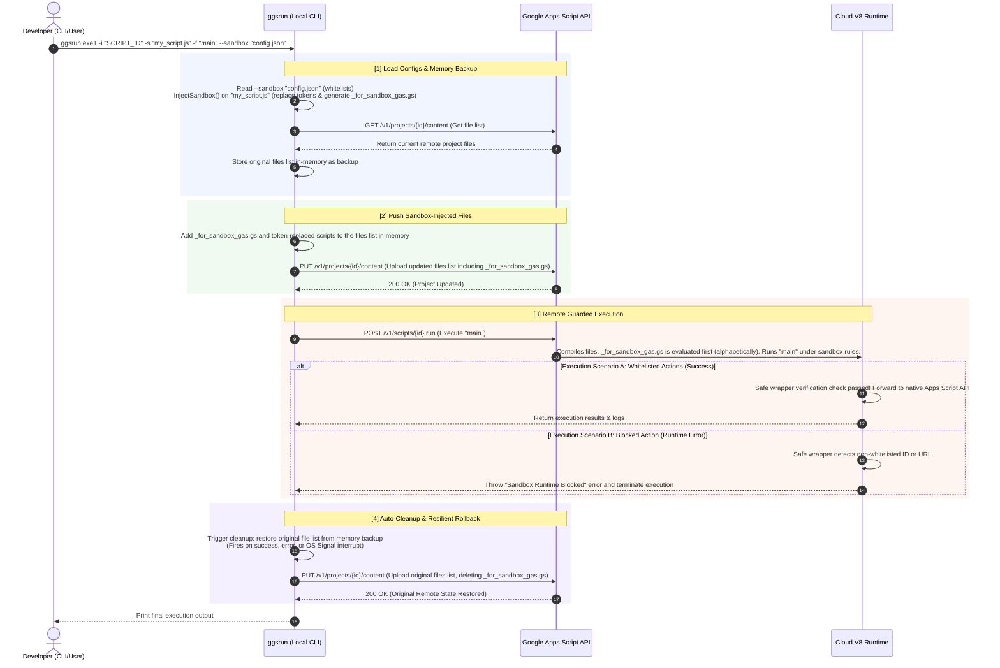

# Google Apps Script Stateful Project Execution (exe1) - Detailed Lifecycle & Diagram

This document provides a highly detailed guide explaining the exact execution lifecycle of `ggsrun`'s stateful Apps Script execution command (`exe1`), both in standard CLI mode and when called autonomously by AI agents via the Model Context Protocol (MCP) server. 

---

## 1. Concrete Execution Walkthrough Scenario

To understand how `exe1` performs dynamic sandboxing and safe rollback operations under the hood, let us trace a real-world scenario.

### A. The User's Prompt
Imagine a user or an AI agent attempts to execute the following instruction:
> *"Access the Google Spreadsheet with ID `1A2B3C4D5E...` and append a log entry 'Connected successfully!' with the current date. Then, retrieve the API health status from `https://api.example.com/v1/health` and return the result."*

### B. The Generated GAS Code
The AI agent writes standard Google Apps Script code to achieve this task:
```javascript
function main() {
  var sheet = SpreadsheetApp.openById('1A2B3C4D5E...');
  sheet.appendRow([new Date(), 'Connected successfully!']);
  
  var response = UrlFetchApp.fetch('https://api.example.com/v1/health');
  return response.getContentText();
}
```

---

## 2. In-Memory Sandbox Injection

Before uploading the code to the remote Google Cloud environment, `ggsrun` checks the active sandbox policy. By default (unless sandbox is explicitly bypassed via `--sandbox bypass` or `"sandbox": "bypass"`), `ggsrun` injects a secure proxy layer.

1. **Whitelisting Configuration:**
   `ggsrun` injects authorized resources (configured locally or passed via parameters) directly into the sandbox variables:
   * `allowedFileIds` $\rightarrow$ `["1A2B3C4D5E..."]`
   * `allowedUrls` $\rightarrow$ `["https://api.example.com/v1/health"]`

2. **Static Token Replacement:**
   `ggsrun` scans the target script and substitutes standard global Google service objects with proxy variables:
   * `SpreadsheetApp` $\rightarrow$ `_wrappedSpreadsheetApp`
   * `UrlFetchApp` $\rightarrow$ `_wrappedUrlFetchApp`

3. **Separate Sandbox Script (`_for_sandbox_gas.gs`):**
   The sandbox wrapper code (containing the whitelists and the proxy objects) is generated as a separate file named `_for_sandbox_gas.gs`. By starting with an underscore, it is sorted first alphabetically, ensuring the wrappers are initialized before any other script runs.

### The Resulting Scripts Uploaded to Google Apps Script

#### File 1: `_for_sandbox_gas.gs` (Separate Sandbox Script)
```javascript
// === SANDBOX SECURITY GUARD INJECTED ===
function createSafeWrapper(original, overrides) { ... }

var _wrappedSpreadsheetApp = (function(global) {
  var allowedFileIds = ["1A2B3C4D5E..."];
  return createSafeWrapper(SpreadsheetApp, {
    openById: function(id) {
      if (!allowedFileIds.includes(id)) {
        throw new Error("Sandbox Runtime Blocked: Spreadsheet ID '" + id + "' is not whitelisted.");
      }
      return SpreadsheetApp.openById(id);
    }
  });
})(this);

var _wrappedUrlFetchApp = (function(global) {
  var allowedUrls = ["https://api.example.com/v1/health"];
  var blockedUrls = [];
  // (Pattern matching & URL verification logic...)
  return createSafeWrapper(UrlFetchApp, {
    fetch: function(url, ...args) {
      checkUrl(url); // Verifies url is whitelisted and not blacklisted
      return UrlFetchApp.fetch.apply(UrlFetchApp, [url, ...args]);
    }
  });
})(this);
// === END OF SANDBOX SECURITY GUARD ===
```

#### File 2: `my_script.gs` (User Script with Token Replacement)
```javascript
// Original Script (Statically Replaced)
function main() {
  var sheet = _wrappedSpreadsheetApp.openById('1A2B3C4D5E...');
  sheet.appendRow([new Date(), 'Connected successfully!']);
  
  var response = _wrappedUrlFetchApp.fetch('https://api.example.com/v1/health');
  return response.getContentText();
}
```

---

## 3. End-to-End Architectural Flow

The entire end-to-end lifecycle under the hood in `ggsrun` behaves as follows, visualizing the CLI interaction with `--sandbox` and the default cleanup behavior:



---

## 4. Key Architectural Stages Explained

### A. Static Analysis & Security Gate Check (MCP Server Only)
Before any execution command is delegated to the compiler in `ggsrun exe1`, the MCP Server acts as an immediate safety guardrail:
* It reads the raw script files/strings and runs `analyzeGASScript()`.
* If write or egress API keywords (like `.appendRow`, `.fetch`, `.setValue`) are detected and the `"confirm"` argument is not set to `true`, the MCP Server **aborts execution** instantly, returning a diagnostic report of the accessed resources and demanding manual verification.

### B. Stateful Project Backup in Memory
* `ggsrun` downloads the exact layout and metadata of files currently residing in the target script project.
* It stores these original file manifests securely inside `e.InitVal.originalFiles` in memory. This eliminates disk-bound backup delays while ensuring we have an absolute, correct state to roll back to.

### C. Sandbox Injection
* If whitelisting configurations are enabled, standard GAS references inside the script are mapped to custom wrapper objects.
* `for_sandbox_gas.js` acts as an embedded engine that wraps fundamental GAS interactions (Drive, Sheets, Docs, Gmail, Calendar, UrlFetchApp, etc.) and performs prefix/whitelisting checks.

### D. Cloud Project Upload & Compilation
* The updated file list is pushed via `projectUpdate2()` using the remote `content` PUT API.
* The script compilation occurs on Google's cloud server. If a script imports unsupported constructs or references missing identifiers, the execution fails gracefully.

### E. Resilient Rollback, State Restoration & Self-Healing
* Regardless of whether the target function succeeds, throws an exception, or if the local terminal process is terminated mid-execution (e.g., via a standard `SIGINT` / `Ctrl+C` interrupt signal), `ggsrun` enters the deferred `performRollback()` block.
* This clean-up handler replaces the remote script project back to `e.InitVal.originalFiles`. In v5.3.9, this rollback guarantees that the entire remote project state—including the original `appsscript.json` manifest and all script files—is completely restored to the pre-execution state.
* **Self-Healing Recovery**: In the rare event that the execution process crashes abruptly before the rollback can trigger, you can use the `$ ggsrun recover` command to immediately rebuild and redeploy the GAS project to its default pristine state (containing only `ggsrun.gs` and the default `appsscript.json` manifest).
