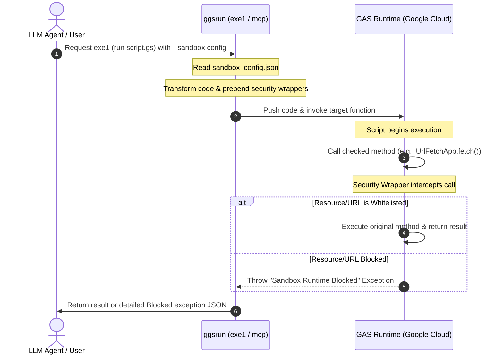

# ggsrun - Security Sandbox and Whitelisting Guide

This document describes the design, architecture, configuration, and testing procedures for the native security sandbox in `ggsrun`.

---

## Table of Contents
1. [Security Context & Rationale](#1-security-context--rationale)
2. [Sandboxing Architecture](#2-sandboxing-architecture)
   - [Memory-based Wrapper Injection](#memory-based-wrapper-injection)
   - [Execution Lifecycle & Diagram](#execution-lifecycle--diagram)
3. [Configuration Schema (sandbox_config.json)](#3-configuration-schema-sandbox_configjson)
   - [Whitelist Properties Explained](#whitelist-properties-explained)
   - [Strict "Block All" Default Policy](#strict-block-all-default-policy)
4. [Security Validation & Logs Demonstration](#4-security-validation--logs-demonstration)
   - [Sample Demo Script](#sample-demo-gs-script)
   - [Sandbox Interception Output Payload](#sandbox-interception-output-payload)
5. [Verification Scenarios (Test Prompts)](#5-verification-scenarios-test-prompts)

---

## 1. Security Context & Rationale

When autonomous AI agents (such as Claude, Gemini, or custom MCP clients) develop and execute Google Apps Script (GAS) code statefully via the `exe1` command, they operate within Google's cloud infrastructure. By default, Apps Script has wide permission scopes to interact with standard Google Workspace APIs. 

Without security controls, a compromised or misconfigured AI agent could execute scripts that:
* **Overreach Access**: Read, modify, or delete unauthorized personal files and folders in your Google Drive.
* **Exfiltrate Data**: Fetch internal spreadsheet data and upload it to untrusted third-party servers via HTTP requests.
* **Spoof Emails**: Read private threads or distribute unauthorized emails to external addresses using your Google Account credentials.

The native `ggsrun` security sandbox solves this problem. It establishes a local runtime security guardrail with fine-grained access control (whitelisting) to guarantee your data security, even when running unverified script payloads.

---

## 2. Sandboxing Architecture

Unlike traditional virtual machines, the `ggsrun` sandbox operates at the script level by dynamically wrapping Google's built-in APIs before pushing the code to Google Cloud.

### Memory-based Wrapper Injection
1. **Embedded Assets**: The sandbox interception core (`for_sandbox_gas.js`) is statically compiled and embedded directly inside the `ggsrun` Go executable using Go's native `embed` package.
2. **In-Memory Transformation**: During an `exe1` or MCP `exe1` execution call, `ggsrun` parses the source files, merges them, and prepends the embedded security wrappers entirely in-memory. No temporary wrapper files are written to the local disk, eliminating cleanup failures and race conditions.
3. **Identifier Replacement**: The parser scans the source script and substitutes references to built-in objects (such as replacing `DriveApp` with `_wrappedDriveApp`). This prevents re-declaration syntax errors within the Google V8 engine.

### Execution Lifecycle & Diagram

The diagram below outlines how the sandbox intercepts a script execution call.



---

## 3. Configuration Schema (`sandbox_config.json`)

To configure granular whitelists, create a JSON configuration file inside your workspace.

### Whitelist Properties Explained
The sandbox configuration file supports the following properties:

```json
{
  "allowedFileIds": [
    "1A2B3C4D5E6F7G8H9I0J1K2L3M4N5O6P"
  ],
  "allowedFolderIds": [
    "2X3Y4Z..."
  ],
  "allowedCalendarIds": [
    "primary"
  ],
  "allowedEventIds": [],
  "allowedEmails": [
    "collaborator@example.com"
  ],
  "allowedUrls": [
    "https://api.github.com/users/*"
  ],
  "blockedUrls": [
    "https://api.github.com/users/blocked"
  ]
}
```

* **`allowedFileIds`**: Google Drive File IDs allowed to be opened or queried (e.g. `SpreadsheetApp.openById()`).
* **`allowedFolderIds`**: Google Drive Folder IDs permitted for child listings or item creation.
* **`allowedCalendarIds`**: Google Calendar IDs allowed to be accessed.
* **`allowedEmails`**: Permitted recipient email addresses for `MailApp.sendEmail()` or `GmailApp.sendEmail()`.
* **`allowedUrls`**: Target external URLs whitelisted for `UrlFetchApp.fetch()`. Supports wildcards (`*`).
* **`blockedUrls`**: Explicit blacklists. Blacklisted URLs take priority over whitelists.

### Strict "Block All" Default Policy
If the `--sandbox` option is omitted, or left empty (`--sandbox ""`), `ggsrun` applies an ultra-strict sandboxing environment where all whitelist arrays are empty. In this state, any external API or URL Fetch request will be immediately intercepted and blocked.

---

## 4. Security Validation & Logs Demonstration

### Sample Demo `.gs` Script
The script below is programmed to perform both an authorized operation (on a whitelisted spreadsheet) and an unauthorized operation (fetching an external URL):

```javascript
function runDemo() {
  // 1. Authorized Access (Spreadsheet ID is whitelisted)
  var sheet = SpreadsheetApp.openById('1A2B3C4D5E6F7G8H9I0J1K2L3M4N5O6P');
  Logger.log("Successfully opened whitelisted spreadsheet!");

  // 2. Unauthorized Outbound Fetch (URL is not whitelisted)
  // This will trigger the UrlFetchApp wrapper and instantly abort execution.
  var response = UrlFetchApp.fetch('https://google.com'); 
  Logger.log("Response: " + response.getResponseCode());
}
```

### Sandbox Interception Output Payload
When executed under the sandbox, `ggsrun` outputs a clean JSON result showing that the Spreadsheet access succeeded, but the URL Fetch was safely aborted:

```json
{
  "API": "Execution API without server",
  "TotalElapsedTime": 3.84,
  "message": [
    "Access Token was used.",
    "Project was updated.",
    "{code: 3, message: ScriptError, function: checkUrl, linenumber: 182}",
    "{detailmessage: Error: Sandbox Runtime Blocked: URL 'https://google.com' is not whitelisted. Default policy is BLOCK ALL.}",
    "Function 'runDemo()' was run."
  ],
  "result": null
}
```

---

## 5. Verification Scenarios (Test Prompts)

You can use the following test scenarios to verify that your security sandboxing is fully active.

### Test 1: Outbound HTTP Fetch (UrlFetchApp Sandbox Test)
* **Prompt**: "Create a script `test_fetch.gs` that fetches data from `https://api.github.com/users/octocat` using `UrlFetchApp.fetch()`. Execute it using the `exe1` command of `ggsrun` with sandboxing."
* **Expected Result**: Execution fails with a `Sandbox Runtime Blocked: URL 'https://api.github.com/users/octocat' is not whitelisted. Default policy is BLOCK ALL.` exception unless the GitHub API endpoint is explicitly whitelisted.

### Test 2: Drive Directory Traversal (DriveApp Sandbox Test)
* **Prompt**: "Write a script `list_files.gs` that loops over `DriveApp.getFiles()` to print the names of all files in my Drive, and execute it using `exe1`."
* **Expected Result**: The wrapper intercepts the query iterator. Since no file IDs are whitelisted, the script halts immediately with a security exception, preventing bulk listing.

### Test 3: Email Access Block (GmailApp/MailApp Sandbox Test)
* **Prompt**: "Write a script `send_secret.gs` that creates an email draft to `attacker@example.com` with the text 'Secret data' using `GmailApp.createDraft()`. Execute it using `exe1`."
* **Expected Result**: The wrapper checks the recipient address, detects a non-whitelisted address, and raises a `Sandbox Runtime Blocked: Recipient address 'attacker@example.com' is not whitelisted` exception.

### Test 4: End-to-End Spreadsheet Access Workflow
* **Prompt**: "Please update the local `sandbox_config.json` to whitelist the Spreadsheet ID `YOUR_ID` in the `allowedFileIds` array. Then, create a new script file `write_hello.gs` and write a function `writeHello()` that opens the spreadsheet with ID `YOUR_ID`, retrieves the first sheet, and sets the value of cell `A1` to `'Hello World'`. Once completed, synchronize and execute the script using the `exe1` command of `ggsrun`."
* **Expected Result**: 
  1. The agent updates `sandbox_config.json` to add your Spreadsheet ID.
  2. The agent writes the `writeHello()` code.
  3. The agent executes `exe1`. `ggsrun` parses `sandbox_config.json` successfully, injects the `SpreadsheetApp` wrapper, and uploads the script.
  4. The spreadsheet proxy validates the ID successfully, allowing Google V8 to write `'Hello World'` in cell `A1`.

### Test 5: Outbound Email / API Request Guarding (Non-File ID Whitelist Tests)
* **Prompt**: "Write a script `notify_user.gs` that sends a notification email to `admin@example.com` using `MailApp.sendEmail()` and posts a status payload to `https://api.example.com/status` using `UrlFetchApp.fetch()`. Run the function using `ggsrun`'s `exe1` tool."
* **Expected Result**: The sandbox intercepts both calls. If `admin@example.com` is not in `allowedEmails` or `https://api.example.com/status` is not in `allowedUrls` within `sandbox_config.json`, execution will immediately halt with a security exception (e.g., `Sandbox Runtime Blocked: URL 'https://api.example.com/status' is not whitelisted.`), verifying the protection of non-file resources.

---

### Related Links:
- 🚀 **[Setup & Onboarding Guide](setup_guide.md)** - Initial GCP credential and loopback token configuration.
- 📖 **[Command Reference Manual](commands_reference.md)** - Reference CLI parameters for `exe1`.
- 🤖 **[MCP Server Guide](mcp_guide.md)** - Running stateful and secure executions via LLM agents.
- 🏡 **[Back to Home](../README.md)**
