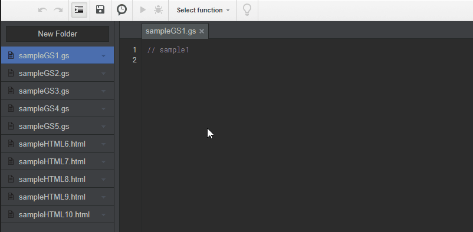
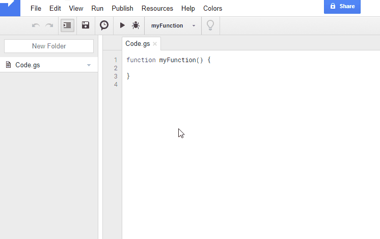

ggsrun
=====

[](https://travis-ci.org/tanaikech/ggsrun)
[](LICENCE)

<a name="top"></a>
# Table of Contents
- [Overview](#Overview)
- [Description](#Description)
- [Demo](#Demo)
- [Google APIs](#googleapis)
    - Comparison for Each Command
    - Execution Flow of Commands ``exe1``, ``exe2`` and ``webapps``
    - For High Security
    - Installation Flow
- [How to Install](#howtoinstall)
    - [Install Google Apps Script API](#onstallexecutionapi)
    - [Install Web Apps](#installwebapps)
- [How to Execute Google Apps Script Using ggsrun](#howtoexecutegoogleappsscriptusingggsrun)
- [Samples](#Samples)
    - Executes GAS and Retrieves Result Values
    - Executes GAS with Values and Retrieves Feedbacked Values
    - For Debug
    - Executes GAS with Values and Downloads File
    - Executes Existing Functions on Project
    - Download Files
        - Download All Files and Folders in Specific Folder
    - Upload Files
    - Show File List
    - Search Files
    - Seach Files using Query and Regex
    - Update Project
    - Retrieve Revision Files and Versions of Projects
    - Rearrange Script in Project
    - Modify Manifests
- [Applications](#applications)
    - For Sublime Text
    - For CoffeeScript
    - Create Triggers
    - Link to Various Resources
- [Appendix](#appendix)
    - Scopes
    - Format of Data to GAS
    - Access Log
    - Show Folder Tree
    - Experiment 1
    - [Trial Usage](#trialusage)
- [Q&A](#Q&A)


<a name="Overview"></a>
# Overview
This is a CLI tool to execute Google Apps Script (GAS) on a terminal.

<a name="Description"></a>
# Description
Will you want to develop GAS on your local PC? Generally, when we develop GAS, we have to login to Google using own browser and develop it on the Script Editor. Recently, I have wanted to have more convenient local-environment for developing GAS. So I created this "ggsrun". The main work is to execute GAS on local terminal and retrieve the results from Google.

Features of "ggsrun" are as follows.

1. **[Develops GAS using your terminal and text editor which got accustomed to using.](#demosublime)**

1. **[Executes GAS by giving values to your script.](#executesgasandretrievesresultvalues)**

1. **[Executes GAS made of CoffeeScript.](#coffeescript)**

1. **[Downloads spreadsheet, document and presentation, while executes GAS, simultaneously.](#executesgaswithvaluesanddownloadsfile)**

1. **[Downloads files from Google Drive and Uploads files to Google Drive.](#downloadfiles)**

1. **[Downloads standalone script and bound script.](#downloadfiles)**

1. **[Downloads all files and folders in a specific folder.](#downloadfilesfromfolder)**

1. **[Upload script files and create project as standalone script and container-bound script.](#uploadfiles)**

1. **[Update project.](#updateproject)**

1. **[Retrieve revision files of Google Docs and retrieve versions of projects.](#revisionfile)**

1. **[Rearranges scripts in project.](#rearrangescripts)**

1. **[Modifies Manifests in project.](#modifymanifests)**

1. **[Seach files in Google Drive using search query and regex](#searchfilesusingregex)**

You can see the release page [here](https://github.com/tanaikech/ggsrun/releases).

<a name="Demo"></a>
# Demo
This demonstration retrieves data from spreadsheet as shown in an image as an array. You can see the cell data retrieved by giving the range data.


The sample script is as follows.

~~~javascript
function work(range) {
  var sheetid = '1zKYnvVAiwkzgWngAhaSGdKCf2EvFzwOpBgPRAZzsvtM';
  var ss = SpreadsheetApp.openById(sheetid);
  var sheet = ss.getSheetByName("sheet1");
  var data = sheet.getRange(range).getValues();
  return data;
}

function main(range) {
  return work(range);
}
~~~


[Also you can see a demo for Sublime Text using ggsrun.](#demosublime)

---

<a name="googleapis"></a>
# Google APIs
ggsrun uses Google Apps Script API(Execution API), Web Apps and Drive API on Google.

1. **[Google Apps Script API(previously known as Execution API)](https://developers.google.com/apps-script/guides/rest/api)** : This can be used by the authorization process of OAuth2. So you can use under higher security. But there are some [limitations](https://developers.google.com/apps-script/guides/rest/api#limitations). The reference of Google Apps Script API is [here](https://developers.google.com/apps-script/api/reference/rest/).

2. **[Drive API](https://developers.google.com/drive/v3/web/about-sdk)** : This can be used for downloading and uploading files.

3. **[Web Apps](https://developers.google.com/apps-script/guides/web)** : This can be used without the authorization process. So a password can be set for using the server. The install process is very simple. However, the security is much lower than that of Google Apps Script API(Execution API). ggsrun has to setup the access to Web Apps as "Anyone, even anonymous". There are no limitations. (I haven't confirmed it yet.) (I don't know whether this can be called an API.)

And also  ggsrun uses a server script (ggsrunif) which is deployed at Google side as an interface for executing GAS script. **This server script is provided as a GAS library. Using APIs and the server, there are <u>4 methods</u> for executing GAS script.** These methods are provided as 4 commands. The comparison for each command is as follows.

## Comparison for Each Command
Each command is used as ``$ ggsrun [Command] [Options]``.

| | Command | Execution method | Security | Response speed | Access token | Server | Authorization<br>for Google Services | Script | Available scripts | Call function | Limitation | Error Message | Library<sup>\*6</sup> |
|:---:|:---:|:---:|:---:|:---:|:---:|:---:|:---:|:---:|:---:|:---:|:---:|:---:|:---:|
| 1 | exe1<br>(e1) | Execution API | <font color="Red">High</font> | Slow<sup>\*1</sup> | Yes | <font color="Red">No</font> | <font color="Red">No</font> | Upload<br>& Save to project<br> | Standalone and Container-bound Script <font color="Red"><sup>NEW!</sup></font> | Functions in project | [Some limitations](https://developers.google.com/apps-script/guides/rest/api) | <font color="Red">Error message<br>Line number</font><sup>\*5</sup> | <font color="Red">Yes</font> |
| 2 | exe1<br>(e1)<br>``-f`` | Execution API | <font color="Red">High</font> | <font color="Red">Fast</font> | Yes | <font color="Red">No</font> | <font color="Red">No</font> | No upload<br>& Only execute function on project | Standalone and Container-bound Script | Functions in project | [Some limitations](https://developers.google.com/apps-script/guides/rest/api) | <font color="Red">Error message<br>Line number<sup></font>\*5</sup> | <font color="Red">Yes</font> |
| 3 | exe2<br>(e2) | Execution API | <font color="Red">High</font> | <font color="Red">Fast</font> | Yes | Yes | <font color="Red">No</font> | Upload<br>& No save | Standalone and Container-bound Script | Functions in execution script | [Some limitations](https://developers.google.com/apps-script/guides/rest/api) | Error message<sup>\*5</sup> | No |
| 4 | webapps<br>(w) | Web Apps | Low<sup>\*2</sup> | <font color="Red">Fast</font> | <font color="Red">No</font><sup>\*2</sup> | Yes | Yes<sup>\*3</sup> | Upload<br>& No save | Standalone and Container-bound Script | Functions in execution script | \*4 | Error message<sup>\*5</sup> | No |

* \*1: At execution of GAS using "webapps", project is updated. So at first, project is downloaded and the project is backed up, your script adds to the project, the project is uploaded with existing project, and project is updated. Therefore, the speed becomes slow.
* \*2: Execution of GAS using "webapps" is not required authorization.
* \*3: [If the script includes API that the authorization is necessary, it has to be authorized for script on script editor.](https://developers.google.com/apps-script/guides/services/authorization)
* \*4: I have never confirmed about the limitation for Web Apps yet.
* \*5: For "exe1", when an error occurs, you can see the error message and line number at error. For "exe2" and "webapps", when an error occurs, you can see the error message. On the other hand, line number at error is NOT shown because the script is sent as one line.
* \*6: The server script is installed as a library. Here, whether libraries except for the server can be used.

<u>Please select one from above 4 commands to use ggsrun. I think that ``exe2`` is high security, high speed, easy to use, and it has some specialized functions.</u> So I always use command ``exe2``.


## Execution Flow of Commands ``exe1``, ``exe2`` and ``webapps``
Here, I explain the flow difference of ``exe1`` and ``exe2`` using flow of each command. The differences of functions have already been explained [above](#comparison).

<a name="fileupdate"></a>
### Flow of ``exe1``


1. Prepare sample script of GAS. For example, it's ``sample.gs``.
1. Execute ggsrun using command ``exe1``.
1. [URL request] At first, the project, which was enabled Google Apps Script API(Execution API), on Google Drive is downloaded for the back up.
1. Add ``sample.gs`` to the downloaded project as a script with name of ``ggsrun.gs``.
1. [URL request] The project with ``sample.gs`` is uploaded and overwrites the project on Google.
1. [URL request] **Using <u>Google Apps Script API(Execution API)</u>, directly execute the function ``main()``** which is a default executing function and retrieves response. Of course, you can choose the function using option ``-f``.

In this case, there are 3 times URL requests.

When I executed above flow for the first time, I felt the low speed and high API cost. So in order to compare them, I made ``exe2`` and ``webapps``.

### Flow of ``exe2`` and ``webapps``


The flow of ``exe2`` and ``webapps`` is the same.

1. Prepare sample script of GAS. For example, it's ``sample.gs``.
1. Execute ggsrun using command ``exe2`` or ``webapps``.
1. [URL request] ``sample.gs`` is uploaded as a value, it executes the server function ``ggsrunif.ExecutionApi()`` for ``exe2`` or ``doPost()`` for ``webapps`` using Execution API.
1. In the server function, **Using <u>``(0,eval)(value)``</u>, the function ``main()`` of the uploaded script is executed.** And then, retrieves the response in this one request.

In this case, there is only 1 URL request.

**<u>Please don't worry. When you saw the flow of ``exe2``, if you don't want to use the server, you can use ggsrun using only ``exe1``. ``exe1`` doesn't required the server. And if you don't use ``doPost()`` and don't deploy web apps, ``webapps`` cannot be used by yourself and others.</u>**

The time due to API costs of ``exe2`` is shorter than that of ``exe1``. When the process time of script is small, you will be able to feel the shorter time by the low API cost. But, when the execution time of GAS script is close to the limitation time (6 min), the time due to API costs might not feel.

## For High Security
Because ``(0,eval)(value)`` is used for the commands ``exe2`` and ``webapps``, I recommends ``exe1`` which has to authorize OAuth2. However, there are some functions which can be executed by only ``webapps``. Therefore, it requires user's careful-judgment.

When you use ``exe1`` and ``exe2``, please don't public the client ID, client secret, refresh token and access token for the project with server. When you use ``webapps``, please don't public the URL of web application.


## Installation Flow
This is an installation flow for Google Apps Script API(Execution API) which is used for command ``exe1`` and ``exe2``, and Web Apps which is used command ``webapps``. Don't worry. These installations are not difficult. The details are [How to install Google Apps Script API(Execution API)](#installexecutionapi) and [How to install Web Apps](#installwebapps).


If you want to trial test using very simple installation, please check [Trial Usage](#trialusage).


<a name="howtoinstall"></a>
# How to Install
Two important scripts are necessary to use ggsrun.

##### 1. Client script which is run on local PC

##### 2. Server script which is run on Google

## 1. Get ggsrun Client (at local PC side)
Download an executable file of ggsrun from [the release page](https://github.com/tanaikech/ggsrun/releases) and import to a directory with path.

or

Use go get.

~~~bash
$ go get -u github.com/tanaikech/ggsrun
~~~

<a name="setupggsrunserver"></a>
## 2. Setup ggsrun Server (at Google side)
This is a common setup for Google Apps Script API(Execution API) and Web Apps.

#### 1. <u>Create project</u>
On Google Drive, a project can be created as a standalone script or a container-bound script. The project can have several script in it. Please create a project, and then open the Script Editor. If a standalone script is created, you can use all functions on ggsrun. If a container-bound script is created, you cannot use command ``exe1``.

- Open the project. And please operate follows using click.
- -> File
- -> Project properties
- -> **Get Script ID**

#### 2. <u>Install server</u>
**ggsrun server is provided as a GAS library.** This can be used for a standalone script and a container-bound script. [If you want to read about Libraries, please check this.](https://developers.google.com/apps-script/guide_libraries).

- Open the project. And please operate follows by click.
- -> Resource
- -> Library
- -> Input Script ID of "**``115-19njNHlbT-NI0hMPDnVO1sdrw2tJKCAJgOTIAPbi_jq3tOo4lVRov``**" to text box
- -> Add library
- -> Please select latest version
- -> Developer mode ON (If you don't want to use latest version, please select others.)
- -> Identifier is "**``ggsrunif``**". (This is a important point)

<a name="onstallexecutionapi"></a>
## Install Google Apps Script API(Execution API)
By installing this, you can use command ``exe1`` and ``exe2``. To use command ``exe1``, the project installed server has to be a standalone script. For the command ``exe2``, you can use a standalone script and a container-bound script.

#### 1. <u>[Deploy API executable](https://developers.google.com/apps-script/guides/rest/api)</u>
1. On the Script Editor
    - -> Publish
    - -> Deploy as API executable
    - -> Choose latest version or Input new version.
    - -> Choose "**Only myself**" as "Who has access to the script"
    - -> Click OK
    - -> Click "Continue"
    - -> Click "Close"

<a name="authorization"></a>
#### 2. <u>Enable APIs (Google Apps Script API and Drive API)</u>
1. On the Script Editor
    - -> Resources
    - -> Cloud Platform Project
    - -> Click the lower part of "This script is currently associated with project:"
2. On "API  APIs&services"
    - In "Getting Started", Click "Enable APIs and get credentials like keys".
    - Click Library at left side.
    - -> At "Search APIs and services", Input "**apps script**", Click it.
    - -> **Enable "Google Apps Script API"**
    - -> You can enable it at [this URL](https://console.cloud.google.com/apis/library/script.googleapis.com/).
        - **Also here [https://script.google.com/home/usersettings](https://script.google.com/home/usersettings) has to be enabled. Please turn ON.**
    - Back to "API Library".
    - -> At "Search APIs and services", Input "**drive api**", Click it.
    - -> **Enable "Google Drive API"**
    - -> You can enable it at [this URL](https://console.cloud.google.com/apis/api/drive.googleapis.com/).

<a name="getclientid"></a>
#### 3. <u>Get Client ID, Client Secret</u>
1. On "API  APIs&services"
    - Click "Credentials" at left side.
    - -> At "Create Credentials", Click OAuth client ID.
    - -> Choose **Other**
    - -> Input Name (This is a name you want.)
    - -> done
    - -> Download a JSON file with Client ID and Client Secret as **``client_secret.json``** using download button. Please rename the file name to **``client_secret.json``**.

<a name="Createconfigurefile"></a>
#### 4. <u>Create configure file (**``ggsrun.cfg``**)</u>
1. Please run ggsrun with ``auth`` command on your terminal (and/or command prompt) as follows. At this time, ggsrun has to be run at the directory with ``client_secret.json``.

```
$ ggsrun auth
```
- When above is run, your browser is launched and waits for login to Google.
- Please login to Google.
- [Authorization for Google Services](https://developers.google.com/apps-script/guides/services/authorization) is launched. Please authorize it.
- The authorization code can be retrieved automatically. And ``Done.`` is displayed on your terminal.
    - If your browser isn't launched or spends for 30 seconds from the wait of authorization, it becomes the input work queue. This is a manual mode. Please copy displayed URL and paste it to your browser, and login to Google. A **code** is displayed on the browser. Please copy it and paste it to your terminal during the input work queue. If you cannot find the code on your browser, please check the URL of your browser.
- When ``Done`` is displayed on your terminal, the authorization is completed and ``ggsrun.cfg`` is created on a directory you currently stay.
- ``ggsrun.cfg`` includes client id, client secret, access token, refresh token, scopes and so on.
- At the default, there are 6 scopes. If you want to change the scopes, please modify ``ggsrun.cfg`` and run ``$ ggsrun auth``.
- You notice that ``script_id`` has no data. Don't worry. This is explained below.

<a name="environmentvariable"></a>
##### Environment Variable <sup><font color="Red">NEW! (v1.2.1)</font></sup>
**``ggsrun.cfg`` can be read using the environment variable.**

- If the environment variable (**``GGSRUN_CFG_PATH``**) is set, ggsrun.cfg is read using it.
- If it is not set, ggsrun.cfg is read from the current working directory. This is as has been the way until now.

For example, in the case of bash, please add a following code to ``.bashrc``.

~~~bash
export GGSRUN_CFG_PATH=~/ggsrun/
~~~

When you want to run ``$ ggsrun auth`` to authorize, please run under a directory with ``client_secret.json``. ``ggsrun.cfg`` is created to the current working directory.

<a name="runggsrun"></a>
#### 5. <u>Run ggsrun as a test</u>
Please create ``sample.gs`` with following script.

```
function main(){return Beacon()}
```

1. **Execution function in the GAS file is ``main()``. This is fixed.** Although you can use other name's functions in the GAS file like [this sample](#coffee), the first execution function is ``main()``.
2. Here, Script ID is required. The Script ID is Script ID of project installed server. You can get as follows.
    - Open Script Editor of the script with server
    - -> File
    - -> Object property
    - -> Script ID
3. Execute ``sample.gs`` as follows. After ggsrun was run using option ``-i [Script ID]``, the script ID is saved in ``ggsrun.cfg``. So after this, the option ``-i`` for running ggsrun is NOT required. ``-j`` displays JSON result by parsing.

```
$ ggsrun e2 -s sample.gs -i [Script ID] -j
```

If following result is shown, installing ggsrun is finished. Enjoy developing GAS!

~~~json
{
  "result": "This is a server for ggsrun. Version is 1.0.0. Autor is https://github.com/tanaikech .",
  "GoogleElapsedTime": 0.001,
  "TotalElapsedTime": 1.416,
  "ScriptDate": "2017-01-01_00:00:00_GMT",
  "API": "Execution API with server",
  "message": [
    "'main()' in the script was run using ggsrun server. Server function is 'ggsrunif.ExecutionApi()'."
  ]
}
~~~

### If an Error Occurred at First Run
If a following error occurs,

```
$ ./ggsrun e2 -s sample.gs
Error: Status Code: 404.
{
  "error": {
    "code": 404,
    "message": "Requested entity was not found.",
    "status": "NOT_FOUND"
  }
}
```
please confirm following settings.

- Whether Execution API at [Google API Console](https://console.developers.google.com/) is enable.
- Whether for the project installed ggsrun server,  API executable has been deployed as latest version.
- **After deployed API executable, each script in the project has been saved by the save button. This is important point!**

### About Timeout of Execution
Now the script runtime is 6 min/execution at [Google](https://developers.google.com/apps-script/guides/services/quotas). By this, the current timeout of request for sending GAS script is 370 seconds. Alto this condition is the same to Web Apps.

### Authorization for Google Services
When you use GAS, you have ever seen [a message of "Authorization required"](https://developers.google.com/apps-script/guides/services/authorization). When you execute GAS using ggsrun, such authorization message is displayed as an error message.

**If you want to use spreadsheet and other Google APIs in Google Apps Script, please do authorization for each API on GAS script editor, before run ggsrun. When the authorization error occurs by running ggsrun client, check your GAS script and do authorization of API.**

### Help
#### Command ``exe1``
~~~
$ ggsrun e1 -help
NAME:
   ggsrun exe1 - Updates project and Executes the function in the project.

USAGE:
   ggsrun exe1 [command options] [arguments...]

DESCRIPTION:
   In this mode, an access token is required.

OPTIONS:
   --scriptid value, -i value    Script ID of project on Google Drive
   --scriptfile value, -s value  GAS file (.gs, .gas, .js, .coffee) on local PC
   --function value, -f value    Function name which is executed. Default is 'main'.
   --value value, -v value       Give a value to the function which is executed.
   --backup, -b                  Backup project with script ID you set as a file.
   --onlyresult, -r              Display only 'result' in JSON results
   --jsonparser, -j              Display results by JSON parser
~~~
#### Command ``exe2``
~~~
$ ggsrun e2 -help
NAME:
   ggsrun exe2 - Uploads GAS and Executes the script using Execution API.

USAGE:
   ggsrun exe2 [command options] [arguments...]

DESCRIPTION:
   In this mode, an access token is required.

OPTIONS:
   --scriptid value, -i value        Script ID of project on Google Drive
   --scriptfile value, -s value      GAS file (.gs, .gas, .js, .coffee) on local PC
   --function value, -f value        Function name of server for executing GAS. Default is 'ggsrunif.ExecutionApi'. If you change the server, use this.
   --value value, -v value           Give a value to the function of GAS script which is executed.
   --stringscript value, --ss value  GAS script as strings.
   --foldertree, -t                  Display a folder tree on Google Drive as an array.
   --convert, --conv                 [Experiment] Download file using byte slice data. Use with '-v [File ID]'.
   --log, -l                         Record access log.
   --onlyresult, -r                  Display only 'result' in JSON results
   --jsonparser, -j                  Display results by JSON parser
~~~

---

<a name="installwebapps"></a>
## Install Web Apps
By installing this, you can use command ``webapps``.

For the command ``webapps``, the authorization is NOT required. Web Apps is used for it. You may have already use it as ``doGet(e)`` and ``doPost(e)``. I applied this to ggsrun.

**The project which was installed ggsrun server can be used both Execution API and Web Apps. So following flow can be accommodated to the project created at above section.**

#### 1. <u>[Deploy Web Apps](https://developers.google.com/apps-script/guides/web)</u>
* Copy the following script and paste it to the project with server on Script Editor. This ``doPost()`` is executed. ``ggsrunif`` is the library of server.

```
function doPost(e) {return ggsrunif.WebApps(e, "password")}
```
* ``password`` is used for using Web Apps at the server. You can select the password freely. In order to improve security even a little, it was introduced.
* On the Script Editor
    - File
    - -> Manage Versions
    - -> Save New Version
    - Publish
    - -> Deploy as Web App
    - -> "Project version:" is latest one or create as New.
    - -> At "Execute the app as", select **"your account"**
    - -> At "Who has access to the app", select **"Anyone, even anonymous"**
    - -> Click "Deploy"
    - -> Copy **"Current web app URL"**
    - -> Click "OK"

#### 2. <u>Run ggsrun</u>
Please create ``sample.gs`` with following script.

```
function main(){return Beacon()}
```
1. **Execution function in the GAS file is ``main()``. This is fixed.** Although you can use other name's functions in the GAS file like [this sample](#coffee), the first execution function is ``main()``.
2. Confirm URL of Web Apps. URL is ``https://script.google.com/macros/s/#####/exec``.
3. Execute ``sample.gs``.

```
$ ggsrun w -s sample.gs -p password -u https://script.google.com/macros/s/#####/exec -j
```
If following result is shown when you run above, install of ggsrun for Web Apps is finished. Enjoy developing GAS!

~~~json
{
  "result": "This is a server for ggsrun. Version is 1.0.0. Autor is https://github.com/tanaikech .",
  "GoogleElapsedTime": 0.15,
  "TotalElapsedTime": 1.945,
  "ScriptDate": "2017-01-01_00:00:00_GMT",
  "API": "Web Apps with server"
}
~~~

### Help
~~~
$ ggsrun w --help
NAME:
   ggsrun webapps - Uploads GAS and Executes the script without OAuth using Web Apps.

USAGE:
   ggsrun webapps [command options] [arguments...]

DESCRIPTION:
   In this mode, an access token is NOT required.

OPTIONS:
   --url value, -u value         URL for using Web Apps.
   --scriptfile value, -s value  GAS file (.gs, .gas, .js, .coffee) on local PC
   --value value, -v value       Give a value to the function of GAS script which is executed.
   --password value, -p value    Password to use Web Apps (if you have set)
   --log, -l                     Not record access log. No this option means 'Record log'.
   --onlyresult, -r              Display only 'result' in JSON results
   --jsonparser, -j              Display results by JSON parser
~~~

---

<a name="howtoexecutegoogleappsscriptusingggsrun"></a>
# How to Execute Google Apps Script Using ggsrun
When you have the configure file ``ggsrun.cfg``, you can execute GAS. If you cannot find it, please download ``client_secret.json`` and run

```
$ ggsrun auth
```

By this, ``ggsrun.cfg`` is created on your working directory.

In the case of using Execution API,

~~~bash
$ ggsrun e1 -s sample.gs
~~~

If you want to execute CoffeeScript, although you can do it changing from ``sample.gs`` to ``sample.coffee``, please read the section of [CoffeeScript](#coffeescript). If you want to execute a function except for ``main()`` of default, you can use an option like ``-f foo``. This command ``exe1`` can be used to execute a function on project.

~~~bash
$ ggsrun e1 -f foo
~~~

~~~bash
$ ggsrun e2 -s sample.gs
~~~

At ``e2``, you cannot select the executing function except for ``main()`` of default.

``e1``, ``e2`` and ``-s`` mean using Execution API and GAS script file name, respectively. Sample codes which are shown here will be used Execution API. At this time, the executing function is ``main()``,  which is a default, in the script.

In the case of using Web Apps,

~~~bash
$ ggsrun w -s sample.gs -p password -u [ WebApps URL ]
~~~

``w`` and ``-p`` mean using Web Apps and password you set at the server side, respectively. Using ``-u`` it imports Web Apps URL like ``-u https://script.google.com/macros/s/#####/exec``.

----

<a name="Samples"></a>
# Samples
Here, it introduces some samples for using ggsrun. <u>Following samples are supposed that command ``exe2`` is used.</u> If you want to use ``exe1`` and ``webbapps``, please change from ``e2`` to ``e1`` and ``w``. Basically usage is the same for all.

<a name="executesgasandretrievesresultvalues"></a>
## 1. Executes GAS and Retrieves Result Values
This may be most popular usage for this tool.

**You can retrieve the results of script using ``return`` in function ``main()``.** Although you can include various name's functions in your script, the function which firstly run is ``main()``.

**Script :** sample.gs

~~~javascript
function main() {
  return 1 + 1;
}
~~~

**Run :**

~~~bash
$ ggsrun e2 -s sample.gs -j
~~~

**Execution function in the GAS file is ``main()``. This is fixed.** Although you can use other name's functions in the GAS file, the first execution function is ``main()``.

Following results are output. The result is output as JSON.

~~~json
{
  "result": 2,
  "GoogleElapsedTime": 0.001,
  "TotalElapsedTime": 1.309,
  "ScriptDate": "2017-01-01_00:00:00_GMT",
  "API": "Execution API with server",
  "message": [
    "'main()' in the script was run using ggsrun server. Server function is 'ggsrunif.ExecutionApi()'."
  ]
}
~~~

  - ``"result"`` is the result returned from ``main()`` function.
  - ``"GoogleElapsedTime"`` is the elapsed time on Google. The unit is second.
  - ``"TotalElapsedTime"`` is the total elapsed time. The unit is second.
  - ``"ScriptDate"`` is the executed time of script. This is also used for a log saving on Google, if option ``-l`` is used.
  - ``"API"`` is API you used.
  - ``"message"`` is included executed function on Google, retrieving access token and error messages.

If you want to get only result, you can run using option ``-r``.

~~~bash
$ ggsrun e2 -r -s sample.gs

>>> 2
~~~

<a name="executesgaswithvaluesandretrievesfeedbackedvalues"></a>
## 2. Executes GAS with Values and Retrieves Feedbacked Values
### 1. Gives a number and executes GAS
At the current version, the number of values which can give to function is only 1. So if you want to give several values to function, please use array and JSON.

**Script :** sample.gs

~~~javascript
function main(values) {
  return values + 1;
}
~~~

**Run :**

~~~bash
$ ggsrun e2 -r -s sample.gs -v 1
~~~

**Result :**

~~~
2
~~~

### 2. Gives a String and Executes GAS
If you want to use double quotations and single quotations, they have to be escaped like ``\"`` and ``\'``.

**Script :** sample.gs

~~~javascript
function main(values) {
  return values + "fuga";
}
~~~

**Run : Pattern 1**

~~~bash
$ ggsrun e2 -r -s sample.gs -v hoge
~~~

**Run : Pattern 2**

~~~bash
$ ggsrun e2 -r -s sample.gs -v "hoge"
~~~

**Run : Pattern 3**

~~~bash
$ ggsrun e2 -r -s sample.gs -v 'hoge'
~~~

**Result :**

~~~
"hogefuga"
~~~

### 3. Gives an Array and Executes GAS
Using an array, you can give some strings and numbers. **<u>For array, space cannot be used. And single and double quotations have to be escaped. When you send a script and data, if an error occurred, please check the strings which should be escaped. It may lead to the solution of errors.</u>**

**Script :** sample.gs

~~~javascript
function main(ar) {
  ar.push("fuga");
  return ar;
}
~~~

**Run :**

~~~bash
$ ggsrun e2 -r -s sample.gs -v [123,\"hoge\"]
~~~

**Result :**

~~~json
[123,"hoge","fuga"]
~~~

When you use option ``-j``, the result is parsed with indent like below.

~~~bash
$ ggsrun e2 -j -r -s sample.gs -v [123,\"hoge\"]
~~~

~~~json
[
  123,
  "hoge",
  "fuga"
]
~~~

### 4. Gives JSON and Executes GAS
Using an array, you can give some strings and numbers. <u>For JSON, also spaces cannot be used.</u>

**Script :** sample.gs

~~~javascript
function main(jdata) {
  jdata.fuga = "hoge";
  return jdata;
}
~~~

**Run :**

~~~bash
$ ggsrun e2 -j -r -s sample.gs -v {\"hoge\":\"fuga\"\,\"foo\":123}
~~~

In this case, spaces cannot be used, and a comma has to be escaped like ``\,``. If you want to use some spaces and not to use ``\,``,

~~~bash
$ ggsrun e2 -j -r -s sample.gs -v "{\"hoge\":\"fuga\", \"foo\":123}"
~~~

Please use ``\"`` for the JSON keys.

**Result :**

~~~json
{
  "foo": 123,
  "fuga": "hoge",
  "hoge": "fuga"
}
~~~

<a name="fordebug"></a>
## 3. For Debug
You know ``Logger.log()`` can be used for a simple debug in GAS. In the of ggsrun, when ``Logger.log()`` is used in a script, the result of it cannot be seen, because the log cannot be output by API. So I prepared a function instead of ``Logger.log()`` for ggsrun. That is ``Log()``. You can use it in your GAS script for using ggsrun. The sample script is as follows.

**Script :** sample.gs

~~~javascript
function main() {
    var n = 10;
    var f1 = 1;
    var f2 = 0;
    var result = [[1]];
    for(var i = 0; i < n - 1; i++) {
        var temp = f1;
        f1 += f2;
        f2 = temp;

        if (f1 % 3 == 0) {
            Log(f1); // Here, output log
        }

        result[i + 1] = [f1];
    }
    return result;
}
~~~

**Run :**

~~~bash
$ ggsrun e2 -s sample.gs
~~~

~~~json
{
    "result":[[1],[1],[2],[3],[5],[8],[13],[21],[34],[55]],
    "logger":[3,21],
    "GoogleElapsedTime":0.002,
    "TotalElapsedTime":1.397,
    "ScriptDate":"2017-04-10_01:27:51_GMT",
    "API":"Execution API with server",
    "message":["'main()' in the script was run using ggsrun server. Server function is 'ggsrunif.ExecutionApi()'."]
}
~~~

You can retrieve logs as ``logger``. If you use option ``-r``, only result is displayed and log is NOT displayed. You can use this for the simple debug.

For "exe1", when an error occurs, you can see the error message and line number at error. For "exe2" and "webapps", when an error occurs, you can see the error message. On the other hand, line number at error is NOT shown because the script is sent as one line.

When a result with error of "exe1" is below. You can see various error messages.

~~~json
{
  "result": ###,
  "TotalElapsedTime": 1.0,
  "API": "Execution API without server",
  "message": [
    "{code: #, message: ReferenceError, function: test, linenumber: #}",
    "{detailmessage: ## is not defined.}",
    "Function 'test()' was run."
  ]
}
~~~

**So I always create GAS script using the command "exe2". When an error occurred, I debug the script using the command "exe1" and the method ``Log()``. By this, the developing efficiency becomes high.**

> Recently, users can use [Stackdriver](https://developers.google.com/apps-script/guides/logging). You can also use for this situation.

<a name="executesgaswithvaluesanddownloadsfile"></a>
## 4. Executes GAS with Values and Downloads File
At command ``exe2``, you can execute script and download file, simultaneously. So you can download file using ID created in the script. This cannot be used for ``exe1`` and ``webapps``.

**Script :** sample.gs

~~~javascript
function main(values) {
  var r = values + 1;
  return {res: r, fileid: '###', extension: 'pdf'};
}
~~~

**Run :**

~~~bash
$ ggsrun e2 -s sample.gs -v 1 -j
~~~

**Result :**

~~~json
{
  "result": {
    "res": 2
  },
  "GoogleElapsedTime": 0.001,
  "TotalElapsedTime": 1.31,
  "ScriptDate": "2017-01-01_00:00:00_GMT",
  "API": "Execution API with server",
  "message": [
    "File was downloaded as 'filename.pdf'.",
    "'main()' in the script was run using ggsrun server. Server function is 'ggsrunif.ExecutionApi()'."
  ]
}
~~~

By using ``{res: r, fileid: '###', extension: 'pdf'}`` as a return, a file can be downloaded, simultaneously. For ``res``, you can choose freely. But both ``fileid`` and ``extension`` are the reserved words.

<a name="ExecutesExistingFunctionsonProject"></a>
## 5. Executes Existing Functions on Project
Of course, ggsrun can execute a function on project. In this case, ``exe1`` is used. Also you can use ``-v`` for the function.

**Function on project :**

It supposes that this function is already existing on the project with server.

~~~javascript
function foo(values) {
  return values + 1;
}
~~~

**Run :**

~~~bash
$ ggsrun e1 -f foo -v 1 -j
~~~

**Result :**

~~~json
{
  "result": 2,
  "TotalElapsedTime": 1.214,
  "API": "Execution API without server",
  "message": [
    "Function 'foo()' was run."
  ]
}
~~~

``GoogleElapsedTime`` cannot output in this mode, because this mode doesn't use server.

<a name="downloadfiles"></a>
## 6. Download Files
ggsrun can download files from Google Drive by file ID and file name. The files also include GAS projects and scripts.

**Run :**

~~~bash
$ ggsrun d -f filename
~~~

~~~bash
$ ggsrun d -i fileid
~~~

If you want to convert and download files, you can use an option ``-e [extension]``. In the case of conversion from Google Docs to pdf file,

~~~bash
$ ggsrun d -f filename -e pdf
~~~

You can convert only from Google Docs Files (spreadsheet, slide, documentation and so on). For example, you cannot convert image files and text data.

- When you download project files which are standalone script and container-bound script, you can use the option of ``--raw``. You can download raw files of project by this.
- When you download a project file, when you use the option ``--zip`` or ``-zip``, you can download the prject as a zip file. This zip file has all scripts in the project. This option was added at v1.5.0.

~~~bash
$ ggsrun d -i fileId -r
~~~

- In order to download container-bound scripts, the project ID of container-bound scripts is required. The project ID can be retrieved as follows.
    - Open the project. And please operate follows using click.
        - -> File
        - -> Project properties
        - -> Get Script ID (**This is the project ID.**)

> For the container-bound script, please download by file ID. Because for the baound script, Google APIs doesn't privide for retrieving file ID from filename yet.

**Delete files**

You can also delete files using file ID.

~~~bash
$ ggsrun d --deletefile [fileId]
~~~

<a name="downloadfilesfromfolder"></a>
### 6-1. Download All Files and Folders in Specific Folder
From version 1.5.0, ggsrun got to be able to download all files and folders in the specific folder in Google Drive. The same folder structure of Google Drive is created to the local PC.

**Run :**

~~~bash
$ ggsrun d -f foldername
~~~

or

~~~bash
$ ggsrun d -i folderid
~~~

- When the option ``--jsonparser`` or ``-j `` is used like ``$ ggsrun d -f foldername -j``, you can see the progress of download. Other options are the same with those of download.
- When the option ``--showfilelist`` or ``-l`` is used, only the file list and folder structure can be retrieved as JSON object. In this case, no files and folders are downloaded.
- When the option ``--overwrite`` or ``-o`` is used, when the duplicated files in the downloaded folder on the local PC are found, the downloaded files are overwritten.
- When the option ``--skip`` or ``-s`` is used, when the duplicated files in the downloaded folder on the local PC are found, the downloaded files are skipped and not saved. This can be used to know whether the files with new filename were created in the folder of Google Drive.
- About the folder, you can download from not only the folders in your Google Drive, but also the shared folders in other Google Drive. When you want to download the files from the shared folder, please use the folder ID of the shared folder.
- When the files and folders are downloaded, the folder structure in Google Drive is also created to the working directory on the local PC.
- When the project of the standalone script script type is downloaded, it is created as a zip file. In the zip file, all scripts are included.
- When files are downloaded from a folder, you can download Google Docs files with the mimeType you want. For example, when you download files from the folder, if ``-e txt`` is used, Google Docs are downloaded as the text file. When ``-e pdf`` is used, they are downloaded as the PDF file. Of course, there are mimeType which cannot be converted.
    - ``$ ggsrun d -f [folderName] -e txt -j``

#### Sample:


As a sample, it supposes that it downloads the files from the above structure. The command is as follows.

~~~bash
$ ggsrun d -f sampleFolder1 -j
~~~

By this command, all files with the folder structure ot the above figure are created in the working directory on local PC. When the command is run, the following result is returned. When ``-j`` is not used, only JSON object is returned.

~~~bash
$ ggsrun d -f sampleFolder1 -j
Files are downloaded from a folder 'sampleFolder1'.
Getting values to download.
Download files from a folder 'sampleFolder1'.
There are 10 files and 6 folders in the folder.
Starting download.
Now downloading 'Spreadsheet1.xlsx' (bytes)... 3595
Now downloading 'Spreadsheet2.xlsx' (bytes)... 3595
Now downloading 'Spreadsheet4.xlsx' (bytes)... 3595
Now downloading 'Spreadsheet3.xlsx' (bytes)... 3595
Now downloading 'Document1.docx' (bytes)... 6097
Now downloading 'image1.jpg' (bytes)... 958546 / 958546
Now downloading 'Slides1.pptx' (bytes)... 31733
Now downloading 'Spreadsheet5.xlsx' (bytes)... 3595
Project file 'StandaloneProject1.gs' is downloaded.
Now downloading 'Text1.txt' (bytes)... 50000000 / 50000000
{
  "id": "### folderId ###",
  "name": "sampleFolder1",
  "mimeType": "application/vnd.google-apps.folder",
  "parents": [
    "### parent folderId ###"
  ],
  "webViewLink": "https://drive.google.com/drive/folders/###",
  "createdTime": "2000-01-01T00:00:00.000Z",
  "modifiedTime": "2000-01-01T00:00:00.000Z",
  "lastModifyingUser": {
    "displayName": "Tanaike",
    "emailAddress": "mailaddress"
  },
  "owners": [
    {
      "displayName": "Tanaike",
      "permissionId": "###",
      "emailAddress": "mailaddress"
    }
  ],
  "message": [
    "Files were downloaded from folder 'sampleFolder1'.",
    "File was downloaded as 'Spreadsheet1.xlsx'. Size was 3595 bytes.",
    "File was downloaded as 'Spreadsheet2.xlsx'. Size was 3595 bytes.",
    "File was downloaded as 'Spreadsheet4.xlsx'. Size was 3595 bytes.",
    "File was downloaded as 'Spreadsheet3.xlsx'. Size was 3595 bytes.",
    "File was downloaded as 'Document1.docx'. Size was 6097 bytes.",
    "File was downloaded as 'image1.jpg'. Size was 958546 bytes.",
    "File was downloaded as 'Slides1.pptx'. Size was 31733 bytes.",
    "File was downloaded as 'Spreadsheet5.xlsx'. Size was 3595 bytes.",
    "StandaloneProject1.gs has 4 scripts.",
    "4 scripts in the project were saved as 'StandaloneProject1.zip'.",
    "File was downloaded as 'Text1.txt'. Size was 50000000 bytes.",
    "There were 10 files and 6 folders in the folder."
  ],
  "TotalElapsedTime": 12.345
}
~~~


> **IMPORTANT :**

> As a limitation, the project ID of the container-bound script still cannot be retrieved using the file ID of Google Docs by Drive API and Apps Script API. By this situation, only the projects of the container-bound script type cannot be downloaded. When the container-bound script can be retrieved from file ID of Google Docs, the backup of folder will be completely done.

> I have already reported about this situation at [https://issuetracker.google.com/issues/111149037](https://issuetracker.google.com/issues/111149037).


<a name="uploadfiles"></a>
## 7. Upload Files
ggsrun can upload local files to Google Drive. The files also include GAS projects and scripts.

**Run :** Uploads files except for scripts

~~~bash
$ ggsrun u -f filename
~~~

At this time, you can upload files to the specific folder using option ``-p [parent folder ID]``. When Microsoft Word, Excel and Powerpoint files are uploaded, they are automatically converted to Google Docs. If you don't want to convert them, please use option ``--nc``.

When files are uploaded from your local PC, the files got to be able to be converted to Google Docs. For this, new option of ``--convertto``, ``-c`` is added. For example, when a text file is uploaded, if you use ``-c doc``, the text file is uploaded as Google Document. ``-c doc``, ``-c sheet`` and ``-c slide`` convert to Google document, spreadsheet and slides, respectively.

~~~bash
$ ggsrun u -f filename -c sheet
~~~

<a name="ResumableUpload"></a>
**Run :** [Resumable upload](https://developers.google.com/drive/v3/web/resumable-upload)

When the file size is less than 5 MB, "multipart/form-data" method is used. When the file size is more than 5 MB, "resumable-upload" method is used. This is automatically selected by ggsrun.

For the resumable-upload method, the chunk size is 100 MB as the default. If you want to change the chunk size, please use the option of ``-chunk``.

~~~bash
$ ggsrun u -f filename -chunk 10
~~~

This means that a file with filename is uploaded by each chunk of 10 MB.


**Run :** Uploads scripts

This is not the update. This is uploaded as a new file to Google Drive.

~~~bash
$ ggsrun u -f [script filename .gs, .gas, .js] -tz [timezone]
~~~

Files upload and convert to GAS. If you want to create a project using several scripts and HTMLs, please use as follows.

> **"timezone" :** For example, my timeZone is "Asia/Tokyo". So I use ``-tz "Asia/Tokyo"``. Please input it for yourself. If you don't use this option, it is automatically defined by Google side. But this might not be your timeZone. Don't worry. You can modify even after created.

~~~bash
$ ggsrun u -pn [project name] -f script1.gs,script2.gs,index.html -tz [timezone]
~~~

These files are uploaded and converted to a project with the project name. When you open the created project, you can see these files in the project. <u>The order of files is the same to the order when was uploaded.</u>


Also you can upload script files as the container-bound script of new Spreadsheet.

~~~bash
$ ggsrun u -pn [project name] -f [script files] -pt [spreadsheet, document, slide, form] -tz [timezone]
~~~

For example, when you want to upload script files as the container-bound script of new spreadsheet.

~~~bash
$ ggsrun u -pn samplename -f script1.gs,script2.gs,index.html -pt spreadsheet -tz "Asia/Tokyo"
~~~

When this sample command runs, a new Spreadsheet is created and the script files are uploaded as a container-bound script. "samplename" is used for spreadsheet and project name.

> **IMPORTANT :**

> 1. After Manifests was added to GAS, the time zone can be set by it. But when a new project is created by API, I noticed that the time zone is different from own local time zone. When a new project is manually created by browser, the time zone is the same to own local time zone. I think that this may be a bug. So I added an option for setting time zone when a new project is created. And also I reported about this to [Google Issue Tracker](https://issuetracker.google.com/issues/72019223).
> 1. If you want to create a bound script in Slide, an error occurs. When a bound script can be created to Apreadsheet, Document and Form using Apps Script API. Furthermore, when the bound script in Slide is updated, it works fine. So I think that this may be also a bug. I reported about this to [Google Issue Tracker](https://issuetracker.google.com/issues/72238499). **This issue was solved at Mar. 6, 2018.**

### Help
~~~
$ ggsrun u -h
NAME:
   ggsrun upload - Uploads files to Google Drive.

USAGE:
   ggsrun upload [command options] [arguments...]

DESCRIPTION:
   In this mode, an access token is required.

OPTIONS:
   --filename value, -f value         File Name on local PC. Please input files you want to upload.
   --parentfolderid value, -p value   Folder ID of parent folder on Google Drive
   --parentid value, --pid value      File ID of Google Docs (Spreadsheet, Document, Slide, Form) for creating container bound-script.
   --timezone value, --tz value       Time zone of project. Please use this together with creating new project. When new project is created by API, time zone doesn't become the local time zone. (This might be a bug.) So please input this.
   --projectname value, --pn value    Upload several GAS scripts as a project.
   --googledocname value, --gn value  Filename of Google Docs which is created.
   --projecttype value, --pt value    You can select where it creates a new project. Please input 'spreadsheet', 'document', 'slide' and 'form'. When you select one of them, new project is created as a bound script. If this option is not used, new project is created as a standalone script. This is a default. (default: "standalone")
   --chunksize value, --chunk value   You can also set the maximum chunk size for the resumable upload. This unit is MB. (default: 100)
   --convertto value, -c value        When you want to upload the file by converting, use this. '-c doc', '-c sheet' and '-c slide' convert to Google document, spreadsheet and slides, respectively. But there are files which cannot be converted. Please be careful this.
   --noconvert, --nc                  If you don't want to convert file to Google Apps format.
   --jsonparser, -j                   Display results by JSON parser
~~~

<a name="showfilelist"></a>
## 8. Show File List
ggsrun can retrieve file list on Google Drive. The list also includes folders.

**Run :**

~~~bash
$ ggsrun ls -j
~~~

**Result :**

In the case of ``ggsrun ls -j``, a statistical table is retrieved. But in the message, it shows ``If you want a file list, please use option '-s' or '-f'. The file name is automatically given.``. Using ``ggsrun ls -s -j``, file list is displayed to standard output. Using ``ggsrun ls -s -f``, file list is output to a file.

~~~json
{
  "message": [
    "Total: 20, File: 15, Folder: 5",
    "If you want a file list, please use option '-s' or '-f'. The file name is automatically given."
  ]
}
~~~

### Help

~~~
$ ggsrun ls -h
NAME:
   ggsrun filelist - Outputs a file list on Google Drive.

USAGE:
   ggsrun filelist [command options] [arguments...]

DESCRIPTION:
   In this mode, an access token is required.

OPTIONS:
   --searchbyname value, --sn value  Search file using File Name. Output File ID.
   --searchbyid value, --si value    Search file using File ID. Output File Name.
   --stdout, -s                      Output all file list to standard output.
   --file, -f                        Output all file list to a JSON file.
   --jsonparser, -j                  Display results by JSON parser
~~~

<a name="searchfiles"></a>
## 9. Search Files
ggsrun can search files on Google Drive.

**Run :**

~~~bash
$ ggsrun ls -sn [file name] -j
~~~

~~~bash
$ ggsrun ls -si [file id] -j
~~~

**Result :**

~~~json
{
  Name: "[file name]",
  ID: "[file id]",
  ModifiedTime: "2017-01-01T00:00:00.000Z",
  URL: "https://docs.google.com/spreadsheets/d/#####/edit?usp=drivesdk"
}
~~~

Result includes file name, file id, modified time and URL.

> **Search of scripts :** You can search standalone scripts using filename and fileId. But the container-bound scripts cannot be searched by filename, while it can be searched by fileId. Because parentId cannot be retrieved using Apps Script API yet. About this, I reported about this to [Google Issue Tracker](https://issuetracker.google.com/issues/71941200).

<a name="updateproject"></a>
## 10. Update Project
It updates existing project on Google Drive. You can update standalone script and container-bound script.

**Run :**

~~~bash
$ ggsrun ud -p [Project ID on Google Drive] -f [script .gs, .gas, .htm, .html]
~~~

If it is not used ``-p``, the project ID is used the script ID in "ggsrun.cfg". When a script for updating is the same to a script name in the project, it is overwritten. Other scripts in the project is not changed. So this can be also used for updating a script in the project.

**Delete files in project**

You can also delete files in a project.

~~~bash
$ ggsrun ud -f [filename in project] -p [Project ID on Google Drive] --deletefiles
~~~

> **IMPORTANT :** If you use this option, at first, please test using a sample project. By this, please use this after you understand the work of this.

### Demo for creating bound script in Google Docs <sup><font color="Red">Updated! (v1.4.0)</font></sup>


In this demonstration, create new Spreadsheet and upload 5 files as new project of bound script. And then, rearrange files in the new project.


<a name="revisionfile"></a>
## 11. Retrieve Revision Files and Versions of Projects
It retrieves revisions for files on Google Drive and retrieves versions for projects.

**Display revision and version ID list for file ID :**

~~~bash
$ ggsrun r -i [File ID]
~~~

When above command is run, you can see the revision list and extensions which can be outputted as follows. Please select one of them and download it.

~~~
"message": [
  "Revision ID list was retrieved.",
  "Extensions which can be outputted are 'xlsx, csv, pdf, zip'."
]
~~~

**Download revision and version file using revision ID :**

~~~bash
$ ggsrun r -i [File ID] -d [Revision ID] -e [Extension]
~~~

Extension is used for converting files. For example, if you want to download spreadsheet on Google Drive as excel file, please input ``-e xlsx``.

<u>At current stage, the revisions of project (GAS) cannot be retrieved yet. Because there are a revision history for each project at the script editor, there are possibly some methods for retrieving them using APIs. But I don't know yet. I'm sorry.</u>

You can see the detail information about revision files at following gists.

- [Retrieve old revision file from Google Drive](https://gist.github.com/tanaikech/ddb3a2a00c9ad383bc4a0789b302b795).
    - This method would not be able to be used.
- [(NEW) Retrieve old revision file from Google Drive](https://gist.github.com/tanaikech/9ab6683e78de0044b4f670ff3761af19)
    - At v1.2.2, this new workaround was reflected. (July 12, 2017)

### Demo for Retrieve Revision File


In this demonstration, 2 revision files of spreadsheet are retrieved.


**Create versions of projects**
You can create versions of projects. Created versions are reflected to version list.

~~~bash
$ ggsrun r -i [File ID] -cv [description of version]
~~~


<a name="rearrangescripts"></a>
## 12. Rearrange Script in Project
Have you ever thought about rearranging Google Apps Scripts in a project which can be seen at the script editor? I also have thought about it. Finally, I could find the workaround to do it. From ggsrun with v1.3.2, scripts in a project can be rearranged. And also, from v1.4.0, it gets to be able to rearrange both standalone script and container-bound script.

If you want to rearrange using a GUI application, please check [RearrangeScripts](https://github.com/tanaikech/RearrangeScripts).

#### IMPORTANT!
> 1. For rearranging scripts, there is one important point. <u>**When scripts in a project is rearranged, version history of scripts is reset once. So if you don't want to reset the version history, before rearranging, please copy the project.**</u> By copying project, the project before rearranging is saved.
> 2. <u>From v1.4.0, it got to be able to rearrange both standalone script and container-bound script.</u>
> 3. The file of ``appsscript`` for Manifests is displayed to the top of files on the script editor, while the array of files can be changed. I think that this is the specification.

### Interactively rearrange scrips on own terminal

~~~bash
$ ggsrun ud -r -p [Project ID]
~~~

#### Keys for rearranging
For rearranging scripts, [go-rearrange](https://github.com/tanaikech/go-rearrange) which is a golang library was used.

| Key | Effect |
|:-----------|:------------|
| **Up**, **Down** | Moving one line |
| **Page up**, **Page down** | Moving several lines |
| **Home**, **End** | Moving top and bottom of data |
| **Enter** | Selecting a value to rearrange |
| **Back space** or **Space** | Reset the rearranged data |
| **Ctrl + c** or **Escape** | Finishing rearranging |

### Rearrange scripts using configuration file
Also you can rearrange scripts using a file. I added this to use from other scripts. The response is returned as JSON.

~~~bash
$ ggsrun ud -rf [Configuration Filename] -p [Project ID]
~~~

Here, the configuration file is a text file as follows.

~~~
sample1
sample2
sample3
sample4
sample5
~~~

These are script names in the project. **There is no extension.** "sample1" to "sample5" mean the order of scripts you want to rearrange.

### Principle of rearranging :
1. Download all scripts in a project.
1. Overwrite the project by one script with the filename which is difference from the filenames of downloaded scripts.
1. Rearrange the downloaded scripts.
1. Overwrite the project by the rearranged scripts. At this time, remove the script ID of each script.

When existing project is overwritten by a script with an unique filename, all scripts in the project are removed and only the file with the unique name is remained. I thought that this can be applied for rearranging scripts.

### Demo for Rearrange Script in Project


In this demonstration, scripts in a project is intaractively rearranged. After rearranging, HTML file is the top of scripts. So GS file of 2nd script is opened as a default. When GS is the top of scripts, it will be opened as the default.

### Add-on using Google Apps Script
If you want to use add-on created by Google Apps Script. Please check [here](https://github.com/tanaikech/RearrangeScripts).

<a name="modifymanifests"></a>
## 13. Modify Manifests
[At October 24, 2017, "Manifests" which is new function for controlling the properties of Google Apps Script was added (GAS).](https://developers.google.com/apps-script/) You can see the detail of "Manifests" [here](https://developers.google.com/apps-script/concepts/manifests). The manifests can be seen as the following flow.

- On the script editor.
- Select View -> Show project manifest

Users can modify the manifests (the properties of GAS) by editing ``appsscript.json``. The json structure is [here](https://developers.google.com/apps-script/concepts/manifests#manifest_structure).

**In order to modify the manifests from local PC, I added this new function to ggsrun. By using this, you can edit the manifests and update it from your local PC.**

I expect that modifying manifests will be able to apply to various applications.

### Usage
#### Update Manifests for Existing Project
At the current stage, the filename for the manifests is only ``appsscript.json``. The strudcure of ``appsscript.json`` is [here](https://developers.google.com/apps-script/concepts/manifests#manifest_structure).

~~~bash
$ ggsrun ud -p [Project ID] -f appsscript.json
~~~

Also you can download the current manifests by

~~~bash
$ ggsrun d -i [Project ID]
~~~

#### Create New Project with Original Manifests
You can also create new project with your original Manifests. By using this, for example, when you created new project, the project can have libraries, Advanced Google Services and so on at the initial stage.

~~~bash
$ ggsrun u -pn [Project name] -f appsscript.json
~~~

### Principle for updating Manifests :
1. Download all scripts in a project.
1. From the downloaded data, modify the source that type and name are "json" and "appsscript", respectively.
    - At that time, the script ID is not required to modify. If the ID is removed and modified, an error of "Bad Request" occurs, when updates.
    - Other scripts are not required to modify.
1. Update the project by the modified json data.

The type of "json" appeared in the json data of project for the first time. Two APIs is used for above flow. You can see the documents about each API at following links.

- [Download project](https://developers.google.com/apps-script/guides/import-export#export_projects_from_drive)
- [Update project](https://developers.google.com/drive/v3/reference/files/update)

In order to use these APIs, an access token retrieved by OAuth2 is required. And the scopes are ``https://www.googleapis.com/auth/drive`` and``https://www.googleapis.com/auth/drive.scripts``. ggsrun supports them.

### Awesome points of Manifests :
Awesome points of Manifests that I think are below.

- Libraries for a project can be installed by scripts.
- Scopes for using Google APIs can be set by scripts.
    - This means that OAuth2 process is not required for GAS.
        - Most users have already known that we can retrieve access token using ScriptApp.getOAuthToken(). The scopes of the access token depended on the scopes shown at script editor (File -> Project properties -> Scopes) so far. But by Manifests, this situation was changed. The Manifests makes us be able to modify the scopes by modifying the file (appsscript.json) for setting Manifests. After modified it, ScriptApp.getOAuthToken() gives an access token with the modified scopes. I think that the OAuth2 process is carried out inside in ScriptApp.getOAuthToken(). So users can retrieve the access token which has various scopes without preparing the script for OAuth2 process.
    - Enabling APIs on API console is required yet.
- Advanced Google Services for a project can be installed by scripts.
    - Enabling APIs on API console is required yet.

### Note
- You can update the manifests (``appsscript.js``), even if you don't carry out ``Select View -> Show project manifest`` on script editor.
- You cannot remove the file of ``appsscript.js`` from the project.
- You cannot rename the file of ``appsscript.js``.
- Before you do both ``Select View -> Show project manifest`` on script editor and you update ``appsscript.js``, when you download the project, ``appsscript.js`` is not included.
- After you updated the manifests once, ``appsscript.js`` is included in the downloaded project, even if you don't carry out ``Select View -> Show project manifest`` on script editor.

### Demo for Modifying Manifests


In this demonstration, Advanced Google Services are modified by modifying the manifests.

<a name="searchfilesusingregex"></a>
## 14. Seach Files using Query and Regex
Although at ggsrun, files can be searched by filename and file ID, searching files using [search query](https://developers.google.com/drive/api/v3/search-parameters) and regex couldn't be done. From version 1.6.0, files got to be able to be searched using the search query and regex.

The flow of this function is as follows.

1. Retrieve all files in Google Drive using the search query and fields.
1. Retrieve files from the retrieved files using regex.
    - Regex is used to the filename.

The command is as follows.

~~~bash
$ ggsrun sf -q "### search query ###" -f "### fields ###" -r "### regex ###"
~~~

- Search query: [Document](https://developers.google.com/drive/api/v3/search-parameters)
- Fields: [Document](https://developers.google.com/drive/api/v3/reference/files#resource)
- Regex: [Document](https://github.com/google/re2/wiki/Syntax)

#### Sample command
~~~bash
ggsrun sf \
  -q "mimeType='application/vnd.google-apps.spreadsheet'" \
  -f "files(id,name)" \
  -r "sample\d{1}"
~~~

This command retrieves files with Google Spreadsheet and the filename of ``sample#`` (``#`` is 0-9.). The file ID and filename of files are returned.

---
<a name="applications"></a>
# Applications
<a name="demosublime"></a>
## 1. For Sublime Text
ggsrun can be also used as a builder for Sublime Text. Recently I had wished if GAS written by CoffeeScript could be built on Sublime Text. This is my large motivation for creating ggsrun. Now this was achieved. :)


Sample script is CoffeeScript as follows. The spreadsheet is the same to that of [terminal demo](#demoterminal). The terminal demo is not CoffeeScript.

#### Script :

~~~coffeescript
work = (range) ->
    sheetid = '1zKYnvVAiwkzgWngAhaSGdKCf2EvFzwOpBgPRAZzsvtM'
    ss = SpreadsheetApp.openById(sheetid)
    sheet = ss.getSheetByName("sheet1")
    sheet.getRange(range).getValues()

main = () ->
    range = 'a1:c5'
    work(range)
~~~

``GAS.sublime-build`` is below. At this time, the current working directory is the same to source file. Please put ``ggsrun.cfg`` in the same directory with the source files. And in the ``GAS.sublime-build``, the path for ggsrun may be needed. Also ggsrun may be able to be used for other text editors. Please enjoy developing GAS using the editor you love!

If you could confirm that ggsrun can be used on other editor, I'm glad if you tell me.

#### ``GAS.sublime-build`` :
Since the file format is evaluated by the extension, GAS and CoffeeScript can be built by only this ``GAS.sublime-build``.

~~~json
{
    "cmd": [
        "ggsrun",
        "exe2",
        "--onlyresult",
        "--scriptfile=${file}"
    ],
    "file_regex": "^(..[^:]*):([0-9]+):?([0-9]+)?:? (.*)$",
    "selector": "source.gs, source.gas, source.coffee",
    "shell":"true",
    "encoding": "UTF-8"
}
~~~

<a name="coffeescript"></a>
## 2. For CoffeeScript
ggsrun can execute CoffeeScript. CoffeeScript can be still used for developing GAS. I prefer to use CoffeeSctipt. This is also one of my aims that I made ggsrun.

**At the current stage, since GAS doesn't support ES2015 (ES6), please use CoffeeScript with version 1 series. CoffeeScript which used for this test is version 1.12.5. File format is evaluated by the extension.**

<u>In order to execute CoffeeScript, it required that CoffeeScript has already been installed.</u> If you want to install CoffeeScript, please check here [http://coffeescript.org](http://coffeescript.org/).

A flow of this sample script is as follows.

  1. Calculates Fibonacci numbers by giving ``para = 20``
  2. Creates new spreadsheet
  3. Imports the data to the spreadsheet
  4. Reads the data from the spreadsheet
  5. Downloads the spreadsheet as a CSV file

### Sample script
``sample.coffee``

~~~coffeescript
Fibonacci = (n) ->
  f1 = 1
  f2 = 0
  r = [1]
  for i in [0..n - 2]
    t = f1
    f1 += f2
    f2 = t
    r[i + 1] = f1
  return r

main = (para) -> # First execution function is main.
  ar = Fibonacci(para)
  ar = ([parseInt(i) + 1, e] for i, e of ar)
  ss = SpreadsheetApp.create('samplesheet')
  range = ss.getSheets()[0].getRange(1, 1, ar.length, ar[0].length)
  range.setValues(ar)
  data = range.getValues()
  return res: data, fileid: ss.getId(), extension: "csv"
~~~

### Run

~~~bash
$ ggsrun e2 -s sample.coffee -v 20 -j
~~~

The compile option for CoffeeScript is ``coffee -cb``.

### Result

When above script is executed, the created csv file is also downloaded, simultaneously.

~~~json
{
  "result": {
    "res":[[1,1],[2,1],[3,2],[4,3],[5,5],[6,8],[7,13],[8,21],[9,34],[10,55],[11,89],[12,144],[13,233],[14,377],[15,610],[16,987],[17,1597],[18,2584],[19,4181],[20,6765]]
  },
  "GoogleElapsedTime": 1.44,
  "TotalElapsedTime": 3.234,
  "ScriptDate": "2017-01-01_00:00:00_GMT",
  "API": "Execution API with server",
  "message": [
    "File was downloaded as 'samplesheet.csv'.",
    "'main()' in the script was run using ggsrun server. Server function is 'ggsrunif.ExecutionApi()'."
  ]
}
~~~

**Downloaded CSV file :** ``samplesheet.csv``

```
1,1
2,1
3,2
4,3
5,5
6,8
7,13
8,21
9,34
10,55
11,89
12,144
13,233
14,377
15,610
16,987
17,1597
18,2584
19,4181
20,6765
```

**And also I have created a GAS library made of CoffeeScript using ggsrun. You can see it [here](https://github.com/tanaikech/CreateImg).**

<a name="createtriggers"></a>
## 3. Create Triggers
In this sample, it creates a trigger using ggsrun on the project. Execution API cannot create triggers because of [the limitation](https://developers.google.com/apps-script/guides/rest/api). So it uses Web Apps of the command ``webapps`` to create the trigger. <u>In this case, it supposes the deployment of Web Apps.</u>

### Script 1
At first, please create following ``trigger.gs`` file. ``sheetid`` and ``sheetname`` are spreadsheet ID and sheet name, respectively. This function is run by the trigger. When this function run, "a1" of spreadsheet changes from "ggsrun" to "trigger".

``trigger.gs``

~~~javascript
function runByTrigger(){
  var sheetid = "#####";
  var sheetname = "#####";
  var ss = SpreadsheetApp.openById(sheetid).getSheetByName(sheetname);
  ss.getRange("a1").setValue("trigger");
}
~~~

### Script 2
Next, please makes following ``create_trigger.gs`` file. ``time_min`` is imported when it is executed.

``create_trigger.gs``

~~~javascript
function createTrigger(n, f){
  if (ScriptApp.getProjectTriggers().length === 1){
    ScriptApp.deleteTrigger(ScriptApp.getProjectTriggers()[0]);
  }
  var onTrigger = ScriptApp.newTrigger(f)
    .timeBased()
    .everyMinutes(parseInt(n))
    .create();
  return onTrigger.getHandlerFunction();
}

function main(time_min){
  var sheetid = "#####";
  var sheetname = "#####";
  var ss = SpreadsheetApp.openById(sheetid).getSheetByName(sheetname);
  ss.getRange("a1").setValue("ggsrun");
  return createTrigger(time_min, "runByTrigger");
}
~~~

### Run
Executes 2 scripts in continuous. You can also use a shell script for this.

~~~bash
$ ggsrun e1 -s trigger.gs -f runByTrigger -j
{
  "result": null,
  "TotalElapsedTime": 4.035,
  "API": "Execution API without server",
  "message": [
    "Project was updated.",
    "Function 'runByTrigger()' was run."
  ]
}
~~~

Using option ``-f``, it confirms errors in the sending script. No errors can be confirmed.

~~~bash
$ ggsrun w -s create_trigger.gs -v 5 -p password -u https://script.google.com/macros/s/#####/exec -j
{
  "result": "runByTrigger",
  "GoogleElapsedTime": 0.822,
  "TotalElapsedTime": 2.583,
  "ScriptDate": "2017-01-01_00:00:00_GMT",
  "API": "Web Apps with server"
}
~~~

It returns the function name of ``runByTrigger`` without errors. When it opens the trigger list, the created trigger can be seen. And it was confirmed that "a1" of spreadsheet changed from "ggsrun" to "trigger". If you want to delete the trigger, please make the script and run ggsrun with the command ``webapps``.

By this, it was found that the send of functions and the creation of new trigger are possible.

<a name="linktovariousresources"></a>
## 4. Link to Various Resources
This is also one of my aims that I made ggsrun. As a sample, it introduces a link to Python. For executing GAS, ggsrun can use not only files, but also string scripts. This is a sample for it.

### Flow
1. Set an initial variable ``n`` at Python script. ``n = 10''. This is sent to Google with the string script (``s1``).
2. Do double ``n`` at Google. This is back to Python script.
3. Do double the received value, create JSON data using Python script. This is sent to Google.
4. Do double the received value at Google. This is back to Python script on local PC.

### Script : Python

~~~python
import json
import subprocess


class ggsrun(object):

    def ggsrun(self, values, stringscript):
        return json.loads(self.__res_cmd(
            "ggsrun" +
            " exe2 --onlyresult --stringscript=\"" +
            stringscript.replace("\"", "\\\"").replace("\n", "") +
            "\" --value=" +
            values
        ).decode("utf8"))

    def __res_cmd(self, cmd):
        return subprocess.Popen(
            cmd, stdout=subprocess.PIPE,
            shell=True
        ).communicate()[0]


def main():
    g = ggsrun()
    s1 = """function main(dat){
  return parseInt(dat) * 2;
}"""
    r1 = g.ggsrun(str(10), s1)
    s2 = """function main(dat){
  return {calculation: '""" + str(r1) + """ * 2 * 2' , result: parseInt(dat) * 2}
}"""
    r2 = g.ggsrun(str(r1 * 2), s2)
    print(r1)
    print(r2)


if __name__ == '__main__':
    main()
~~~

**The script which can be used for ``--stringscript`` is only GAS, not CoffeeScript. And also this cannot be included comment out using ``//``.**

### Result

~~~
20
{'calculation': '20 * 2 * 2', 'result': 80}
~~~

The GAS script can be modified by the received values from Google. I think that this indicates the possibility of the creations of various scripts with higher degrees of freedom using various languages.


**I believe other applications. I'm very glad if you tell me when you found it.**

---
<a name="appendix"></a>
# Appendix
## A1. Scopes
As the default, 7 scopes are set in ggsrun as follows.

- https://www.googleapis.com/auth/drive
- https://www.googleapis.com/auth/drive.file
- https://www.googleapis.com/auth/drive.scripts
- https://www.googleapis.com/auth/script.external_request
- https://www.googleapis.com/auth/script.scriptapp
- https://www.googleapis.com/auth/spreadsheets
- https://www.googleapis.com/auth/script.projects

If you want to change the scopes,

1. Modify the scopes in ``ggsrun.cfg``.
2. Run ``$ ggsrun auth``.

When you run ggsrun , if you see an error message below,

"**Authorization Error: Please check SCOPEs of your GAS script and server using GAS Script Editor.
If the SCOPEs have changed, modify them in 'ggsrun.cfg' and delete a line of 'refresh_token', then, execute 'ggsrun' again. You can retrieve new access token with modified SCOPEs.**"

Please confirm Scopes, which is used at your script, at the Script Editor on Google.

> ``https://www.googleapis.com/auth/script.projects`` was added from v.1.4.0.

## A2. Format of Data to GAS
Here it describes about the format of data received at GAS on Google. Data you inputted is converted by ggsrun as follows.
### For Execution Api
```
{
  com:     [strings and numbers sent by ggsrun] (string),
  exefunc: Function name you want to execute (string),
  Log:     Whether it records a log. (boolean)
}
```
This is a JSON format.

### For Web Apps
```
e.parameters.pass // Password you set

e.parameters.com // Strings and numbers sent by ggsrun

e.parameters.log // Whether it records a log. (boolean)
```

You can see the detail of ``e.parameters`` at [https://developers.google.com/apps-script/guides/web](https://developers.google.com/apps-script/guides/web).

## A3. Access Log
ggsrun can record access log when a script is executed. ``exe1`` cannot record log, because it doesn't use server. ``exe2`` can record log using option ``-l``. When the option ``-l`` is NOT used, log is NOT recorded. ``webapps`` records log by compulsion, because ``webapps`` is NOT required the authorization.

Access log which is a spreadsheet is ``ggsrun.log``. This is created besides the server project.

## A4. Show Folder Tree
ggsrun can retrieve a folder tree on Google Drive as an array. You can do it as follows.

~~~bash
$ ggsrun e2 -j -r -t
~~~

**Result :**

~~~
[
    [foldername1(folder1 id)],
    [foldername1(folder1 id), sub foldername1s(sub folde1s id)],
    [foldername1(folder2 id)],
    [foldername2(folder2 id), sub foldername2s1(sub folde2s1 id)],
    [foldername2(folder2 id), sub foldername2s1(sub folde2s1 id), sub foldername2s2(sub folde2s2 id)]
]
~~~


## A5. Experiment 1
As an experiment, it added a function to download files without Drive API using only Execution API. Files on Google are converted to byte slice by the server and feedbacked it as a text data. It is reconstructed by ggsrun. This is just experiment. If you have some advices, feel free to tell me. At the current version, it leaves the mimeType to Google site.

~~~bash
$ ggsrun e2 --convert -j -v [file ID]
~~~

~~~json
{
  "result": "### Byte Slice of File ###",
  "GoogleElapsedTime": 0.393,
  "TotalElapsedTime": 2.343,
  "ScriptDate": "2017-01-01_00:00:00_GMT",
  "API": "Execution API with server",
  "message": [
    "'main()' in the script was run using ggsrun server. Server function is 'ggsrunif.ExecutionApi()'.",
    "File was downloaded as 'samplesheet'. MimeType is 'application/pdf'."
  ]
}
~~~

<a name="trialusage"></a>
## A6. Trial Usage
Here, it introduces a Quickstart for ggsrun. So please also check [the detail information](#Google API).

<font color="Red"><u>This is just very very simple trial test. I prepared this as a simple trial usage. You are not always necessary to do this trial.</u></font>

1. Download ggsrun [the release page](https://github.com/tanaikech/ggsrun/releases), or ``$ go get -u github.com/tanaikech/ggsrun``.
2. Create a standalone Script on Google Drive, and install a server to the script as a library.
    - Script ID is ``115-19njNHlbT-NI0hMPDnVO1sdrw2tJKCAJgOTIAPbi_jq3tOo4lVRov``.
3. Copy and paste following function to the script.
    - ``function doPost(e) {return ggsrunif.WebApps(e, "password")}``
4. [Deploy Web Apps](https://developers.google.com/apps-script/guides/web) with
    - File -> Manage Versions -> Save New Version - Publish -> Deploy as Web App -> At Execute the app as, select **"your account"** -> At Who has access to the app, select **"Anyone, even anonymous"** -> Click "Deploy" -> Copy **"Current web app URL"** -> Click "OK"
5. Create GAS file as ``sample.gs``.
    - ``function main(){return Beacon()}``
6. Run ggsrun at terminal or command prompt. If the server information is displayed, it's done.
    - ``$ ggsrun w -s sample.gs -p password -j -u [URL of web apps]``
7. After this trial was done, <font color="Red"><u>**Please stop the deployed Web Apps.**</u></font> Because the web apps is deployed for anyone.

---

<a name="qa"></a>
# Q&A
If your GAS script has errors when it executes at Google, it shows "Script Error on GAS side:". At that time, you can check your script. If it shows "Error:" without "GAS", that's the error inside ggsrun.

When you executed a GAS script, if an error occurred, please check the strings which should be escaped. It may lead to the solution of errors.

When an error occurs on ggsrun, solutions for most errors will be provided from ggsrun. However, also I think that there are errors I have never known. If you noticed bugs and errors of ggsrun, I'm glad when you tell me them. I would like to modify them. If the errors occur for your scripts when you use ggsrun, I think that modifying the errors will lead to the growth of this tool.

<a name="qa1"></a>
#### 1. [Authorization for Google Services](https://developers.google.com/apps-script/guides/services/authorization) for your script
- When you execute your GAS script, Authorization for Google Services may be required. At that time, only one time, please execute your script on Script Editor with the project installed the ggsrun server. And please auth Authorization for Google Services. After this, you can execute your script using ggsrun.

<a name="qa2"></a>
#### 2. In the case that result is ``Script Error on GAS side: Insufficient Permission``
- Please confirm [Authorization for Google Services](https://developers.google.com/apps-script/guides/services/authorization) for the script you use on Script Editor.
- Please confirm about API you want to use at [Google API Console](https://console.developers.google.com).

<a name="qa3"></a>
#### 3. In the case that a following error occurs
```
Error: Status Code: 404.
{
  "error": {
    "code": 404,
    "message": "Requested entity was not found.",
    "status": "NOT_FOUND"
  }
}
```
Please confirm following settings.

- Whether Execution API at [Google API Console](https://console.developers.google.com/) is enable.
- Whether for the project installed ggsrun server,  API executable has been deployed as latest version.
- After deployed API executable, each script in the project has been saved. This is important point!

<a name="qa4"></a>
#### 4. In the case that a following error occurs
"**Script Error on GAS side: Script has attempted to perform an action that is not allowed when invoked through the Google Apps Script Execution API.**"

When it uses ``exe1`` or ``exe2``, there is a case to see the error. That is one of [limitations](https://developers.google.com/apps-script/guides/rest/api#limitations) for ``exe1`` or ``exe2``. So please try to execute the same script using ``webapps``. It might be able to use.

<a name="qa5"></a>
#### 5. In the case that a following error occurs
Please be careful for ``;`` of end of each line of the script.
When I have been creating sample GAS scripts for ggsrun, following error often occurred.

```
Missing ';' before statement.
```

In such case, please confirm whether ``;`` with end of each line in the script is placed to the correct position for Javascript. Although the script have no errors at Google Script Editor, when it is executed by ggsrun, the error occurred. Since ``exe2`` and ``webapps``of ggsrun send scripts as 1 line, it has to separate correctly between each line of the script. When it is executed by ``exe1``, no such errors occur since the function on Script Editor is directly called.

<u>When I had been developing applications using CoffeeScript and ggsrun, I have never seen above error yet.</u>

<a name="qa6"></a>
#### 6. Library
You can use various libraries for GAS by ggsrun. But there are one limitation. When you want to use libraries, please add them to the project with server, and execute scripts using ``exe1`` mode. At ``exe2`` mode, additional library cannot be used, because the mode executes on the server script.

<a name="qa7"></a>
#### 7. Order of directories for searching
- About the order of directories for searching ``client_secret.json`` and ``ggsrun.cfg``, at first, files are searched in the current working directory, and next, they are searched in the directory declared by the environment variable of ``GGSRUN_CFG_PATH``.
- About uploading and downloded files, the current working directory is used as the default.

<a name="Update_History"></a>
# Update History
You can see the Update History at **[here](UpdateHistory.md)**.

[TOP](#top)
